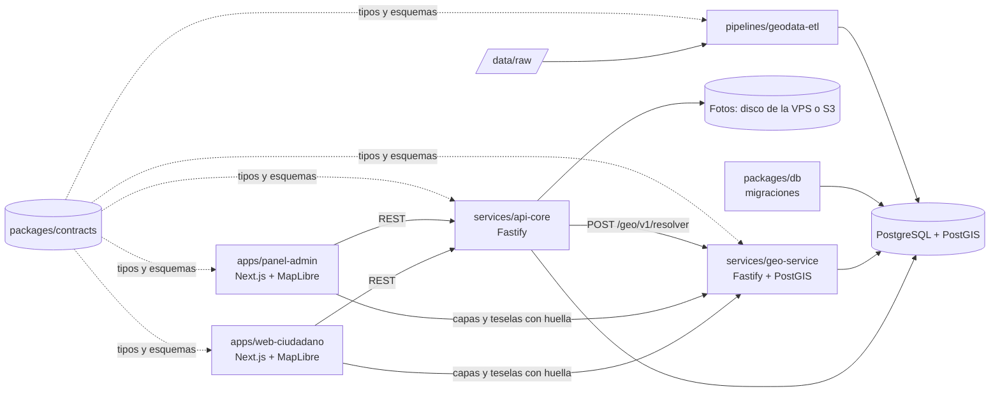

# CLAUDE.md — Mi Curichi

> **Manual operativo del repositorio.** Cualquier agente o persona que trabaje aquí lo lee completo antes de tocar nada.
> **Estado:** Fase 1 — Local, en curso. Las cinco partes corren con los datos reales del municipio; queda el cierre (tarea 9: E2E, seguridad, resumen de fase). Estado exacto y cómo retomar: **`docs/TRASPASO.md`**; mapa de la app, últimas pruebas y pendientes: **`docs/revision/2026-10-03-mapeo-y-pruebas.md`**. Plan de producción en una VPS: `docs/revision/2026-09-26-plan-produccion-vps.md` (ADR 0006).
> Última actualización: 2026-10-04.

## 0. Reglas de oro (leer aunque no se lea nada más)

1. **Solo se tocan las carpetas designadas de la parte que ejecuta la tarea** (§4 y §5). Fuera de ellas: documentar y avisar, nunca editar.
2. **No se cruza una puerta de fase sin un "aprobado" explícito del usuario** (§10).
3. **`data/raw/` es inmutable.** Todo `data/processed/` se regenera con un solo comando (§6).
4. **Nunca convertir un shapefile sin conocer su CRS.** Si falta `.prj`, detenerse y preguntar.
5. **Distrito y unidad vecinal se calculan por point-in-polygon**, nunca se toman de texto escrito por el usuario.
6. **No inventar** normativas, versiones, cifras ni fuentes. Lo no verificado se escribe como `<a confirmar>`.
7. **Ningún secreto en el repo.** Todo por variables de entorno con `.env.example` sin valores reales.
8. **La ubicación de un reporte es dato sensible.** Vista pública con precisión degradada cuando corresponda; identidad del reportante nunca en el mapa público. La posición del dispositivo, que se usa para comprobar el radio de 60 m, **nunca se guarda ni se registra en logs**. Los permisos de ubicación y de cámara se piden **solo al reportar**, nunca al cargar la web.
9. **Antes de programar: plan → aprobación → reparto.** El agente principal, con el modelo más potente, arma el plan con metas verificables; el usuario lo aprueba; recién entonces se reparte a subagentes según su nivel (§12.4). Sin excepciones.
10. **Probar antes de tocar y verificar al terminar.** Quien edita código corre antes las pruebas del paquete y las vuelve a correr después: lo que estaba verde no puede quedar rojo, y lo que ya estaba rojo se informa, no se arregla de pasada. **Toda función nueva o arreglo termina con la verificación SDD hecha por subagentes** (§12.4), aunque no se haya pedido `/sdd`. El `/sdd` completo (`docs/proceso/sdd.md`), solo cuando el usuario lo pide.
11. **Alcance de la Misión 1 cerrado** (§3). Todo lo demás va al backlog (§15).

---

## 1. Propósito del proyecto

**Mi Curichi.** En Santa Cruz (Bolivia), *curichi* es un bajío donde el agua se estanca. La municipalidad no tiene un inventario georreferenciado, alimentado por la ciudadanía, de **dónde**, **con qué frecuencia** y **con qué profundidad** se anega la ciudad.

**Solución.** Plataforma web de **reporte ciudadano georreferenciado de puntos de inundación**. El vecino marca dónde se estanca el agua cerca de donde está, saca una foto con la cámara y carga los datos; el sistema publica el reporte como «NO SE HA VERIFICADO» tras una demora corta, lo valida, lo clasifica por severidad y lo muestra en un mapa cruzado con la división oficial (**distrito municipal** y **unidad vecinal**).

| Usuario | Qué hace | Parte |
|---|---|---|
| Ciudadano / vecino | Ve el mapa público sin cuenta. Para reportar crea su cuenta, inicia sesión y comparte su ubicación: el punto se ajusta dentro de 60 m de su posición. Foto opcional, solo con la cámara dentro de la página. Ve sus propios reportes, también los que esperan publicarse | Parte 1 (`apps/web-ciudadano`) |
| Técnico municipal | Revisa los reportes publicados: valida, rechaza, fusiona, reclasifica, filtra, exporta, mira indicadores | Parte 2 (`apps/panel-admin`) |
| Administrador | Lo del técnico, más usuarios, retiro de verificados y activación de capas (único rol que ve «Capas») | Parte 2 |
| Ejecutivo (secretarios, concejales, alcalde) | Ve dónde y cuánto se inunda y cómo va el trabajo en `/ejecutivo`: cifra grande, pestañas por severidad, dos gráficas por distrito y un mapa de distritos y UV; no modera ni exporta | Parte 2 |

**Territorio.** Santa Cruz de la Sierra, Bolivia `<a confirmar>`. Capas del municipio en shapefile, carpeta **`DM_UV_MZ_2025`**: distritos municipales (16), unidades vecinales (576) y manzanas (27 527), en EPSG:32720. Fuente oficial, vigencia y licencia `<a confirmar>`. Las manzanas son solo de render; el point-in-polygon resuelve distrito y UV.

**Es** un inventario de reportes ciudadanos (percepción, no medición). **No es** un modelo hidráulico, ni un estudio de drenaje, ni un instrumento para decidir inversiones por sí solo (§9.4).

---

## 2. Glosario del dominio

| Término | Definición operativa |
|---|---|
| **Anegamiento / inundación** | Agua acumulada sobre calle, acera o predio que no drena en un tiempo razonable. No se distinguen formalmente; la severidad (§9.1) hace la gradación. |
| **Profundidad estimada** | Altura del agua por referencia corporal: tobillo (<10 cm), rodilla (10–40), muslo (40–70), más de 70 cm. |
| **Frecuencia** | Cuánto se repite: primera vez, ocasional, «solo cuando llueve fuerte» (`cada_lluvia_fuerte`), «cada lluvia» (`permanente`) y «agua estancada» (`agua_estancada`). |
| **Distrito municipal / unidad vecinal (UV) / manzana** | División oficial. Cada UV pertenece a un distrito; la UV es la unidad de agregación. Entre manzanas hay huecos (calles) por diseño. |
| **Point-in-polygon (PIP)** | Operación espacial que decide en qué polígono cae un punto; así se asignan distrito y UV. |
| **Punto crítico** | Agrupación analítica de reportes verificados en un radio configurable (§9.2). No reemplaza a los reportes. |
| **Clustering visual** | Agrupación de puntos por zoom, solo para dibujar (MapLibre). No es un punto crítico. |
| **EPSG:4326 / EPSG:32720** | WGS 84 geográfico (obligatorio en la web y en `geom`) / WGS 84 UTM 20S, métrico, el de las capas de Santa Cruz. |
| **Teselas vectoriales** | Capa cortada por zoom para no descargar el GeoJSON entero. Aquí se generan al vuelo en `geo-service`. |
| **Jitter** | Desplazamiento pequeño y determinista de la coordenada pública para no exponer una vivienda. |
| **Demora de publicación** | 1 min para el 1.º reporte del día de la cuenta y 4 min para el 2.º y el 3.º; la fija el servidor en `publicar_en`. Mientras espera, solo lo ve su autor. |
| **Reporte sin verificar** | Publicado en estado `nuevo`, sin revisión técnica: etiqueta exacta «NO SE HA VERIFICADO»; los validados dicen «Verificado». |
| **Radio del dispositivo** | Distancia máxima (60 m) entre el punto y la posición del teléfono al enviar. La posición se usa para comprobarlo y no se guarda. |

Vocabulario de drenaje y pavimento (sumidero, colector, contrapendiente, PCI, IRI, IDF…): `docs/dominio/drenaje-y-pavimento.md`.

---

## 3. Alcance de la Misión 1 (MVP)

### 3.1 Dentro del alcance (y solo esto)

1. **Mapa público** con los puntos (clustering visual) — Parte 1.
2. **Detalle del punto** con coordenadas, distrito y UV (por PIP), fecha, descripción, foto, severidad y estado («NO SE HA VERIFICADO», «Verificado» o «Resuelto») — Parte 1.
3. **Point-in-polygon** contra las capas oficiales en PostGIS — Parte 4.
4. **Formulario de reporte** con la ubicación del dispositivo **obligatoria** (el punto se ajusta dentro de 60 m: arrastrando, con las flechas, «mover 5 m» o escribiendo coordenadas), foto opcional con la cámara dentro de la página y los campos de §7.1 — Partes 1 y 3.
5. **Panel técnico**: bandeja (tabla + mapa reactivo) con filtros, moderación posterior a la publicación, exportación CSV y GeoJSON, indicadores — Parte 2.
6. **ETL** shapefile → GeoJSON → PostGIS con un comando — Parte 5.
7. **Entorno local completo** con Docker Compose y el lanzador `Mi-Curichi.exe` — Parte 5.

### 3.2 Fuera de alcance (va a §15)

Modelación hidráulica; priorización de inversión; notificaciones; app nativa (la PWA cubre el MVP); lluvia en tiempo real; analítica avanzada; órdenes de trabajo; autenticación social, perfiles y gamificación; multi-municipio compartido (la estrategia es **una instalación por ciudad**, ADR 0004).

---

## 4. Arquitectura: 5 partes

Toda tarea se asigna a **una** parte, con sus carpetas designadas.

### 4.1 Resumen

| Parte | Nombre | Carpetas designadas | Qué entrega |
|---|---|---|---|
| **1** | Frontend público | `apps/web-ciudadano/` | Mapa, detalle, formulario de reporte, PWA accesible |
| **2** | Frontend administrativo | `apps/panel-admin/` | Bandeja, moderación, exportación, indicadores, ejecutivo, capas y usuarios |
| **3** | Backend / API | `services/api-core/` (custodia `packages/contracts/`) | API REST, reglas de negocio, severidad, estados, auth, fotos, auditoría, antispam |
| **4** | Datos y geoespacial | `packages/db/`, `services/geo-service/` | Esquema PostGIS, migraciones, seeds sintéticos, PIP, capas, agregados, puntos críticos |
| **5** | GIS / DevOps / seguridad / calidad | `pipelines/geodata-etl/`, `infra/`, `e2e/`, `.github/`, `data/`, `scripts/`, `docs/` (índice, `seguridad/`, `operaciones/`, `revision/`, `TRASPASO.md`), configuración raíz | ETL, Docker Compose, lanzador, CI, seguridad, E2E, operación y traspaso |
| — | Transversal | `packages/contracts/` | Única fuente de tipos, esquemas Zod y OpenAPI (§4.8) |

### 4.2 Diagrama



Reglas de dependencia: los frontends **nunca** hablan con la base. `api-core` es el único que escribe reportes. `geo-service` es de **solo lectura**. Solo `packages/db` cambia el esquema, por migraciones. Solo el ETL escribe las tablas de capas. En la pila Docker el proxy Caddy es lo único que publica puertos **hacia fuera** (`https://localhost` y `https://panel.localhost`); lo demás escucha solo en `127.0.0.1`; las apps de Next reenvían `/api` y `/geo` a los servicios.

### 4.3 Parte 1 — Frontend público (`apps/web-ciudadano/`)

| Aspecto | Detalle |
|---|---|
| **Propósito** | Que cualquier vecino, desde el celular, vea el mapa y reporte un punto en menos de 2 minutos. |
| **Responsabilidades** | Mapa MapLibre con capa base atribuida, UV y distritos, puntos con clustering; detalle con «NO SE HA VERIFICADO» visible (texto, icono y color de aviso) en el detalle, las tarjetas, las pastillas y la leyenda; formulario anclado a la posición del dispositivo («Compartir mi ubicación», precisión de 50 m o menos, círculo de 60 m, relectura de la posición al enviar); foto con la **cámara dentro de la página** (`getUserMedia`), **sin input de archivo** ni galería; permisos solo dentro del flujo de reporte; aviso de la demora y cuenta regresiva; «Mis reportes» desde la API; validación con Zod + React Hook Form; previsualización de la UV antes de enviar; login con correo o solo el usuario (se completa con `@curichi.local`); la página pública **no se refresca sola**; PWA; mobile-first; WCAG 2.2 AA; texto de limitaciones (§9.4) visible. |
| **NO le corresponde** | Calcular severidad, distrito o UV; decidir la demora ni comprobar el radio (lo hace el servidor); moderar; almacenar fotos; hablar con la base; definir tipos de intercambio. |
| **Entradas** | `GET /api/v1/reportes`, `/reportes/:id`, `/mis-reportes`, `/configuracion`, `/auth/yo`; `POST /geo/v1/resolver`; capas por `CapaInfo.url` (con huella). |
| **Salidas** | `POST /api/v1/reportes` (con `dispositivo`) y `POST /api/v1/fotos`, con sesión; `POST /api/v1/auth/registro`, `/auth/login`, `/auth/logout`. |
| **Definition of Done** | lint + typecheck + Vitest verdes; Playwright: abrir mapa → clic en punto → distrito y UV; crear reporte con GPS simulado, ajuste dentro de 60 m y foto de cámara simulada; README; `.env.example`. |

### 4.4 Parte 2 — Frontend administrativo (`apps/panel-admin/`)

| Aspecto | Detalle |
|---|---|
| **Propósito** | Que el técnico convierta reportes crudos en un inventario validado, exportable y consultable. |
| **Responsabilidades** | Login de técnico, admin y ejecutivo (una cuenta ciudadana no entra). **Bandeja**: tabla y mapa sincronizados con filtros (distrito, UV, severidad, estado, fechas); clic en una zona del mapa pone su filtro con el id real de la capa y los selectores la muestran; clic en un punto resalta su fila y abre una tarjeta con «Ver detalle»; interruptor «Filtrar por el área del mapa» (encendido por defecto) que filtra por el área visible (`bbox` en la URL) y un chip «Mirando: Distrito X · UV Y». **Moderación posterior a la publicación**: validar, rechazar (con motivo), fusionar (solo con un `validado` cercano, elegido de una lista ordenada por distancia: 100 m, ampliable a 300 m y 1 km; el panel no deja pegar un ID, la API sigue aceptando UUID o ID corto), reclasificar severidad (con motivo); la bandeja y el detalle avisan que un `nuevo` ya se ve en el mapa público y que rechazarlo lo retira; el admin tiene «Retirar del mapa» en un `validado`; el detalle muestra cómo se ubicó el punto, la precisión y la distancia al dispositivo; ficha imprimible del reporte. **Exportación** CSV y GeoJSON de la selección filtrada (técnico y admin). **Indicadores**: tarjetas, «Por severidad» como pestañas («Todo» y cada severidad, con números que no cambian al filtrar; la misma selección que la fila «Filtrar por severidad»), «Por estado», dos tortas (por distrito y por UV, porcentaje sobre el total filtrado, las 8 mayores y «Otros», leyenda como tabla) con fichas de severidad que las filtran; clic en un distrito acota la torta de UV y clic en una UV abre la bandeja filtrada; estado en la URL; tabla «De una capa anterior». **Ejecutivo** (`/ejecutivo`, única pantalla del rol ejecutivo; técnico y admin también la ven): cifra grande de inundación activa (`nuevo` + `validado`) con «N verificadas · M en revisión», pestañas por severidad, dos gráficas por distrito («Inundaciones activas por distrito», con «Otros», y «Cómo va el trabajo»), la nota metodológica en una línea y un mapa de distritos y UV con selección de UV; sin coropleta, sin selector de período y **sin exportación**. **Capas**: solo el admin; aparece en el menú solo si hay una versión cargada sin activar; los demás roles ven «solo para administración». Bandeja, detalle, indicadores y ejecutivo se actualizan **cada 10 s** sin caché, solo con la pestaña visible, con consultas de sondeo (`x-curichi-sondeo`) que no renuevan la inactividad de la sesión. |
| **NO le corresponde** | Ejecutar el ETL; calcular severidad ni puntos críticos; analítica avanzada. |
| **Salidas** | `PATCH /api/v1/reportes/:id/estado`, `PATCH /reportes/:id/severidad`, `POST /reportes/:id/fusionar`, `GET /exportar`, `GET /indicadores`, `POST /admin/capas/:id/activar`. |
| **Definition of Done** | lint + typecheck + tests verdes; Playwright: login → filtrar por UV → validar → exportar GeoJSON; README; `.env.example`. |

### 4.5 Parte 3 — Backend / API (`services/api-core/`)

| Aspecto | Detalle |
|---|---|
| **Propósito** | Único punto de escritura del dominio y guardián de las reglas de negocio. |
| **Responsabilidades** | CRUD de reportes; máquina de estados (§7.3); severidad (§9.1) con función pura testeada; comprobación de la posición del dispositivo (precisión, antigüedad, radio de 60 m) sin guardarla ni registrarla; resolución de distrito/UV vía `geo-service`; `publicar_en` fijado en el INSERT y **una sola condición de visibilidad** (`condicionPublico` / `condicionPublicado`) en todas las rutas; recálculo de puntos críticos en cada transición (§9.2); sesión por cookie y autorización por rol; validación con `contracts`; auditoría; rate limiting, antispam y **cupo diario por cuenta en la base**; idempotencia por cuenta; fotos (magic bytes, **WebP** de 1600 px máx. **sin metadatos**, guarda de disco); exportación con nota metodológica; indicadores con filtros; healthchecks; logs estructurados. **Custodia `packages/contracts`.** |
| **NO le corresponde** | Esquema y migraciones (Parte 4); operaciones sobre polígonos (Parte 4); ETL, infra, CI (Parte 5); render. |
| **Definition of Done** | lint + typecheck + Vitest verdes; integración del camino crítico (`POST /reportes` con dispositivo a ≤ 60 m → UV → severidad → `nuevo` con `publicar_en`); prueba de tabla de visibilidad que recorre todas las rutas; tabla de severidad (§9.1); foto con EXIF GPS → WebP sin EXIF, XMP ni ICC; README; `.env.example`; OpenAPI en `/docs`. |

### 4.6 Parte 4 — Datos y geoespacial (`packages/db/`, `services/geo-service/`)

| Aspecto | Detalle |
|---|---|
| **Propósito** | Dueña del modelo de datos y de toda operación espacial. |
| **Responsabilidades** | **`packages/db`**: esquema Drizzle de `public` y `geo` (§7), migraciones versionadas (cada una con su prueba `test/migracion-NNNN-*.test.ts`), cliente tipado, seeds **sintéticos** (`db:seed:samples`, se niega a correr con `NODE_ENV=production`), consulta DBSCAN y recálculo de puntos críticos. **`services/geo-service`**: `POST /geo/v1/resolver` (§7.4); capas y teselas con la **huella** del contenido en la URL (`immutable` 1 año, `410` con huella vieja); agregados por UV y distrito; puntos críticos; healthchecks; caché de la versión vigente y cifras con 2 min de antigüedad como máximo. |
| **NO le corresponde** | Escribir reportes; ejecutar el ETL; autenticación; render. |
| **Definition of Done** | Migraciones desde cero e idempotentes; seeds cargan; tests de `geo-service` con capa sintética (interior, borde con `en_limite`, hueco con `asignado_por_proximidad`, fuera de cobertura); `EXPLAIN` del PIP con índice GIST; README y `.env.example`. |

### 4.7 Parte 5 — GIS / DevOps / seguridad / calidad

| Aspecto | Detalle |
|---|---|
| **Propósito** | Que los datos entren limpios y versionados, que todo se levante con un clic, que nada inseguro llegue a `main` y que la calidad se mida. |
| **Responsabilidades** | **GIS**: ETL de §6. **DevOps**: monorepo pnpm + Turborepo, Biome, Husky/lint-staged/commitlint, Dockerfiles, Docker Compose, GitHub Actions, README raíz, lanzador `Mi-Curichi.exe` (`scripts/lanzador/`). **Seguridad**: política de §13, escaneo de secretos en pre-commit y CI, auditoría de dependencias, cabeceras y CORS. **Infraestructura**: volúmenes, redes, healthchecks, respaldos, observabilidad (logs JSON, `/metrics`). **Calidad**: E2E transversal en `e2e/` con el runner `e2e/scripts/correr-local.mjs` (base aparte `curichi_e2e`), accesibilidad y rendimiento (§14), checklist de PR. |
| **NO le corresponde** | Lógica de negocio, esquema, interfaz. La seguridad la define, configura y audita; cada parte la implementa en lo suyo. |
| **Definition of Done** | `pnpm etl:all` regenera `data/processed/` sin pasos manuales y `etl:test` cubre reproyección, reparación, normalización y solape/hueco; `docker compose --profile servicios up -d` deja todo `healthy`; CI verde; E2E verde; escaneo de secretos activo; README y `.env.example` raíz. |

### 4.8 Transversal — `packages/contracts` (custodia: Parte 3)

- Enums, esquemas Zod de payloads y respuestas, tipos inferidos, **OpenAPI 3.1** (`openapi/openapi.yaml`, generado), tabla de severidad versionada y constantes de dominio. Versión actual: **0.17.0**.
- **Ninguna parte define un tipo de intercambio por su cuenta**: lo agrega aquí en una tarea que lo anuncie; la Parte 3 lo revisa.
- Todo cambio de contrato sube la versión, se documenta en `packages/contracts/CHANGELOG.md` y regenera el OpenAPI (`pnpm --filter contracts build`; el CI comprueba que no cambie al regenerarlo).
- El ETL importa `contracts` directamente; `dist/dominio.json` queda para consumidores en otros lenguajes.

---

## 5. Carpetas y regla estricta de carpetas designadas

### 5.1 Estructura

```
CLAUDE.md                 # este archivo; se edita solo con autorización del usuario
README.md  package.json  pnpm-workspace.yaml  turbo.json  biome.json  docker-compose.yml
.nvmrc  .env.example  .gitignore  .gitattributes  .husky/  .github/workflows/        [Parte 5]
.claude/                  # proceso /sdd (skill y agentes)                          [Parte 5]
apps/web-ciudadano/       # Parte 1
apps/panel-admin/         # Parte 2
services/api-core/        # Parte 3
services/geo-service/     # Parte 4
packages/contracts/       # Transversal (custodia Parte 3)
packages/db/              # Parte 4
pipelines/geodata-etl/    # Parte 5 — ETL en TypeScript (ADR 0002)
e2e/                      # Parte 5 — Playwright transversal y runner local
scripts/lanzador/         # Parte 5 — fuente de Mi-Curichi.exe (el .exe no se versiona)
data/raw/<version>/       # shapefiles originales + MANIFEST.md. INMUTABLE. No se versiona
data/processed/           # generado por el ETL. No se versiona
data/samples/             # muestras SINTÉTICAS pequeñas, versionadas
docs/                     # TRASPASO, decisiones (ADR), dominio, operaciones, revision, seguridad, proceso, sdd
infra/                    # Dockerfiles, proxy (Caddy), sql de init (solo extensiones y roles)
```

### 5.2 Regla estricta (no negociable)

- Cada tarea declara **una parte** y su **carpeta designada**: dentro se crea, edita y borra; fuera, **no**.
- Excepciones: `packages/contracts/` con cambio de contrato anunciado (la Parte 3 revisa) y el ADR de la tarea en `docs/decisiones/`.
- Un defecto fuera de la carpeta se documenta (archivo, línea, síntoma, riesgo) y se avisa. Para tocarlo hace falta autorización explícita con archivo, motivo y riesgo.
- La raíz la toca **solo la Parte 5**. `CLAUDE.md` se edita únicamente con autorización del usuario. `data/raw/` es de solo lectura para todos.

### 5.3 Tabla de permisos

| Parte | Puede tocar | No puede tocar |
|---|---|---|
| **1** | `apps/web-ciudadano/`; contracts con anuncio; su ADR | Todo lo demás |
| **2** | `apps/panel-admin/`; contracts con anuncio; su ADR | Todo lo demás |
| **3** | `services/api-core/`; `packages/contracts/` (custodia); su ADR | `geo-service`, el esquema de `packages/db` (consume su cliente), apps, pipelines, data, infra, e2e, raíz |
| **4** | `packages/db/`, `services/geo-service/`; contracts con anuncio; su ADR | `api-core`, apps, pipelines, infra, e2e, raíz; `data/*` solo lectura |
| **5** | `pipelines/`, `infra/`, `e2e/`, `.github/`, `scripts/`, `data/processed/`, `data/samples/`, su parte de `docs/`, raíz declarada; carga de filas en `geo.*`; contracts con anuncio | `data/raw/` (nunca), `apps/*`, `services/*`, esquema de `packages/db`, `CLAUDE.md` sin autorización |

---

## 6. Pipeline geoespacial: shapefile → GeoJSON → PostGIS

Vive en `pipelines/geodata-etl/` (Parte 5), en **TypeScript con mapshaper** y `@turf/turf`, probado con Vitest (ADR 0002: la máquina no tiene GDAL, Python ni tippecanoe). Un comando por versión y uno para todo; **idempotente**.

### 6.1 Ingesta e inspección

- Los shapefiles entran en `data/raw/<version>/` tal como los entrega el municipio (`.shp`, `.shx`, `.dbf`, `.prj`, `.cpg`), con un `MANIFEST.md` escrito a mano: fuente, quién entregó, fecha de recepción y de vigencia, CRS declarado y `sha256` de cada archivo. La correspondencia archivo → capa y los campos van en `pipelines/geodata-etl/config/capas.yaml` (para `DM_UV_MZ_2025`: `DIS` y `UV` como código, nombres generados «Distrito {codigo}» y «Unidad Vecinal {codigo}», `OBJECTID` para manzanas).
- **Sin `.prj` el pipeline se detiene** y se pregunta el CRS; confirmado, se registra en el MANIFEST y se pasa con `--crs-origen EPSG:xxxxx`. Sin `.cpg` se asume UTF-8 y se registra la decisión.
- `pnpm etl:inspect` informa CRS, cantidad y tipos de geometría, atributos y nulos, encoding y bbox (en origen y en 4326); avisa si el bbox no cae en la ciudad.

### 6.2 Transformación (`pnpm etl:run`)

- Salida **siempre en EPSG:4326**; el CRS de origen queda en `metadata.json` y en `capa_version`.
- Validación antes y después de reparar, con el id afectado en el reporte de calidad: geometrías inválidas (se reparan; si el área cambia más de 0,1 % `<umbral a confirmar>`, se pregunta), vacías (se excluyen), duplicadas exactas (se excluye la segunda), códigos repetidos (se reportan, no se tocan), solapes entre UV (se reportan; solo se corrigen si son < 1 m² `<a confirmar>`), huecos entre UV dentro de un distrito (se reportan, no se rellenan) y UV sin distrito (se asigna por su punto representativo y se marca `distrito_inferido`).
- Atributos normalizados en `snake_case`, UTF-8: `id` (`<tipo>:<codigo>`), `codigo`, `nombre`, `tipo`, `distrito_id` (UV y manzana), `unidad_vecinal_id` (manzana), `version_capa`, `fuente`, `fecha_vigencia`.
- Dos salidas por capa en `data/processed/<version>/<capa>/`: `<capa>.full.geojson` (sin simplificar, para PostGIS) y `<capa>.web.geojson` (mapshaper Visvalingam `interval=3`, `keep-shapes`, preservando bordes compartidos), más `reporte_calidad.md/json` y `metadata.json`. Las capas grandes se sirven como **teselas generadas al vuelo** por `geo-service` (`geojson-vt` + `vt-pbf`), no como PMTiles.

### 6.3 Carga (`pnpm etl:load`) y activación

- **Una versión se carga en una sola transacción**: todas sus capas o ninguna. Inserta en `geo.<capa>`, repara con `ST_MakeValid`, comprueba el conteo y crea o actualiza `capa_version` con `vigente = false`.
- **Activar** una versión es acción del **admin** desde el panel («Capas»), con auditoría. Única excepción: si la capa no tiene ninguna versión vigente (base nueva), el ETL activa esa y lo registra sin actor.

### 6.4 Reglas duras

1. `data/raw/` es **inmutable**: corregir el origen es una **nueva versión** con su MANIFEST.
2. Todo `data/processed/` se regenera con **`pnpm etl:all`**; si algo requiere un paso manual, el pipeline está roto.
3. Archivos pesados fuera de git (`data/raw/` y `data/processed/` en `.gitignore`); la reproducibilidad la dan los `sha256` y `metadata.json`. Sin Git LFS en Fase 1.
4. `data/samples/` solo con geometrías **sintéticas** (< 1 MB por archivo), etiquetadas como tales.
5. El PIP se hace en PostGIS con índice **GIST**; nunca iterando polígonos en memoria del servicio.

---

## 7. Modelo de datos y contratos de API

El esquema y las migraciones son de la **Parte 4** (`packages/db/`); los contratos HTTP, de `packages/contracts/` (custodia: Parte 3). El ETL solo **carga filas** en `geo.*`.

### 7.1 Tabla `reporte_inundacion` (esquema `public`)

| Columna | Tipo | Notas |
|---|---|---|
| `id` | `uuid` PK | generado por el servidor |
| `geom` | `geometry(Point, 4326)` | GIST; coordenada exacta (solo técnico/admin) |
| `creado_en` / `actualizado_en` | `timestamptz` | |
| `publicar_en` | `timestamptz` NOT NULL | `now()` + 60 s (1.º del día de la cuenta) o + 240 s (2.º y 3.º), fijado en el INSERT con el contador de `cuota_reporte_diaria`; `CHECK` entre `creado_en` y + 1 h. La visibilidad es el filtro `publicar_en <= now()` |
| `evento_en` | `timestamptz` null | si null, se asume `creado_en` |
| `autor_id` | `uuid` null FK `usuario` | sale de la sesión; null solo en reportes previos a las cuentas o si se borró la cuenta |
| `distrito_id`, `unidad_vecinal_id` | `text` FK a `geo.*` | **calculados por el sistema** |
| `version_capa` | `text` | versión de capa con la que se resolvió |
| `resolucion_flags` | `jsonb` | `{ en_limite, asignado_por_proximidad, distancia_m, distrito_discrepante? }` (§7.4) |
| `ubicacion_metodo` | `gps` \| `manual` | lo **deriva el servidor**: `gps` si la distancia punto–dispositivo es ≤ `max(2 m, precision_m)`, si no `manual` |
| `precision_gps_m` | `numeric` null | precisión declarada por el dispositivo (≤ 50 m para aceptar) |
| `distancia_dispositivo_m` | `smallint` null, 0–1000 | distancia redondeada punto–dispositivo; la posición del dispositivo **no se guarda** |
| `ubicacion_tipo` | `via_publica` \| `vivienda_o_predio` \| `otro` | activa el jitter público (§13) |
| `descripcion` | `text` | 10–1000 caracteres `<a confirmar>` |
| `profundidad_estimada` | `tobillo` \| `rodilla` \| `muslo` \| `mas_70` | |
| `frecuencia` | `primera_vez` \| `ocasional` \| `cada_lluvia_fuerte` \| `permanente` \| `agua_estancada` | `agua_estancada` desde la migración 0017 |
| `causa_presunta` | `sumidero_tapado` \| `falta_sumidero` \| `hundimiento_pavimento` \| `contrapendiente` \| `colector_saturado` \| `desborde_cauce` \| `desconocida` | |
| `sumidero_cercano` | `si` \| `no` null | opcional |
| `sumidero_estado` | `tapado` \| `no_tapado` null | opcional |
| `agua_brota_sumidero` | `boolean` null | opcional; síntoma de colector saturado |
| `severidad_calculada` | `baja` \| `media` \| `alta` \| `critica` | función pura §9.1; **nunca** editable a mano |
| `severidad_manual` / `severidad_motivo` | ídem null / `text` null | reclasificación del técnico; motivo obligatorio |
| `estado` | `nuevo` \| `validado` \| `duplicado` \| `rechazado` \| `resuelto` | §7.3 |
| `estado_motivo` | `text` null | obligatorio en `rechazado` y `duplicado` |
| `fusionado_en_id` | `uuid` null FK self | reporte canónico si `duplicado` |
| `punto_critico_id` | `uuid` null FK | §9.2; se recalcula |
| `validado_por` / `validado_en` | `uuid` null / `timestamptz` null | |
| `ip_hash` | `text` null | hash con sal, solo antispam; se borra a los N días `<propuesto 30>` |

La API expone `severidad_efectiva = COALESCE(severidad_manual, severidad_calculada)`.

### 7.2 Tablas complementarias

- **`reporte_foto`**: `id`, `reporte_id`, `objeto_key` (`<uuid>.webp`), `mime`, `bytes`, `ancho`, `alto`, `exif_sanitizado` (debe ser `true` para servirse), `subido_por` (FK `usuario`, `ON DELETE SET NULL`), `creado_en`. Toda foto nueva es **WebP** calidad 80, 1600 px por lado como máximo, sin metadatos; las `.jpg` anteriores se sirven como están. Una foto solo se asocia a un reporte de quien la subió, dentro de las 24 h; sin reporte, solo la ve quien la subió.
- **`cuota_reporte_diaria`** (0014): `(usuario_id, dia)` PK, `reportes_n`, `fotos_n`, `actualizado_en`. Se incrementa de forma atómica dentro de la transacción del reporte (`INSERT … ON CONFLICT DO UPDATE … WHERE reportes_n < máximo RETURNING`); el número devuelto fija la demora. El mantenimiento borra los días anteriores.
- **`idempotencia`** (0004): clave con prefijo de la cuenta (`<usuario_id>:<clave>`); la posición del dispositivo no entra en la huella.
- **`geo.distrito_municipal`**, **`geo.unidad_vecinal`**, **`geo.manzana`**: `id`, `codigo`, `nombre`, `geom MultiPolygon 4326` con GIST, `version_capa`, `fuente`, `fecha_vigencia`, `distrito_id` (UV y manzana), `unidad_vecinal_id` (manzana), `distrito_inferido` (UV). PK `(id, version_capa)`; vistas `geo.<capa>_vigente`.
- **`geo.capa_version`**: `id`, `capa`, `version`, `fuente`, `fecha_vigencia`, `crs_origen`, `sha256_manifiesto`, `n_features`, `cargado_en`, `vigente`, `activado_por`, `activado_en`.
- **`punto_critico`**: `id`, `geom` (centroide), `n_reportes`, `primer_reporte_en`, `ultimo_reporte_en`, `severidad_max`, `distrito_id`, `unidad_vecinal_id`, `radio_m`, `calculado_en`.
- **`usuario`**: `id`, `email` (único), `nombre`, `rol` (`ciudadano` \| `tecnico` \| `ejecutivo` \| `admin`), `activo`, `creado_en`; contraseña con **Argon2id**. Autenticación propia de `api-core` (sesión por cookie).
- **`auditoria`**: `id`, `entidad`, `entidad_id`, `accion`, `actor_id`, `antes`, `despues`, `creado_en`, en cada creación (con `publicar_en`, sin la posición del dispositivo), transición, reclasificación, fusión, retiro y activación de capa.

### 7.3 Máquina de estados del reporte

```
nuevo ───validar───▶ validado ───resolver───▶ resuelto
  │                     ├──retirar (solo admin)──▶ rechazado
  │                     └──fusionar──────────────▶ duplicado
  ├──rechazar────────────────────────────────────▶ rechazado ──reabrir (admin)──▶ nuevo
  └──fusionar────────────────────────────────────▶ duplicado
```

| Transición | Quién | Requiere |
|---|---|---|
| `nuevo → validado` | técnico, admin | — |
| `nuevo → rechazado` | técnico, admin | `estado_motivo` |
| `nuevo/validado → duplicado` | técnico, admin | `fusionado_en_id` de **otro** reporte `validado` (UUID o ID corto de 8 caracteres) y `estado_motivo` |
| `validado → resuelto` | técnico, admin | `estado_motivo` (qué se hizo) |
| `validado → rechazado` | **solo admin** (técnico: `403`) | `estado_motivo`; recalcula el punto crítico |
| `rechazado → nuevo` | admin | `estado_motivo`; vuelve a ser público al instante |

Nadie modera un reporte antes de su `publicar_en` (las rutas responden `404`). Fusión: no consigo mismo (`409 FUSION_CONSIGO_MISMO`); reporte y canónico se bloquean juntos en orden de id; los que apuntaban al fusionado pasan al nuevo canónico, con auditoría `fusion:reapuntar`.

**Publicación sin moderación previa.** Público: `nuevo` («NO SE HA VERIFICADO», `verificado = false`), `validado` («Verificado») y `resuelto` («Resuelto»), siempre con `publicar_en <= now()`. `rechazado` y `duplicado` no se publican. La visibilidad vive en un solo lugar: `ESTADOS_PUBLICOS` en `contracts` y `condicionPublico` / `condicionPublicado` en `api-core`, aplicadas en todas las rutas (pública, técnica, exportación, indicadores, ejecutivo, moderación, fotos, agregados); una prueba de tabla las recorre. Mientras espera, solo lo ve su autor («Mis reportes», con su foto, también si queda rechazado o duplicado).

### 7.4 Resolución point-in-polygon (`geo-service`)

```sql
SELECT uv.id, uv.codigo, uv.nombre, uv.distrito_id
FROM geo.unidad_vecinal_vigente uv
WHERE ST_Contains(uv.geom, ST_SetSRID(ST_MakePoint($1, $2), 4326))
LIMIT 1;
```

1. **Dentro de una UV**: caso normal; el distrito sale de la UV y se cruza con un PIP de distritos; si difieren, manda la UV y se marca `distrito_discrepante`.
2. **Sobre un borde** (varias UV): la de menor `id`, con `en_limite = true`.
3. **En un hueco**: la UV más cercana a 20 m `<a confirmar>`, con `asignado_por_proximidad = true` y `distancia_m`; si no hay, caso 4.
4. **Fuera de cobertura**: `dentro_cobertura = false`; `api-core` responde `422 FUERA_DE_COBERTURA` y no crea el reporte.

Respuesta: `{ dentro_cobertura, distrito: {id, codigo, nombre}, unidad_vecinal: {id, codigo, nombre}, version_capa, en_limite, asignado_por_proximidad, distancia_m }`.

### 7.5 Endpoints de `api-core` (prefijo `/api/v1`)

| Método y ruta | Rol | Descripción |
|---|---|---|
| `POST /reportes` | autenticado (rate limited) | Crea en `nuevo`; autor de la sesión (sin sesión, `401 SIN_SESION`). Body `ReporteCrearSchema` con `dispositivo` **obligatorio** (`lat`, `lon`, `precision_m`, `antiguedad_s`), sin `ubicacion_metodo` ni `precision_gps_m`. Antes de resolver y sin gastar cupo: `422 PRECISION_INSUFICIENTE` (> 50 m), `422 POSICION_VENCIDA` (> 600 s `<a confirmar>`), `422 UBICACION_FUERA_DE_RADIO` (> 60 m). Límite por IP y **3 reportes por cuenta y por día** en `ZONA_HORARIA` (`429 CUOTA_DE_REPORTES` con `Retry-After` hasta la medianoche). Resuelve UV, calcula severidad, fija `publicar_en`; devuelve `publicar_en` y `segundos_para_publicar` (también en el replay idempotente). |
| `POST /fotos` | autenticado (rate limited) | Multipart; `FOTO_MAX_BYTES` (8 MB) y 3 fotos por reporte `<a confirmar>`; entran JPEG, PNG y WebP por magic bytes y **sale WebP**. 12 fotos por cuenta y por día (`429 CUOTA_DE_FOTOS`, devueltas si falla el procesamiento); `507 SIN_ESPACIO` bajo `FOTOS_MIN_LIBRE_BYTES`. Devuelve un `objeto_key` que solo esa cuenta puede asociar. |
| `GET /fotos/:key` | público (rate limited) | Foto de reporte publicado: `public, no-cache` con `ETag` (revalida la visibilidad). El autor ve las suyas en cualquier estado y técnico/admin las de publicados luego rechazados o fusionados, con `private, no-store`. Sin reporte, solo quien la subió. Lo demás, `404`. |
| `GET /reportes` | público | **Siempre vista pública**: `nuevo`, `validado`, `resuelto` con `publicar_en <= now()`, jitter, sin autor. Filtros: `bbox`, `estado` (dentro de los públicos), `distrito_id`, `unidad_vecinal_id`, `punto_critico_id`, `severidad`, `desde`, `hasta`, `pagina`, `limite`. |
| `GET /reportes/:id` | público | Detalle público; `404` si espera, está rechazado o duplicado. |
| `GET /mis-reportes` | autenticado | Los propios (50 máx.) en cualquier estado, con `estado`, `verificado`, `publicar_en` y `retirado`; `private, no-store`, `Vary: Cookie`. |
| `GET /tecnico/reportes`, `/tecnico/reportes/:id` | técnico, admin | Vista técnica de los publicados: todos los estados, coordenada exacta, precisión, distancia al dispositivo; mismos filtros (incluido `bbox`). |
| `PATCH /reportes/:id/estado` | técnico, admin | `{ estado, estado_motivo?, fusionado_en_id? }` según §7.3. |
| `PATCH /reportes/:id/severidad` | técnico, admin | `{ severidad_manual, severidad_motivo }` o `null`. |
| `POST /reportes/:id/fusionar` | técnico, admin | Marca `:id` como `duplicado` de `{ canonico_id }`. |
| `GET /exportar` | **técnico, admin** | `formato=csv\|geojson` + filtros, vista técnica, hasta 50 000 filas; si hay más, lo dice (`total`, `exportados`, `truncado`, encabezado del CSV y `X-Curichi-Truncado: 1`). El ejecutivo recibe `403`. |
| `GET /indicadores` | técnico, admin | `total`, `por_estado`, `por_severidad`, `por_distrito`, `por_unidad_vecinal` (con `distrito_id`), puntos críticos con `n ≥ 2` y capas vigentes, solo de publicados. Filtros opcionales (contracts 0.16.0): `severidad` (lista, severidad efectiva) y `distrito_id`; inválidos, `400 FILTROS_INVALIDOS`. Los puntos críticos solo se acotan por distrito. Sin caché; deduplica consultas en vuelo. |
| `GET /ejecutivo/resumen` | ejecutivo, técnico, admin | `ventana=7d\|30d\|todo`: `activas` (`total`, `verificadas`, `en_revision`, `por_severidad`), `resueltas`, `por_estado`, `por_distrito`, `ultimo_reporte_en`. Sin caché. Forma exacta en el CHANGELOG (0.6.0). |
| `GET /configuracion` | público | Ciudad de la instalación (`nombre`, `pais`, `zona_horaria`, `locale`, `centro`, `zoom_inicial`); `public, max-age=300`. |
| `POST /auth/registro` | público (rate limited) | Alta ciudadana (rol siempre `ciudadano`); responde igual exista o no el correo; `429 DEMASIADAS_CUENTAS` por IP (hora y tope diario `ALTAS_POR_DIA_POR_IP` = 10 `<a confirmar>`). |
| `POST /auth/login`, `/auth/logout`, `GET /auth/yo` | — / autenticado | Login con correo o con el usuario solo (se completa con `@curichi.local`); rota la sesión. `/auth/yo` suma `reportes_restantes_hoy`, `demora_proximo_s`, `puede_reportar_desde` y, a técnico, admin y ejecutivo, `panel_url`. |
| `GET /admin/capas` | técnico, admin | Versiones cargadas (el panel la muestra solo al admin). |
| `POST /admin/capas/:id/activar` | admin | Activa una versión, con auditoría, e invalida la caché de `geo-service`. |
| `GET /health`, `GET /ready` | público | `/ready` prueba la base, `geo-service` y el almacén de fotos (escribiendo y borrando un archivo en disco y mirando que quede espacio sobre `FOTOS_MIN_LIBRE_BYTES`, o S3); `503` solo si falla la base; lo demás, `200` con `degradado: true` (`fotos: 'poco_espacio'` si falta disco). |
| `GET /docs` | público en local | OpenAPI UI. |

### 7.6 Endpoints de `geo-service` (prefijo `/geo/v1`)

| Método y ruta | Descripción |
|---|---|
| `POST /resolver` | `{ lat, lon }` → §7.4. Lo usa `api-core` (con `x-token-interno`, sin rate limit) y la previsualización pública (cupo por IP). |
| `GET /capas`, `GET /capas/vigentes` | Capas vigentes: modo (GeoJSON o teselas) y `url` con la **huella** del contenido; versión vigente por capa. `public, no-cache`. |
| `GET /capas/{capa}/v/{huella}` | GeoJSON web: con la huella vigente, `immutable` 1 año y `ETag`; con una vieja, `410 CAPA_CAMBIO`; `413 USAR_TESELAS` si es demasiado grande. |
| `GET /teselas/{capa}/{huella}/{z}/{x}/{y}.mvt` | Teselas al vuelo, mismas reglas de huella; `204` si está vacía. |
| `GET /agregados/unidades-vecinales` | Por UV: publicados, `n_verificados`, `severidad_max_verificada`, puntos críticos. Cifras con 2 min de antigüedad como máximo. |
| `GET /puntos-criticos?bbox=` | Puntos críticos (solo verificados) con centroide público; 5000 máx. |
| `POST /capas/invalidar` | **Interna** (token; el proxy la corta con `404`). |
| `GET /health`, `/ready`, `/metrics` | `/metrics` con `METRICAS_TOKEN`. |

### 7.7 Dónde vive cada contrato

`packages/contracts/src/dominio/enums.ts` (enums), `severidad.ts` (§9.1), `geo.ts` (`distanciaMetros`, `dentroDelRadio`: la misma cuenta en la interfaz y en `api-core`); `CONFIG_DOMINIO` y `ESTADOS_PUBLICOS` (radio 60 m, precisión 50 m, antigüedad 600 s, demoras 60/240 s, 3 reportes y 12 fotos por día, 10 altas por IP, WebP 80 a 1600 px, etiquetas públicas); `src/esquemas/{reporte,geo,auth,admin}.ts` (Zod); `openapi/openapi.yaml` (generado, no se edita a mano); `dist/dominio.json`.

---

## 8. Stack y decisiones

### 8.1 Versiones (el patch exacto está en `pnpm-lock.yaml`)

| Componente | Versión | Nota |
|---|---|---|
| Node.js | 24.x LTS | `.nvmrc` y `engines`; no usar versiones *Current* |
| pnpm / Turborepo | 12.4.x / 2.10.x | |
| TypeScript | 5.9.x | `strict: true`; fijada a propósito (no subir a 7 sin ADR) |
| Next.js / React | 16.3.6+ / 19.3.x | App Router; 16.3.6 por el aviso crítico que marcó `pnpm audit` el 2026-10-03 (`next/og`) |
| Tailwind / TanStack Query / Zod / React Hook Form | 4.3 / 5.102 / 4.6 / 7.88 | |
| MapLibre GL JS | 6.9.x | sin servicios propietarios |
| Fastify / Drizzle ORM | 5.12.x / 0.45.x | geometría con SQL tipado de Drizzle |
| PostgreSQL + PostGIS | `postgis/postgis:18-3.6` | igual en local y en producción |
| MinIO | `ghcr.io/coollabsio/minio`, fijada por digest | solo desarrollo (perfil `minio`) |
| sharp | 0.35.x | WebP, redimensionado y sin EXIF |
| Vitest / Playwright | 4.1.x / 1.63.x | Vitest fijado a propósito (no subir a 5 sin ADR) |
| Biome | 2.5.x | lint + formato, reglas a11y |
| Husky / lint-staged / commitlint | 9.1 / 17.5 / 21.2 | |
| mapshaper / @turf/turf | 0.7.x / vigente | ETL (ADR 0002) |

Los PR automáticos de Dependabot con versiones mayores no se mezclan sin probarlos y sin ADR.

### 8.2 Decisiones que condicionan el trabajo

- **Monorepo pnpm + Turborepo**, TypeScript estricto: un cambio de contrato rompe el `typecheck` del consumidor, no la producción.
- **Next.js App Router** para las dos apps; **MapLibre** para el mapa; **Fastify** para los dos servicios; **PostgreSQL + PostGIS** para todo; **Drizzle** con migraciones SQL legibles.
- **Base local en Docker (ADR 0005)**: contenedor `postgis` en `127.0.0.1:5432`. Cada servicio usa su rol de mínimo privilegio (`API_DATABASE_URL` → `curichi_api`, `GEO_DATABASE_URL` → `curichi_geo`); migraciones, ETL y seeds van con el rol dueño (`DATABASE_URL`). **PGlite** (ADR 0002/0003) queda para las bases efímeras de las pruebas y como alternativa sin Docker (`pnpm db:local`).
- **Una instalación por ciudad (ADR 0004)**: la ciudad se configura en tiempo de ejecución (`CIUDAD_*`, `ZONA_HORARIA`, `CRS_METRICO_EPSG`); `api-core` la valida al arrancar y la publica en `/configuracion`.
- **Fotos**: en disco (`infra/.storage/` en local, disco de la VPS en producción, con guarda `FOTOS_MIN_LIBRE_BYTES` ≈ 2 GiB) o S3 con `S3_ENDPOINT` (MinIO en local).
- **Contraseñas con Argon2id** (OWASP: m = 19 MiB, t = 2, p = 1), sin dependencias nativas; los hashes `scrypt` viejos migran solos al siguiente login.
- **Fuentes** con `@fontsource` (Sora y Source Sans 3); componentes de UI propios (sin shadcn).
- **Observabilidad**: logs JSON (pino), `X-Request-Id` de `api-core` a `geo-service`, `/health`, `/ready` y `/metrics` (Prometheus, con token) recogidos por el perfil `observabilidad`; alertas de disco de fotos y de bandeja sin verificar atrasada.
- **Producción en una VPS (ADR 0006)**: una réplica de cada servicio con el `docker-compose.yml` del repo y las imágenes del CI; técnicos y ejecutivo al día con sondeo de 10 s; la página pública sin tráfico automático; capas y teselas con huella, cacheables 1 año. Todo el estado de la publicación diferida vive en la base.

---

## 9. Criterios de dominio

### 9.1 Severidad (función pura, `packages/contracts/src/dominio/severidad.ts`)

`severidad(profundidad, frecuencia) → { puntaje, banda }`. La calcula `api-core`; el frontend solo la muestra o la previsualiza. Versión guardada: **`severidad_version = 2`**.

| Puntos | Profundidad (P) | Frecuencia (F) |
|---|---|---|
| 1 | tobillo | primera vez |
| 2 | rodilla | ocasional |
| 3 | muslo | `cada_lluvia_fuerte` («Solo cuando llueve fuerte») |
| 4 | > 70 cm | `permanente` («Cada lluvia») |
| 5 | — | `agua_estancada` («Agua estancada») |

`puntaje = 2·P + F` (rango 3 … 13; la profundidad pesa doble por el riesgo directo para personas, vehículos y viviendas).

| Puntaje | 3–4 | 5–7 | 8–10 | 11–13 |
|---|---|---|---|---|
| Banda base | `baja` | `media` | `alta` | `critica` |

Escalamiento (solo sube): **E1** P = 4 → `critica` (se anota siempre que P = 4); **E3** F = 4 o 5 → mínimo `media` (guarda; con estas bandas no llega a dispararse).

| P | F | Puntaje | Final |
|---|---|---|---|
| 1 | 1 | 3 | `baja` |
| 2 | 2 | 6 | `media` |
| 2 | 4 | 8 | `alta` |
| 3 | 3 | 9 | `alta` |
| 3 | 5 | 11 | `critica` |
| 4 | 1 | 9 | `critica` (E1) |
| 4 | 5 | 13 | `critica` (E1) |

Pesos, cortes y reglas son parámetros iniciales a validar con el técnico municipal `<a confirmar>`. Todo cambio es de contrato con versión. **Pendiente (D3)**: `agua_estancada` amplió el rango a 13 sin subir `severidad_version` ni documentarlo en el CHANGELOG, y las etiquetas de `permanente` y `cada_lluvia_fuerte` cambiaron sin migrar datos.

### 9.2 Puntos críticos (recurrencia espacial)

- Varios reportes del mismo charco se ven como **un punto crítico**, sin perder ningún reporte.
- **Solo con verificados** (`validado` y `resuelto`): un reporte sin revisar no fabrica recurrencia ni pinta de crítica una UV (`severidad_max_verificada`).
- `RECURRENCIA_RADIO_M = 25` `<a confirmar>`; `ST_ClusterDBSCAN(ST_Transform(geom, CRS_METRICO_EPSG), eps := 25, minpoints := 1)`; el recálculo incremental mide en la misma proyección.
- Salida en `punto_critico` (centroide, `n_reportes`, fechas, `severidad_max`, distrito y UV por PIP del centroide); cada reporte guarda `punto_critico_id`.
- Se recalcula en cada transición a `validado`, `resuelto`, `duplicado` y al retirar un verificado (vecindad), y completo con `pnpm --filter db puntos-criticos:recalcular`.
- DBSCAN encadena: grupo con diámetro > 4 × radio se advierte; el técnico decide `<a confirmar>`. No confundir con el clustering visual.

### 9.3 Drenaje y pavimento

Relación entre `causa_presunta`, los campos del sumidero y la patología que los explica: `docs/dominio/drenaje-y-pavimento.md`. El sistema aporta el **dónde** y el **cuánto se repite**; método racional, curvas IDF, PCI e IRI son solo referencia.

### 9.4 Limitaciones (en la UI pública y en toda exportación)

- Es un **inventario de reportes ciudadanos**: datos de **percepción**, profundidad estimada por referencia corporal, ubicación con el error del GPS.
- **No es** un modelo hidráulico, ni un estudio de drenaje, ni un diagnóstico de pavimento; cualquier inversión u obra **requiere estudio técnico formal**.
- La ausencia de reportes no significa ausencia de anegamiento (sesgo de participación).
- «NO SE HA VERIFICADO» = no revisado por un técnico; puede ser erróneo.
- El radio de 60 m no prueba que el vecino estuviera en el lugar: el GPS se puede falsear.
- Cada exportación lleva estas limitaciones en `nota_metodologica` y en el encabezado del CSV.

---

## 10. Fases y Definition of Done

| Fase | Entregable | Puerta de salida |
|---|---|---|
| **0** | Este manual | Aprobada el 2026-09-13 |
| **1 — Local** (en curso) | Las 5 partes funcionando en local con Docker Compose y datos reales. Sin despliegue | **Aprobación explícita del usuario** |
| **2 — Web completa** | VPS por ciudad (ADR 0006), dominio, HTTPS, respaldos, monitoreo | Solo tras el «aprobado» de la Fase 1 |

Al terminar cada fase o parte: resumen corto con qué se hizo, cómo verificarlo, pendientes y decisiones. Lo que falta de la Fase 1 está en `docs/TRASPASO.md`.

**Definition of Done** (cada paquete): compila sin warnings nuevos; `lint`, `typecheck` y `test` verdes en local y en CI; al menos un test del camino crítico (§4); README con propósito, comandos, variables y cómo probar; `.env.example` sin valores reales; lo sintético declarado como tal; sin cambios fuera de la carpeta designada (o con autorización registrada); resumen al usuario.

---

## 11. Comandos

Los paquetes se llaman igual que su carpeta (`pnpm --filter <nombre>`).

| Comando | Qué hace |
|---|---|
| `Mi-Curichi.exe` | **Arranque con un clic** (raíz del repo): enciende Docker Desktop si hace falta, levanta los perfiles `servicios` y `minio`, espera a que todo esté sano y abre `https://localhost`. Menú: panel, estado, registros, actualizar con `--build`, compartir con amigos (túneles de Cloudflare que se cierran al salir), E2E, detener. Flags `--iniciar [--sin-navegador]`, `--estado`, `--detener`, `--ayuda`. Se compila con `powershell -ExecutionPolicy Bypass -File scripts/lanzador/compilar.ps1` (el `.exe` no se versiona). |
| `docker compose up -d` | Sin perfiles, solo `postgis`. Perfiles: `servicios` (migraciones, `api-core`, `geo-service`, las dos apps y Caddy, lo único con puertos hacia fuera), `minio`, `respaldos`, `observabilidad`. Pila completa: `docker compose --profile servicios --profile minio up -d --build`. Nunca `docker compose down` sobre la base del usuario. |
| `pnpm install` / `pnpm dev` | Instala; `dev` levanta api-core 3001, geo-service 3002, web 3000 y panel 3100 (no levanta la base). |
| `pnpm db:migrate` / `db:generate` / `db:seed:samples` | Migraciones (rol dueño, `DATABASE_URL`); nueva migración; cuentas de desarrollo y reportes sintéticos. En producción: el job `migraciones` del perfil `servicios` (`node node_modules/db/dist/cli/migrar.js [--hasta NNNN] [--publicar-nuevos-existentes]`; en `packages/db`, `pnpm --filter db migrate:prod`). La 0015 aborta si quedan `nuevo` enviados con la regla anterior, salvo con `--publicar-nuevos-existentes`. |
| `pnpm db:local` | Alternativa sin Docker (PGlite en 5433). |
| `pnpm etl:inspect` / `etl:run` / `etl:load` / `etl:all` / `etl:test` | ETL (§6), con `-- --version DM_UV_MZ_2025 [--capa …]`. |
| `pnpm lint` / `typecheck` / `test` / `build` | `lint` es `biome check .` sobre todo el repo; `typecheck`, `test` y `build` van por Turborepo (en esta máquina, con `--concurrency=1`). |
| `node e2e/scripts/correr-local.mjs --grupo G1…G5\|todos` | **E2E local**: levanta los servicios contra la base aparte `curichi_e2e` (nunca `curichi`) con el entorno de prueba y corre Playwright por grupos. Exige los puertos 3000–3002 y 3100 libres y 2,5 GB de RAM libre. |
| `pnpm contracts:build` | Regenera OpenAPI y `dominio.json`. |
| `pnpm secretos` / `pnpm auditoria` | Escaneo de secretos y `pnpm audit --audit-level high` (igual que el CI). |

**Cuentas de desarrollo** (las crea el seed, solo local): `admin`, `tecnico`, `vecina` y `ejecutivo` en `@curichi.local`, con la contraseña igual al usuario; se entra escribiendo solo el usuario. `SEED_*_PASSWORD` las cambia.

---

## 12. Convenciones de código, git y PR

### 12.1 Código

- TypeScript `strict`; sin `any` sin comentario; sin `@ts-ignore`; sin `console.log`.
- Biome es la única fuente de lint y formato; nada entra con errores de Biome.
- Dominio en **español** (`reporte`, `unidad_vecinal`, `severidad`), lo técnico genérico en inglés (`handler`, `middleware`); nunca mezclados en un identificador.
- `snake_case` en columnas y API; `camelCase` en TS, con mapeo explícito.
- Funciones de dominio **puras**, en `contracts` o en `dominio/` del servicio.
- Textos de la interfaz en español, con voseo y sin anglicismos evitables. Comentarios solo donde el *por qué* no es evidente.

### 12.2 Git

- **Conventional Commits en español** con scope: `feat(geo-service): …`, `fix(api-core): …`, `docs(claude): …`. Tipos: `feat`, `fix`, `docs`, `chore`, `refactor`, `test`, `ci`, `perf`, `build`. Scopes: `web-ciudadano`, `panel-admin`, `api-core`, `geo-service`, `db`, `geodata-etl`, `contracts`, `infra`, `e2e`, `docs`, `repo`, `claude`.
- Ramas `feat/<scope>/<descripcion>` y `fix/<scope>/<descripcion>`. Remoto: `github.com/paltaunkwnow/MICURICHI`.
- A `main` se sube **solo cuando el usuario lo pide**, después de verificar (lint, typecheck, test, build, audit). Cada push a `main` dispara el CI completo, incluida la E2E. El agente no commitea ni sube por su cuenta.
- Husky corre lint-staged (Biome) y la búsqueda de secretos en `pre-commit`, y commitlint en `commit-msg`. Nunca `--no-verify`. `.gitattributes` fija `eol=lf`.

### 12.3 Pull Requests

- Un PR por tarea, con la parte y la carpeta en el título: `[P3 api-core] Máquina de estados del reporte`.
- Plantilla `.github/PULL_REQUEST_TEMPLATE.md`: qué cambia, cómo verificarlo, cambios de contrato, hallazgos fuera de la carpeta, checklist DoD.
- CI: lint, typecheck, test, build, secretos, audit; E2E en `main` y bajo demanda.

### 12.4 Cómo trabaja Claude: plan, subagentes por nivel y verificación SDD

Fijado por el usuario el 2026-10-04. Vale para todo trabajo que cambie código; un cambio chico tiene un plan chico, no ninguno.

**1. Plan primero, con el modelo más potente.** El agente principal corre en el modelo más potente disponible (hoy Opus 5.5 o Fable 5.1; lo elige el usuario en el selector de la app, Claude no cambia su propio modelo). Arma el plan de **todo** el trabajo antes de repartir nada, y cada tarea declara:

- parte y carpeta designada (§5) y lo que no puede tocar;
- **meta verificable**: qué tiene que quedar funcionando y con qué comando o prueba se demuestra;
- dependencias (qué tareas terminan antes);
- **nivel** y modelo asignado (tabla de abajo).

El plan pasa por la aprobación del usuario (regla 9). Después el agente principal no programa: reparte, integra, revisa cada resultado contra su meta y cierra.

**2. Reparto por nivel e importancia.**

| Nivel | Modelo del subagente | Tareas |
|---|---|---|
| **Raíz** | Opus 4.8 (`claude-opus-4-8`) | Lo que sostiene al resto: `packages/contracts`, esquema y migraciones, máquina de estados y visibilidad, severidad, autenticación y sesión, seguridad y privacidad (§13), PIP y capas, publicación diferida, Docker, CI y proxy, y **toda tarea de la que dependan otras**. También los subagentes `sdd-*`. |
| **Estándar** | Sonnet 5.5 (`sonnet`) | Funciones acotadas a una carpeta que siguen un patrón que ya existe: pantallas y componentes, endpoints de lectura, pruebas nuevas, ETL sobre lo ya definido, documentación técnica. |
| **Mecánico** | Haiku 4.5 (`haiku`) | Buscar y resumir código, inventarios, renombres, formato, correr un comando y transcribir la salida. |

- Las tareas raíz van **primero** y nunca por debajo de Opus 4.8; las que dependen de ellas arrancan cuando la raíz alcanzó su meta.
- Ante la duda, un nivel más arriba. Si un subagente no alcanza su meta en dos intentos, la tarea sube un nivel.
- Ningún subagente corre en Opus 5.5.
- Cómo se fija el modelo: Sonnet y Haiku con el parámetro `model` del Agent tool (`sonnet`, `haiku`). Opus 4.8 con un agente que lo tenga en su frontmatter (`trabajador-raiz` y los `sdd-*`), **sin** pasar `model`, que lo pisaría. El alias `opus` puede resolver a Opus 5.5: no se usa.
- Un solo escritor por carpeta a la vez; lo que lee va en paralelo y lo que ejecuta (suites, builds, Docker, E2E) va en fila, mirando antes la memoria libre.
- Cada subagente recibe su tarea, su meta, su carpeta y lo que no puede tocar; si escribe código, cumple la regla 10 con la salida pegada. Ningún subagente commitea.

**3. Verificación SDD al terminar cada función o arreglo.** Ninguna función nueva ni arreglo se da por terminado sin esto, con los comandos de `.claude/skills/sdd/matriz-de-riesgo.md` para las banderas que active el cambio:

1. **Antes de tocar:** el agente principal prepara lo que en `/sdd` hace F0 (banderas, foto `refs/sdd/<slug>`, carpeta `docs/sdd/<fecha>-<slug>/` con `plan.md`, el plan aprobado, cuyas metas hacen de criterios). `sdd-verificador` en modo **línea base**.
2. **Al terminar, en paralelo:** `sdd-verificador` en modo **verificación** (comparación con la línea base, test por test); `sdd-revisor` contra las metas de `plan.md`; `sdd-auditor` si hay banderas `seguridad`, `privacidad`, `compartir` o `lanzadores`, o el diff toca `api-core`, fotos o autenticación.
3. **En vivo:** con `ui`, `api` o `infra`, `sdd-verificador` en modo **en vivo** sobre la pila Docker, con permiso del usuario para reconstruirla.

- Regresión (verde en la línea base, rojo después) = **bloqueante**: vuelve al subagente que la causó y no se cierra.
- «Verde» sin la salida pegada no cuenta; lo que no se pudo ejecutar queda **no verificado**, con el motivo.
- El cierre al usuario: qué se hizo, el resultado de la verificación (regresiones primero) y lo no verificado.
- El `/sdd` completo (spec, pruebas en rojo, dos puertas) sigue siendo solo cuando el usuario lo pide.

---

## 13. Seguridad, privacidad y manejo de datos

**Política: Parte 5** (la define, la configura en infra y CI y revisa los PR que tocan `api-core`, fotos o autenticación). Cada parte la implementa en lo suyo.

| Tema | Regla |
|---|---|
| **Cuenta y autor** | Reportar exige **cuenta**; el autor sale de la sesión, nunca del cuerpo. La identidad del reportante **nunca** aparece en el mapa ni en exportaciones públicas. |
| **Ubicación del dispositivo** | Se exige precisión ≤ 50 m, posición ≤ 600 s `<a confirmar>` y punto a ≤ 60 m (`422` propios, sin gastar cupo). La posición **no se guarda** ni se registra (pino redacta `body.dispositivo`); solo queda `distancia_dispositivo_m`. Es coherencia, **no prueba de presencia**: los controles reales son la cuenta, el cupo, la auditoría y la revisión técnica. |
| **Permisos del navegador** | La web no pide ubicación ni cámara al cargar: la ubicación al tocar «Compartir mi ubicación», la cámara al tocar «Sacar foto». `Permissions-Policy: geolocation=(self), camera=(self), microphone=(), payment=(), usb=()`. Al cerrar la cámara se detienen sus pistas. Ambas exigen HTTPS. |
| **Jitter público** | `vivienda_o_predio` → desplazamiento determinista (semilla = `id`) de hasta 30 m `<a confirmar>`; vista pública redondeada a 5 decimales. El técnico ve la coordenada exacta. |
| **EXIF y fotos** | Conversión a **WebP** sin metadatos **antes** de guardar; `exif_sanitizado = true` para servir; test que verifica, por los chunks RIFF, que no queda EXIF, XMP ni ICC. Tipos por magic bytes; nombres generados por el servidor; `507 SIN_ESPACIO` bajo el umbral de disco. Las de reportes publicados se sirven con `public, no-cache` y `ETag` (retirar el reporte deja de servir la foto sin purgar cachés). Una foto sin reporte solo la ve quien la subió. «Solo cámara» es una barrera de interfaz, no una garantía. |
| **Rate limiting y cupos** | Por IP en reportes (10/h `<a confirmar>`), fotos (el triple) y registro; **por cuenta y por día** en `ZONA_HORARIA`: 3 reportes y 12 fotos; tope de 10 altas por IP y día. El límite por IP es por proceso; cupos y tope de altas viven en la base. Honeypot en el formulario; `ip_hash` con sal rotativa, borrado a los N días. |
| **Publicación sin moderación previa (ADR 0006)** | Se publica sola al vencer `publicar_en` (ningún cliente puede adelantarla); mientras espera, solo la ve su autor. Se muestra «NO SE HA VERIFICADO» con su foto; rechazar o fusionar la retira; el admin retira verificados. Alerta `BandejaSinVerificarAtrasada` (24 h provisional `<plazo a confirmar con el municipio>`). Sin difuminado de caras ni filtro de texto (backlog). |
| **Secretos** | Nunca en el repo; `.env.example` sin valores; GitHub Secrets en CI; escaneo en pre-commit y gitleaks en CI. |
| **Validación y autorización** | Todo payload pasa por Zod de `contracts` en el servidor. Autorización por rol en cada handler: moderación y exportación exigen técnico o admin; retirar un verificado, admin; el ejecutivo solo `/ejecutivo/resumen` (y crear reportes) y recibe `403` en moderación, exportación, indicadores y admin. `geo-service` no escribe. |
| **Login** | Ningún atajo de contraseña en el código: el login depende solo de `verificarPassword` (Argon2id); el auditor lo trata como BLOQUEANTE. Las cuentas de desarrollo con contraseña corta existen solo por el seed, que no corre en producción. |
| **Auditoría** | Toda creación, transición, reclasificación, fusión, retiro y activación de capa, con actor y antes/después, nunca con la posición del dispositivo. |
| **Cabeceras** | CSP con nonce por petición y `strict-dynamic` en `script-src` (sin `unsafe-inline`; `style-src` todavía lo conserva), `blob:` en `img-src` para la cámara, `connect-src` sin comodines; HSTS en Fase 2; `nosniff`; CORS restringido a las dos apps. |
| **IP detrás del proxy** | Caddy **reemplaza** `X-Forwarded-For` por la IP real y descarta `X-Real-IP` y `Forwarded`; quita `x-middleware-rewrite`. Las apps **no publican puertos** (solo Caddy); `api-core` y `geo-service` con `TRUST_PROXY=1` (`2`, `true` o `*` no se aceptan). |
| **Modo compartir (túnel)** | Solo para pruebas: `Mi-Curichi.exe` abre túneles de Cloudflare y los cierra al salir. Todo lo que entra por el túnel comparte una IP para los límites; no se reparten cuentas de técnico ni admin con contraseña corta. Nunca `next dev --experimental-https` ni `mkcert`: instalan una autoridad raíz en Windows. |
| **Datos personales** | Lo mínimo: email, nombre y hash de la contraseña; `ip_hash` temporal; de cada reporte, precisión y distancia, nunca la posición del dispositivo. Retención `<a confirmar con el municipio>`. |
| **Respaldos** | Perfil `respaldos`: respaldo diario cifrado de la base a un S3 externo, con alerta. Las fotos en disco **no** entran: su copia fuera de la máquina y la clave de cifrado fuera del servidor bloquean la apertura (`docs/operaciones/produccion.md`). |

---

## 14. Accesibilidad, rendimiento y diseño

### 14.1 Accesibilidad (WCAG 2.2 AA)

- Todo el flujo de reporte se completa **con teclado** y lector de pantalla: alternativa al arrastre (coordenadas, flechas, «mover 5 m»), foto opcional, mensajes claros sin ubicación precisa, diálogo de cámara que atrapa el foco.
- Contraste ≥ 4,5:1; severidad con **color + texto + forma**; «NO SE HA VERIFICADO» con texto, icono y color de aviso; pastillas del mapa con `aria-label`. Gráficos con leyenda o tabla que no dependa del color.
- Objetivos táctiles ≥ 24×24 px (48 px en el UI kit); formularios con etiquetas y errores anunciados (`aria-live`); `lang="es"`; sin siglas sin expandir en la UI pública.
- Auditoría con Lighthouse y `axe` en Playwright (Parte 5); las Partes 1 y 2 corrigen.

### 14.2 Presupuesto de carga (objetivos iniciales `<a confirmar con medición>`)

| Métrica | Objetivo |
|---|---|
| LCP móvil 4G, página pública | < 2,5 s (mapa diferido con `next/dynamic`) |
| Mapa interactivo | < 4 s en 4G |
| `unidad_vecinal.web.geojson` | ≤ 1,5 MB gzip; si no, teselas |
| Puntos en pantalla | hasta ~10 000 con clustering; más, por bbox |
| Tráfico automático de la página pública | ninguno |
| Consulta PIP | < 50 ms p95 en local |

### 14.3 Mapa base

Fase 1: teselas raster de OpenStreetMap **solo para desarrollo**, con atribución. Fase 2: mapa base vectorial sin dependencia de pago (Protomaps u OpenFreeMap `<a confirmar>`, con ADR), siempre con atribución.

### 14.4 Sistema de diseño (fijado por el usuario, 2026-09-13)

- **Paleta del logotipo**: verde marca `#28934D` (botones rellenos en `#1B6B38`), azul agua `#0D6189` (enlaces, resuelto), tinta `#0F2D43` (texto, mapa oscuro); rampas 100–900; fondo verde-gris muy claro, superficies blancas.
- **Severidad**: baja `#28934D` / texto `#1B6B38`; media `#C98A0E` / `#8A5A00`; alta `#E4601B` / `#B84A0E`; crítica `#B3200A`, texto blanco sobre tinta; siempre con etiqueta y contador de barras.
- **Tipografía**: Sora 600 en titulares y cifras; Source Sans 3 400/600 en interfaz (16 px mínimo; 18 px en el flujo de reporte).
- **UI kit**: radios de 12 a 30 px, controles en pastilla, objetivos de 48 px, foco verde visible; primario verde 700, secundario blanco con filete, acciones del mapa en tinta; chips con punto de color.
- **Layouts**: móvil con mapa a pantalla completa, «Reportar un punto» al alcance del pulgar y hoja de detalle; escritorio con panel izquierdo de tarjetas y mapa oscuro a la derecha. Tono cercano con voseo.
- **Imágenes en WebP** (logo `public/logo.webp`; `logo.png` solo como `apple-touch-icon`).

### 14.5 PWA

`manifest.webmanifest`; service worker con caché del shell y de capas y teselas **con huella** (borra huellas viejas; ante `410 CAPA_CAMBIO` vuelve a pedir `/geo/v1/capas`). El reporte offline está en el backlog: el borrador vive en `sessionStorage` y el service worker no encola `POST`.

---

## 15. Backlog (no implementar sin nueva aprobación)

| Prioridad | Ítem |
|---|---|
| Alta | Reporte offline con cola de envío; geocodificación inversa; Fase 2 (despliegue, dominio, CDN, HTTPS, respaldos, monitoreo). |
| Media | Analítica temporal; cruce con lluvia registrada; capas de drenaje; notificaciones al reportante; órdenes de trabajo; rate limit compartido entre réplicas; «Reportar contenido»; retirar una sola foto; difuminado de caras y patentes; SSE en los paneles. |
| Baja | Anular envío durante la demora; recodificar a WebP las `.jpg` viejas; app nativa; priorización de inversión; modelación hidráulica; multi-municipio compartido; invalidación de cachés entre réplicas (`LISTEN/NOTIFY`); número de emergencias por país (hoy 911 fijo); deck.gl. |

---

## 16. Decisiones abiertas

| # | Punto | Supuesto actual | Decisión necesaria |
|---|---|---|---|
| 1 | Ciudad y fuente de las capas | Santa Cruz de la Sierra; capas `DM_UV_MZ_2025` del municipio | Oficina que entrega, vigencia, licencia de uso y código de manzana (hoy `OBJECTID`, repetido). |
| 2 | Hosting de la Fase 2 | Una VPS por ciudad (ADR 0006), proveedor sin elegir | ¿Municipal o nube?, presupuesto, dominio institucional. |
| 3 | Parámetros de dominio | Severidad §9.1, radio 25 m, jitter 30 m, hueco 20 m, rate limit 10/h, foto 8 MB × 3, radio 60 m, precisión 50 m, antigüedad 600 s, demoras 60/240 s, 3 reportes y 12 fotos por día, 10 altas por IP | Validar con el técnico municipal. |
| 4 | Retención | `ip_hash` 30 días | Retención de datos personales y de fotos rechazadas; RPO y RTO con el municipio. |
| 5 | Plazo de revisión de la bandeja | 24 h provisional | Plazo y quién atiende la alerta (bloquea la apertura). |
| 6 | Pendientes del 2026-10-03 (`docs/revision/2026-10-03-mapeo-y-pruebas.md`) | — | D2: botón «Usar ubicación de prueba» visible en producción. D3: versión de severidad, CHANGELOG y etiquetas de frecuencia. D4: `panel_url` para quien entra por el túnel. D5: IP compartida por el túnel. D6: demora de publicación en 0 en el `.env` local. D7: columna `ultimo_reporte_en` que la 0016 no borró en la base local (`pnpm --filter db privilegios` en rojo). |
