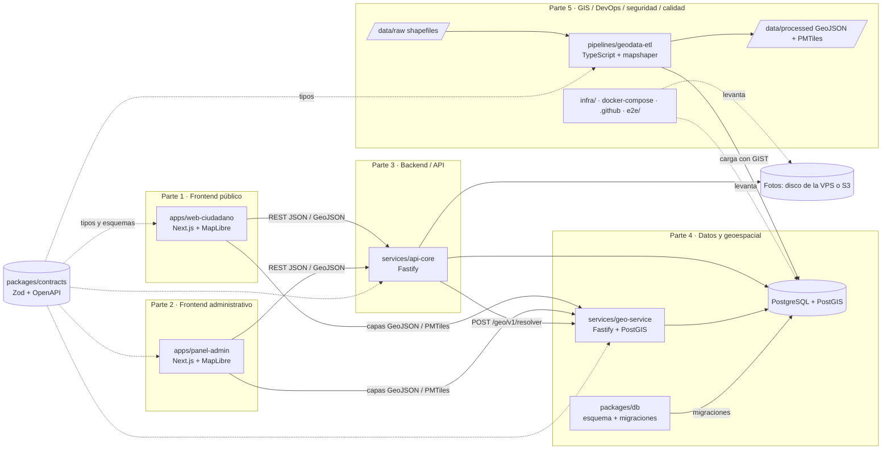

# CLAUDE.md — Mi Curichi

> **Manual operativo permanente del repositorio.** Cualquier agente o persona que trabaje aquí debe leer este archivo completo antes de tocar nada.
> Estado actual: **Fase 1 — Local, en curso.** Fase 0 aprobada el 2026-09-13. Las cinco partes están escritas y corren con los datos reales del municipio; queda la tarea 9 (E2E, seguridad, cierre). El estado exacto, los defectos abiertos y cómo retomar están en **`docs/TRASPASO.md`**.
> **Cambios aprobados el 2026-09-26; se implementan por tandas T1 a T9; avance en `docs/TRASPASO.md`.** Plan: `docs/revision/2026-09-26-plan-produccion-vps.md`; decisión: ADR 0006. Este manual ya describe el comportamiento aprobado: publicación sin moderación previa con la etiqueta «NO SE HA VERIFICADO», demora de publicación de 1 y 4 min fijada por el servidor, ubicación del dispositivo obligatoria con el punto a 60 m o menos, foto solo con la cámara dentro de la página, fotos e imágenes en WebP, 3 reportes por cuenta y por día, técnicos y ejecutivo al día cada 10 s, y producción en una VPS. Mientras una tanda no esté cerrada, el código puede seguir con el comportamiento anterior en lo que esa tanda cambia: la tabla de tandas de `docs/TRASPASO.md` dice qué falta.
> Última actualización: 2026-09-26 (plan de producción en una VPS: publicación sin moderación previa, demora en el servidor, ubicación a 60 m con precisión de 50 m, cámara y WebP, cupo diario, sondeo de 10 s, capas con huella y guarda de disco (ADR 0006). Antes, el mismo día: reportar exige cuenta; panel ejecutivo con inundación activa = nuevos + validados; una instalación por ciudad (ADR 0004); base local en PostgreSQL con Docker (ADR 0005)).
> Versiones de software verificadas el 2026-09-13 (ver §8). Distribución del trabajo en **5 partes** fijada por el usuario (§4).

## 0. Reglas de oro (leer aunque no se lea nada más)

1. **Solo se tocan las carpetas designadas de la parte que ejecuta la tarea** (§4 y §5). Fuera de ellas: documentar y avisar, nunca editar.
2. **No se cruza una puerta de fase sin un "aprobado" explícito del usuario** (§10).
3. **`data/raw/` es inmutable.** Todo `data/processed/` se regenera con un solo comando (§6).
4. **Nunca convertir un shapefile sin conocer su CRS.** Si falta `.prj`, detenerse y preguntar.
5. **Distrito y unidad vecinal se calculan por point-in-polygon**, nunca se toman de texto escrito por el usuario.
6. **No inventar** normativas, versiones, cifras ni fuentes. Lo no verificado se escribe como `<a confirmar>`.
7. **Ningún secreto en el repo.** Todo por variables de entorno con `.env.example` sin valores reales.
8. **La ubicación de un reporte es dato sensible.** Vista pública con precisión degradada cuando corresponda; identidad del reportante nunca en el mapa público. La posición del dispositivo, que se usa para comprobar el radio de 60 m, **nunca se guarda ni se registra en logs**. Los permisos de ubicación y de cámara se piden **solo al reportar**, nunca al cargar la web.
9. **Antes de programar cualquier parte: plan corto → aprobación → código.** Sin excepciones.
10. **Alcance de la Misión 1 cerrado** (§3). Todo lo demás va al backlog (§15).

---

## 1. Propósito del proyecto y problema que resuelve

**Nombre:** Mi Curichi. En el habla de Santa Cruz (Bolivia), *curichi* es un bajío o zona pantanosa donde el agua se estanca; el nombre alude a los charcos recurrentes que cada vecino conoce en su barrio.

**Problema.** En la ciudad existen puntos recurrentes de inundación y estancamiento de agua (anegamientos) que hoy no están sistematizados. La municipalidad no dispone de un inventario georreferenciado, alimentado por la ciudadanía, que permita saber **dónde**, **con qué frecuencia** y **con qué profundidad** se anega la ciudad.

**Solución.** Plataforma web de **reporte ciudadano georreferenciado de puntos de inundación**. El vecino, desde donde está, marca dónde se estanca el agua, saca una foto con la cámara y carga los datos del evento; el sistema publica el reporte como «NO SE HA VERIFICADO» tras una demora corta, lo acumula, lo valida, lo clasifica por severidad y visualiza los puntos sobre un mapa, cruzándolos automáticamente con la división administrativa oficial (**distrito municipal** y **unidad vecinal**).

**Usuarios.**

| Usuario | Qué hace | Parte |
|---|---|---|
| Ciudadano / vecino | Consulta el mapa público sin cuenta. Para reportar crea su cuenta, inicia sesión y comparte su ubicación: el punto se ajusta dentro de 60 m de su posición. La foto, opcional, solo se toma con la cámara dentro de la página. Ve sus propios reportes, también los que esperan publicarse | Parte 1 (`apps/web-ciudadano`) |
| Técnico municipal / analista | Revisa los reportes ya publicados: valida, rechaza, fusiona duplicados, reclasifica, filtra, exporta, analiza | Parte 2 (`apps/panel-admin`) |
| Administrador | Gestiona capas base, usuarios, moderación y configuración; retira del mapa un reporte ya verificado si resulta inapropiado | Parte 2 (`apps/panel-admin`) |
| Ejecutivo (secretarios, concejales, alcalde) | Ve dónde y cuánto se está inundando y cómo va el trabajo: cifra grande, pestañas por severidad y dos gráficas por distrito, sin coropleta ni selector de período, actualización cada 10 s (`/ejecutivo`) | Parte 2 (`apps/panel-admin`) |

**Contexto territorial.** Ciudad: **Santa Cruz de la Sierra, Bolivia** `<a confirmar>` (inferido por el nombre "curichi" y por la división distrito municipal / unidad vecinal, propia de esa ciudad). Capas administrativas provistas por el municipio en **shapefile**, en una carpeta llamada **`DM_UV_MZ_2025`** con tres capas: distritos municipales (DM), unidades vecinales (UV) y **manzanas** (MZ). Fuente oficial y fecha de vigencia `<a confirmar>`. Las manzanas se usan para el **render del mapa interactivo**; el point-in-polygon del MVP resuelve distrito y UV.

**Lo que este sistema ES y NO ES.** Es un **inventario de reportes ciudadanos** (percepción, no medición). **No es** un modelo hidráulico, ni un estudio de drenaje, ni un instrumento para decidir inversiones por sí solo. Ver §9.5.

---

## 2. Glosario del dominio

| Término | Definición operativa en este proyecto |
|---|---|
| **Anegamiento** | Acumulación de agua sobre la superficie (calle, acera, predio) que no drena en un tiempo razonable tras la lluvia. Es el fenómeno que se reporta. |
| **Inundación** | Anegamiento con profundidad y extensión suficientes para afectar personas, vehículos o viviendas. En el sistema no se distingue formalmente de anegamiento; la severidad (§9.1) hace la gradación. |
| **Profundidad estimada** (antes «tirante») | Altura de la lámina de agua sobre el suelo. Se estima por referencia corporal: tobillo (<10 cm), rodilla (10–40 cm), muslo (40–70 cm), >70 cm. |
| **Recurrencia / frecuencia** | Cuántas veces se anega el mismo punto: primera vez, ocasional, cada lluvia fuerte, permanente. |
| **Escorrentía** | Fracción de la lluvia que no infiltra y corre por la superficie hacia el sistema de drenaje. |
| **Sumidero (boca de tormenta, rejilla)** | Estructura de captación que toma el agua de la calle y la lleva al colector. Tiene una capacidad de captación limitada; si está tapado o es insuficiente, el agua se acumula. |
| **Cuneta** | Canal longitudinal al borde de la calzada que conduce el agua hacia los sumideros. Requiere pendiente longitudinal para funcionar. |
| **Colector** | Tubería o canal principal que recibe el agua de los sumideros. Si se satura, el agua deja de entrar e incluso puede brotar por los sumideros (sobrecarga). |
| **Bombeo (pendiente transversal)** | Inclinación de la calzada desde el eje hacia los bordes para evacuar el agua a las cunetas. Si se pierde (deformación, mal recapado), el agua queda en el carril. |
| **Contrapendiente** | Tramo donde la pendiente longitudinal se invierte y crea un punto bajo sin salida por gravedad. Causa típica de charcos permanentes. |
| **Hundimiento** | Asentamiento localizado del pavimento (subrasante débil, fuga de tubería que lava finos). Genera una depresión que atrapa agua. |
| **Ahuellamiento** | Deformación en las huellas de los neumáticos. Las huellas se convierten en canales de agua estancada. |
| **Bache** | Pérdida de material en la carpeta. Actúa como trampa de agua y el agua acelera su crecimiento (ciclo vicioso). |
| **PCI** | *Pavement Condition Index* (ASTM D6433), índice 0–100 del estado superficial del pavimento. Solo referencia; no se calcula en este sistema. |
| **IRI** | *International Roughness Index* (m/km), regularidad longitudinal. Solo referencia. |
| **Curva IDF** | Intensidad–Duración–Frecuencia de lluvia; relaciona intensidad de precipitación con su duración y período de retorno. No se implementa en Misión 1. |
| **Período de retorno** | Intervalo medio (años) entre eventos de lluvia de cierta magnitud. Referencia para diseño de drenaje. |
| **Método racional** | Q = C · i · A: caudal pico = coeficiente de escorrentía × intensidad × área. Referencia para fases futuras. |
| **Distrito municipal** | Unidad administrativa mayor de la ciudad. Capa oficial en shapefile. |
| **Unidad vecinal (UV)** | Subdivisión del distrito. Es la unidad de agregación principal del sistema. Cada UV pertenece a exactamente un distrito. |
| **Manzana (MZ)** | Bloque urbano delimitado por calles, dentro de una UV. Capa de referencia visual en el mapa; entre manzanas hay huecos (calles) por diseño, no por error. |
| **Point-in-polygon (PIP)** | Operación espacial que determina en qué polígono cae un punto. Es como el sistema asigna distrito y UV a cada reporte. |
| **Punto crítico** | Agrupación analítica de reportes validados dentro de un radio configurable (§9.2). No reemplaza a los reportes individuales. |
| **CRS / SRS** | Sistema de referencia de coordenadas. Define cómo se interpretan los números de una coordenada. |
| **EPSG:4326** | WGS 84 geográfico (lat/lon en grados). CRS obligatorio para todo lo que consume la web y para `geom` en base de datos. |
| **UTM** | Proyección métrica por zonas. Santa Cruz cae en la zona 20 Sur: WGS 84 / UTM 20S = **EPSG:32720**; capas antiguas pueden venir en PSAD56 / UTM 20S = **EPSG:24880**. `<a confirmar leyendo el .prj de cada capa>`. |
| **Shapefile** | Formato vectorial de ESRI. Un "shapefile" son varios archivos: `.shp` (geometría), `.shx` (índice), `.dbf` (atributos), `.prj` (CRS), `.cpg` (encoding). |
| **GeoJSON** | Formato JSON para geometrías. Por RFC 7946 debe estar en EPSG:4326. |
| **Teselas vectoriales / PMTiles** | Capa cortada en mosaicos por nivel de zoom, para renderizar capas grandes sin descargar todo el GeoJSON. PMTiles empaqueta todas las teselas en un único archivo servible por HTTP con *range requests*. |
| **PostGIS / índice GIST** | Extensión espacial de PostgreSQL. El índice GIST hace que el PIP sea O(log n) en lugar de recorrer todos los polígonos. |
| **Clustering visual** | Agrupación de puntos en el mapa según el zoom, solo para render (MapLibre `cluster: true`). Distinto del punto crítico, que es analítico. |
| **Jitter** | Desplazamiento aleatorio pequeño y determinista aplicado a una coordenada en la vista pública para no exponer una vivienda exacta. |
| **Demora de publicación** | Tiempo entre que el reporte llega al servidor y que se hace visible: 1 min para el 1.º reporte del día de la cuenta y 4 min para el 2.º y el 3.º. La fija el servidor en `publicar_en`; durante la espera no lo ve nadie más que su autor. |
| **Reporte sin verificar** | Reporte publicado en estado `nuevo`, que ningún técnico revisó todavía. Se muestra con la etiqueta exacta «NO SE HA VERIFICADO»; los validados dicen «Verificado». |
| **Radio del dispositivo** | Distancia máxima (60 m) entre el punto reportado y la posición que informa el teléfono al enviar. La posición del teléfono se usa para esa comprobación y no se guarda. |

---

## 3. Alcance de la Misión 1 (MVP) y fuera de alcance

### 3.1 Dentro del alcance (y solo esto)

1. **Mapa interactivo** que renderiza los puntos de inundación reportados (con clustering visual) — Parte 1.
2. **Panel de detalle** (Parte 1) al tocar/hacer clic en un punto, con como mínimo:
   - Coordenadas lat/lon (EPSG:4326).
   - **Distrito municipal** y **unidad vecinal** del punto, calculados por PIP.
   - Fecha/hora del reporte, descripción, foto (si existe), severidad y estado de verificación: «NO SE HA VERIFICADO» (`nuevo`), «Verificado» (`validado`) o «Resuelto».
3. **Resolución espacial por point-in-polygon** contra las capas oficiales cargadas en PostGIS — Parte 4.
4. **Formulario de reporte** para crear un punto nuevo, con la ubicación del dispositivo **obligatoria**: el punto arranca en la posición del teléfono y se ajusta solo dentro de un círculo de 60 m (arrastrando, con las flechas, con «mover 5 m» o escribiendo coordenadas); foto opcional tomada con la cámara dentro de la página; y los campos del modelo (§7.1) — Parte 1 (interfaz) y Parte 3 (creación, validación del radio, severidad y demora de publicación).
5. **Panel técnico mínimo** (Parte 2): tabla + mapa con filtros, moderación posterior a la publicación (validar / rechazar / fusionar / reclasificar; el admin, además, retira un verificado), exportación CSV y GeoJSON, indicadores básicos.
6. **Pipeline ETL** shapefile → GeoJSON → PostGIS, reproducible con un comando — Parte 5.
7. **Entorno local completo** con Docker Compose — Parte 5.

### 3.2 Explícitamente fuera de alcance (va a §15)

- Modelación hidráulica o hidrológica de cualquier tipo.
- Priorización de inversión, cálculo de costos, ranking de obras.
- Notificaciones (email, SMS, push), suscripciones, alertas.
- Aplicación móvil nativa (la PWA cubre el MVP).
- Integración con datos de lluvia en tiempo real, pluviómetros, radar.
- Analítica avanzada, series temporales, mapas de calor por período de retorno.
- Gestión de órdenes de trabajo o seguimiento de obras.
- Autenticación social, perfiles de ciudadano, gamificación.
- Multi-municipio (una plataforma compartida por varias ciudades). La estrategia de crecimiento es **una instalación por ciudad** (ADR 0004): la misma imagen sirve a otra ciudad o país cambiando configuración y capas (§8.2).

---

## 4. Arquitectura: 5 partes

El trabajo se divide **exactamente** en estas cinco partes. Cada parte tiene carpetas designadas, responsabilidades, límites, contratos y Definition of Done propios. Toda tarea se asigna a **una** parte.

### 4.1 Tabla resumen

| Parte | Nombre | Carpetas designadas | Qué entrega |
|---|---|---|---|
| **1** | Frontend público / experiencia ciudadana | `apps/web-ciudadano/` | Mapa público, panel de detalle, formulario de reporte, PWA accesible |
| **2** | Frontend administrativo / plataforma técnica | `apps/panel-admin/` | Moderación, filtros, exportación, indicadores, administración de capas y usuarios |
| **3** | Backend / API y lógica de negocio | `services/api-core/` (custodia `packages/contracts/`) | API REST, reglas de negocio, severidad, máquina de estados, auth, fotos, auditoría, antispam |
| **4** | Datos / base de datos y arquitectura geoespacial | `packages/db/`, `services/geo-service/` | Esquema PostGIS, migraciones, seeds sintéticos, point-in-polygon, capas, agregaciones, puntos críticos |
| **5** | GIS / DevOps / seguridad / infraestructura / calidad | `pipelines/geodata-etl/`, `infra/`, `e2e/`, `.github/`, `data/`, `docs/` (índice, `seguridad/`, `operaciones/` y `TRASPASO.md`), configuración raíz | ETL shapefile → PostGIS, Docker Compose, CI, política de seguridad, E2E transversal, calidad medida, operación y traspaso |
| — | Transversal | `packages/contracts/` | Única fuente de verdad de tipos, esquemas Zod y OpenAPI (§4.8) |

### 4.2 Diagrama



Reglas de dependencia: los frontends (Partes 1 y 2) **nunca** hablan directo con la base de datos. `api-core` (Parte 3) es el único que escribe reportes. `geo-service` (Parte 4) es de **solo lectura**. Solo `packages/db` (Parte 4) cambia el esquema, vía migraciones. Solo el ETL (Parte 5) escribe las tablas de capas.

### 4.3 Parte 1 — Frontend público / experiencia ciudadana (`apps/web-ciudadano/`)

| Aspecto | Detalle |
|---|---|
| **Propósito** | Que cualquier vecino, desde el celular, vea el mapa y reporte un punto en menos de 2 minutos. |
| **Responsabilidades** | Mapa MapLibre con capa base atribuida, capa de UV/distritos, puntos con clustering visual; popup/panel de detalle con la etiqueta «NO SE HA VERIFICADO» visible (texto, icono y color de aviso) en el detalle, las tarjetas, las pastillas del mapa y la leyenda; formulario de reporte anclado a la posición del dispositivo: «Compartir mi ubicación», precisión exigida (50 m o menos), círculo de 60 m con el marcador recortado a él, y relectura de la posición al enviar; foto con la **cámara dentro de la página** (`getUserMedia`, con Repetir y Usar esta foto), **sin ningún input de archivo** ni acceso a la galería; permisos de ubicación y cámara pedidos solo dentro del flujo de reporte, nunca al cargar; aviso previo de la demora («Se publica 1 minuto después de enviarlo», o 4) y cuenta regresiva tras enviar; «Mis reportes» desde la API; validación de campos con Zod + React Hook Form; previsualización de la UV resuelta antes de enviar; la página pública **no se refresca sola** (sin pedidos por foco, reconexión ni intervalo); PWA instalable; mobile-first; WCAG 2.2 AA; español; texto de limitaciones (§9.5) visible. |
| **NO le corresponde** | Calcular severidad, distrito o UV (los muestra, no los decide). Decidir la demora de publicación ni comprobar el radio (lo hace el servidor; la interfaz solo lo anticipa). Moderar. Almacenar fotos directamente. Hablar con la base de datos. Definir tipos de intercambio por su cuenta. |
| **Entradas** | `GET /api/v1/reportes` (GeoJSON público), `GET /api/v1/reportes/:id`, `GET /api/v1/mis-reportes` (con sesión: los reportes propios en cualquier estado, con `publicar_en`), `POST /geo/v1/resolver` (previsualización), capas de `geo-service` por la URL con huella de `CapaInfo.url`, `GET /api/v1/configuracion` (la ciudad: nombre, zona horaria, locale, centro y zoom inicial del mapa, leída en tiempo de ejecución), `GET /api/v1/auth/yo` (sesión, `reportes_restantes_hoy` y `demora_proximo_s`). |
| **Salidas** | `POST /api/v1/reportes` con `dispositivo` (`lat`, `lon`, `precision_m`, `antiguedad_s`) y `POST /api/v1/fotos`, **con sesión**: reportar exige cuenta, ver el mapa no. `POST /api/v1/auth/registro` (alta de cuenta ciudadana), `POST /api/v1/auth/login`, `POST /api/v1/auth/logout`. |
| **Dependencias** | `packages/contracts`; Parte 3 (`api-core`); Parte 4 (`geo-service`, capas). |
| **Comandos** | `pnpm --filter web-ciudadano dev / build / test / test:e2e / lint / typecheck` |
| **Definition of Done** | Compila; lint + typecheck + Vitest verdes; Playwright propio cubre: (a) abrir mapa, clic en punto, ver distrito y UV en el panel; (b) crear reporte con GPS simulado, ajuste dentro de 60 m y foto de la cámara simulada; README con comandos; `.env.example`; Lighthouse accesibilidad ≥ 90 en local `<umbral a confirmar>`. |

### 4.4 Parte 2 — Frontend administrativo / plataforma técnica (`apps/panel-admin/`)

| Aspecto | Detalle |
|---|---|
| **Propósito** | Que el técnico municipal convierta reportes crudos en un inventario validado, exportable y consultable. |
| **Responsabilidades** | Login (técnico, admin y ejecutivo; una cuenta ciudadana no entra al panel); tabla + mapa sincronizados con filtros (distrito, UV, severidad, estado, rango de fechas); moderación **posterior a la publicación**: validar / rechazar (con motivo) / fusionar duplicados / reclasificar severidad (con motivo); la bandeja y el detalle avisan que un `nuevo` ya es visible en el mapa público como «NO SE HA VERIFICADO» y que rechazarlo lo retira; el admin tiene además «Retirar del mapa» en un `validado`, con motivo obligatorio; el detalle muestra cómo se ubicó el punto («En la posición del GPS» o «Ajustado a mano, a ≤ 60 m del GPS»), la precisión y la distancia al dispositivo; exportación CSV y GeoJSON de la selección filtrada; indicadores básicos: reportes por UV, por distrito, por estado, recurrencia (puntos críticos con n ≥ 2), coropletas por UV y la tabla «De una capa anterior». **Panel ejecutivo** (`/ejecutivo`, única pantalla del rol ejecutivo; técnico y admin también la ven), limpio: la cifra grande es la inundación activa (reportes `nuevo` + `validado`), con «N verificadas · M en revisión» debajo; pestañas por severidad; dos gráficas por distrito («Inundaciones activas por distrito», con «Otros», y «Cómo va el trabajo», donde van los resueltos); la nota metodológica en una línea; sin mapa, sin coropleta y sin selector de período. Bandeja, detalle, indicadores y ejecutivo se actualizan **cada 10 s** sin caché, solo con la pestaña visible, con consultas marcadas como sondeo (`x-curichi-sondeo`), que no renuevan la inactividad de la sesión; la geometría de las capas no se vuelve a pedir. Admin: gestión de usuarios técnicos y activación de la versión vigente de capas. |
| **NO le corresponde** | Ejecutar el ETL (solo ve y activa versiones cargadas). Calcular severidad ni puntos críticos (los solicita). Analítica avanzada. |
| **Entradas** | Endpoints autenticados de `api-core`; capas (por `CapaInfo.url`, con huella) y agregados de `geo-service`. |
| **Salidas** | `PATCH /api/v1/reportes/:id/estado` (incluido `validado → rechazado`, solo admin), `PATCH /api/v1/reportes/:id/severidad`, `POST /api/v1/reportes/:id/fusionar`, `GET /api/v1/exportar`, `POST /api/v1/admin/capas/:id/activar`. |
| **Dependencias** | `packages/contracts`; Parte 3 (`api-core`); Parte 4 (`geo-service`). |
| **Comandos** | `pnpm --filter panel-admin dev / build / test / test:e2e / lint / typecheck` |
| **Definition of Done** | Compila; lint + typecheck + tests verdes; Playwright propio cubre login → filtrar por UV → validar un reporte → exportar GeoJSON; README; `.env.example`. |

### 4.5 Parte 3 — Backend / API y lógica de negocio (`services/api-core/`)

| Aspecto | Detalle |
|---|---|
| **Propósito** | Ser el único punto de escritura del dominio y el guardián de las reglas de negocio. |
| **Responsabilidades** | CRUD de reportes; máquina de estados (§7.3); cálculo de severidad (§9.1) con función pura testeada; comprobación de la posición del dispositivo (precisión, antigüedad y radio de 60 m) sin guardarla ni registrarla; llamada a `geo-service` para resolver distrito/UV al crear o mover un reporte; `publicar_en` fijado en el INSERT (1 o 4 min según el contador del día) y **una sola condición de visibilidad** (`condicionPublico` / `condicionPublicado`) aplicada en la vista pública, la técnica, la exportación, indicadores, ejecutivo, moderación y fotos; disparo del recálculo de puntos críticos en cada transición (§9.2); autenticación (sesión) y autorización por rol; validación de payloads con los esquemas de `contracts`; auditoría de cada cambio; rate limiting, antispam y **cupo diario por cuenta contado en la base** (`cuota_reporte_diaria`); idempotencia por cuenta; gestión de fotos (límite de tamaño, tipos de entrada por *magic bytes*, conversión a **WebP** de 1600 px por lado como máximo **sin metadatos**, guarda de espacio en disco, subida al almacén); fotos del autor visibles para él en cualquier estado; `GET /mis-reportes`; exportación CSV/GeoJSON con nota metodológica; healthchecks; logging estructurado. **Custodia `packages/contracts`**: revisa todo cambio de contrato propuesto por otras partes. |
| **NO le corresponde** | Definir el esquema de base de datos ni escribir migraciones (Parte 4; consume el cliente de `packages/db`). Operaciones espaciales sobre polígonos (Parte 4). ETL, infraestructura, CI (Parte 5). Render. |
| **Entradas** | Peticiones HTTP de Partes 1 y 2; respuesta de `geo-service`; cliente tipado de `packages/db`. |
| **Salidas** | Filas en `reporte_inundacion`, `reporte_foto`, `cuota_reporte_diaria`, `idempotencia`, `auditoria`, `usuario`; objetos en el almacén de fotos (disco de la VPS o S3); JSON/GeoJSON a clientes. |
| **Dependencias** | `packages/contracts`, `packages/db`, PostgreSQL/PostGIS, almacén de fotos (disco o S3; MinIO en local), `geo-service`. |
| **Comandos** | `pnpm --filter api-core dev / build / test / lint / typecheck` |
| **Definition of Done** | Compila; lint + typecheck + Vitest verdes; test de integración del camino crítico: `POST /reportes` con la posición del dispositivo a 60 m o menos → se resuelve UV → severidad calculada → estado `nuevo` con `publicar_en` a 1 o 4 min; prueba de tabla que recorre todas las rutas y comprueba que un reporte en espera no aparece en ninguna (salvo para su autor) y sí aparece al vencer la demora; test de tabla de severidad (§9.1) con todos los casos de escalamiento; test que sube una foto con EXIF GPS y verifica que el objeto guardado es WebP y no conserva EXIF, XMP ni ICC; README; `.env.example`; OpenAPI publicado en `/docs`. |

### 4.6 Parte 4 — Datos / base de datos y arquitectura geoespacial (`packages/db/`, `services/geo-service/`)

| Aspecto | Detalle |
|---|---|
| **Propósito** | Ser dueña del modelo de datos y de toda operación espacial: que el esquema evolucione solo por migraciones y que "¿en qué distrito y UV cae este punto?" se responda en milisegundos. |
| **Responsabilidades** | **`packages/db`**: esquema Drizzle de `public` y `geo` (§7); migraciones versionadas (extensiones PostGIS, tablas, índices GIST, vistas `*_vigente`); cliente tipado exportado a `api-core` y `geo-service`; seeds **sintéticos** (`db:seed:samples`) desde `data/samples/`; consulta DBSCAN y script de recálculo de puntos críticos (§9.2). **`services/geo-service`**: `POST /geo/v1/resolver` (PIP con GIST, manejo de borde, hueco y cobertura, §7.4); capas GeoJSON web y teselas con la **huella del contenido servido** en la URL (`immutable` por 1 año, `410` con una huella vieja); consultas por bbox; agregaciones por UV/distrito que cuentan los reportes publicados `nuevo`, `validado` y `resuelto`, con `n_verificados` y `severidad_max_verificada` aparte (§9.2); `GET /geo/v1/puntos-criticos`; healthchecks; caché en memoria de la versión vigente y cifras con 2 min de antigüedad como máximo. |
| **NO le corresponde** | Escribir reportes (Parte 3). Ejecutar el ETL ni cargar capas (Parte 5). Autenticación de usuarios. Render. |
| **Entradas** | Coordenadas y bbox; tablas `geo.*` cargadas por el ETL; `data/processed/` (solo lectura) para servir PMTiles. |
| **Salidas** | Migraciones aplicadas; cliente `db`; JSON de resolución (§7.4); GeoJSON; PMTiles; puntos críticos. |
| **Dependencias** | `packages/contracts`, PostGIS. |
| **Comandos** | `pnpm --filter db migrate / generate / seed:samples / test / puntos-criticos:recalcular`; `pnpm --filter geo-service dev / build / test / lint / typecheck` |
| **Definition of Done** | Las migraciones aplican desde cero sobre un PostGIS vacío y son idempotentes; seeds sintéticos cargan; tests de `geo-service` con capa sintética: punto interior → UV correcta; punto en borde → determinista y `en_limite = true`; punto en hueco → `asignado_por_proximidad = true`; punto fuera → `dentro_cobertura = false`; `EXPLAIN` del PIP muestra uso de índice GIST (documentado en README); README y `.env.example` en ambos paquetes. |

### 4.7 Parte 5 — GIS / DevOps / seguridad / infraestructura / calidad (`pipelines/geodata-etl/`, `infra/`, `e2e/`, `.github/`, `data/`, configuración raíz)

| Aspecto | Detalle |
|---|---|
| **Propósito** | Que los datos oficiales entren limpios y versionados, que todo se levante con un comando, que nada inseguro llegue a `main` y que la calidad se mida en vez de suponerse. |
| **Responsabilidades (5 frentes)** | **GIS**: pipeline completo de §6 (inspección, reproyección, validación topológica, normalización, simplificación, PMTiles, carga a PostGIS, reporte de calidad, manifiestos). **DevOps**: monorepo pnpm + Turborepo, Biome, Husky/lint-staged/commitlint, Dockerfiles, Docker Compose, GitHub Actions, README raíz. **Seguridad**: política de §13, escaneo de secretos en pre-commit y CI, auditoría de dependencias, cabeceras y CORS en infraestructura, revisión de seguridad de cada PR que toque `api-core`, fotos o autenticación. **Infraestructura**: volúmenes, redes Docker, healthchecks, `pg_dump` manual, observabilidad mínima (logs JSON, `/metrics`). **Calidad**: umbrales de cobertura `<a confirmar>`, E2E transversal en `e2e/` (recorrido ciudadano → técnico → mapa público → exportación), auditoría de accesibilidad y rendimiento (§14), checklist de DoD en la plantilla de PR. |
| **NO le corresponde** | Lógica de negocio (Parte 3). Esquema de base de datos ni migraciones (Parte 4; el ETL carga en tablas que Parte 4 define). Interfaz (Partes 1 y 2). Implementar la seguridad dentro del código de otras partes: la define, la configura en infra/CI y la audita; cada parte la implementa en lo suyo. |
| **Entradas** | `data/raw/<version>/` + `MANIFEST.md` (solo lectura); código de las demás partes para construir, probar y auditar. |
| **Salidas** | `data/processed/` y `data/samples/`; tablas `geo.*` cargadas; imágenes Docker; pipelines de CI; reportes de E2E, accesibilidad, rendimiento y seguridad. |
| **Dependencias** | mapshaper y `@turf/turf` (ETL en TypeScript, ADR 0002; GDAL, tippecanoe y Python + GeoPandas/Shapely/pyogrio quedan como referencia de §6), Docker, PostGIS; `packages/contracts` (importado directamente). |
| **Comandos** | `pnpm etl:inspect / etl:run / etl:load / etl:all / etl:test`; `docker compose up -d`; `pnpm lint / typecheck / test / build`; `pnpm test:e2e` (ver §11). |
| **Definition of Done** | `pnpm etl:all` regenera todo `data/processed/` desde cero sin intervención manual y las pruebas del ETL con Vitest (ADR 0002) cubren reproyección, reparación reportada, normalización y detección de solape/hueco con fixture sintético; `docker compose --profile servicios up -d` deja todos los servicios `healthy` (sin perfil solo levanta `postgis`); CI verde en cada PR; `pnpm test:e2e` verde con el recorrido completo; escaneo de secretos activo; README raíz con la secuencia de arranque; `.env.example` raíz. |

### 4.8 Transversal — `packages/contracts` (custodia: Parte 3)

- Contiene: enums del dominio, esquemas Zod de cada payload y respuesta, tipos TypeScript inferidos (`z.infer`), especificación **OpenAPI 3.1** (`openapi/openapi.yaml`), **tabla de severidad** (§9.1) como constante versionada, constantes de configuración de dominio (radio de recurrencia, jitter, límites de foto).
- Regla: **ninguna parte define un tipo de intercambio por su cuenta.** Si lo necesita, lo agrega aquí en una tarea que lo anuncie explícitamente; la Parte 3 revisa el cambio.
- Los cambios de contrato son **breaking por defecto**: se versionan (`/api/v1`), se documentan en `packages/contracts/CHANGELOG.md`, y las partes consumidoras se adaptan en sus propias tareas.
- El ETL (Parte 5), en TypeScript desde el ADR 0002, importa los enums directamente de `contracts`, así que los valores de `tipo` de capa y los nombres de campos son los mismos por construcción. `pnpm --filter contracts build` sigue generando `dist/dominio.json` para consumidores en otros lenguajes.

---

## 5. Estructura de carpetas y regla estricta de carpetas designadas

### 5.1 Estructura objetivo

```
MI CURICHI/
  CLAUDE.md                 # este archivo; se edita solo con autorización
  README.md                 # cómo levantar el proyecto en 5 líneas                 [Parte 5]
  package.json              # raíz del monorepo (pnpm workspaces)                   [Parte 5]
  pnpm-workspace.yaml       #                                                       [Parte 5]
  turbo.json                #                                                       [Parte 5]
  biome.json                #                                                       [Parte 5]
  docker-compose.yml        #                                                       [Parte 5]
  .nvmrc  .env.example  .gitignore  .gitattributes  .husky/                        [Parte 5]
  .github/workflows/        # CI                                                    [Parte 5]
  apps/
    web-ciudadano/          # Parte 1 — frontend público
    panel-admin/            # Parte 2 — frontend administrativo
  services/
    api-core/               # Parte 3 — API y lógica de negocio
    geo-service/            # Parte 4 — servicio geoespacial
  packages/
    contracts/              # Transversal — tipos, Zod, OpenAPI, severidad (custodia Parte 3)
    db/                     # Parte 4 — esquema Drizzle, migraciones, seeds sintéticos, cliente
  pipelines/
    geodata-etl/            # Parte 5 — ETL shapefile → GeoJSON → PostGIS (TypeScript + mapshaper, ADR 0002)
  e2e/                      # Parte 5 — Playwright transversal (recorrido completo)
  data/
    raw/                    # shapefiles originales. INMUTABLE. Solo lectura. No se versiona.
      <version>/            # p. ej. DM_UV_MZ_2025/: las capas tal como las entrega el municipio
        *.shp *.shx *.dbf *.prj *.cpg
        MANIFEST.md         # fuente, fecha de recepción, sha256 de cada archivo, CRS declarado
    processed/              # generado por el ETL (Parte 5). Reproducible. No se versiona.
      <version>/<capa>/     # p. ej. DM_UV_MZ_2025/unidad_vecinal/
    samples/                # muestras pequeñas (< 1 MB c/u), SINTÉTICAS, versionables (Parte 5)
  docs/
    TRASPASO.md             # estado exacto, tandas del plan vigente y cómo retomar (Parte 5)
    decisiones/             # ADRs; cada parte escribe los suyos; índice a cargo de Parte 5
    dominio/                # notas técnicas de drenaje y pavimento
    operaciones/            # producción en la VPS, manual, observabilidad, respaldos (Parte 5)
    revision/               # revisiones y planes aprobados (p. ej. el plan de producción en una VPS)
    seguridad/              # política, checklist de revisión de PR (Parte 5)
  infra/
    docker/                 # Dockerfiles por servicio (Parte 5)
    sql/                    # init del contenedor PostGIS: solo extensiones y roles (Parte 5).
                            # Tablas, índices y vistas van SIEMPRE por migración en packages/db (Parte 4).
```

### 5.2 Regla estricta (no negociable)

- Cada tarea se asigna a **una parte** y declara **una carpeta designada** de esa parte. Dentro de ella se puede crear, editar y borrar. Fuera de ella, **no**.
- Excepción única: `packages/contracts/` cuando el cambio es de contrato **y** se anuncia explícitamente en el plan de la tarea. La Parte 3 lo revisa.
- `docs/decisiones/` admite el ADR de la propia tarea, anunciado en el plan.
- Si se detecta un bug o mejora fuera de la carpeta designada: se documenta en el resumen de la tarea (archivo, línea, síntoma, riesgo) y se avisa. **No se toca.**
- Para tocar algo fuera de la carpeta: pedir autorización explícita describiendo **archivo, motivo y riesgo**, y esperar el "aprobado".
- La raíz del repositorio la toca **solo la Parte 5** y solo cuando la tarea declara qué archivos raíz incluye. `CLAUDE.md` se edita únicamente con autorización del usuario.
- `data/raw/` es de solo lectura para todas las partes, incluida la Parte 5.

### 5.3 Tabla `Parte → Carpetas → Puede tocar / No puede tocar`

| Parte | Carpetas designadas | Puede tocar | No puede tocar |
|---|---|---|---|
| **1** Frontend público | `apps/web-ciudadano/` | Su carpeta; `packages/contracts/` solo con cambio de contrato anunciado; su ADR en `docs/decisiones/` | `apps/panel-admin/`, `services/*`, `packages/db/`, `pipelines/*`, `data/*`, `infra/*`, `e2e/*`, raíz |
| **2** Frontend administrativo | `apps/panel-admin/` | Ídem | `apps/web-ciudadano/`, `services/*`, `packages/db/`, `pipelines/*`, `data/*`, `infra/*`, `e2e/*`, raíz |
| **3** Backend / API | `services/api-core/` | Su carpeta; `packages/contracts/` (custodia: propone y revisa cambios); su ADR en `docs/decisiones/` | `services/geo-service/`; `packages/db/` (consume el cliente, **no** edita esquema ni migraciones); `apps/*`, `pipelines/*`, `data/*`, `infra/*`, `e2e/*`, raíz |
| **4** Datos / geoespacial | `packages/db/`, `services/geo-service/` | Sus carpetas; `packages/contracts/` con anuncio; su ADR en `docs/decisiones/` | `services/api-core/`, `apps/*`, `pipelines/*`, `data/*` (lectura sí, escritura no), `infra/*`, `e2e/*`, raíz |
| **5** GIS / DevOps / seguridad / infra / calidad | `pipelines/geodata-etl/`, `infra/`, `e2e/`, `.github/`, `data/processed/`, `data/samples/`, `docs/` (índice, `seguridad/`, `operaciones/` y `TRASPASO.md`), archivos raíz de configuración declarados | Sus carpetas; **escritura** en `data/processed/` y `data/samples/`; tablas `geo.*` en PostGIS (carga de datos, no cambio de esquema); `packages/contracts/` con anuncio | `data/raw/` (solo lectura, **nunca** modificar ni renombrar); `apps/*`; `services/*`; `packages/db/` (el esquema es de Parte 4); `CLAUDE.md` sin autorización |
| — Transversal | `packages/contracts/` | Cualquier parte, solo con cambio de contrato anunciado en su plan; Parte 3 revisa | Código de las partes consumidoras (ellas se adaptan en sus propias tareas) |

---

## 6. Pipeline geoespacial: shapefile → GeoJSON → PostGIS

Todo el pipeline vive en `pipelines/geodata-etl/` y es responsabilidad de la **Parte 5** (frente GIS). Se ejecuta con **un comando** por capa y versión, y con **un comando** para todo. Es **idempotente**: correrlo dos veces produce byte a byte los mismos archivos (salvo `fecha_ejecucion` en `metadata.json`).

### 6.1 Ingesta

- Los shapefiles entran en `data/raw/<version>/` tal como los entrega el municipio; la primera versión real es la carpeta **`DM_UV_MZ_2025`**, que contiene las tres capas (`distrito_municipal`, `unidad_vecinal`, `manzana`), cada una con su conjunto completo: `.shp`, `.shx`, `.dbf`, `.prj`, `.cpg`. La correspondencia archivo → capa y los nombres de campos se declaran en `pipelines/geodata-etl/config/capas.yaml`; el comando `etl:inspect` lista archivos y campos para completarla.
- Junto a ellos, `MANIFEST.md` escrito a mano con: fuente oficial, persona/oficina que entregó, fecha de recepción, fecha de vigencia declarada, CRS declarado, y `sha256` de cada archivo (`shasum -a 256 *`).
- **Si falta `.prj`: el pipeline se detiene con error y se pregunta el CRS de origen. No se adivina.** Una vez confirmado, se registra en `MANIFEST.md` y se pasa por parámetro `--crs-origen EPSG:xxxxx`.
- Si falta `.cpg`: intentar UTF-8; si aparecen caracteres corruptos en `nombre`, probar `ISO-8859-1` con `-oo ENCODING=ISO-8859-1` y **registrar la decisión** en el reporte de calidad.

### 6.2 Inspección previa (`pnpm etl:inspect`)

Comando subyacente:

```bash
ogrinfo -al -so "data/raw/DM_UV_MZ_2025/UV.shp"
```

El ETL emite `reporte_calidad.md` sección "Inspección" con: CRS detectado (nombre + EPSG si se resuelve), número de features, tipos de geometría (y si hay mezcla Polygon/MultiPolygon), listado de atributos con tipo, conteo de nulos por atributo, encoding detectado/asumido, extensión (bbox) en CRS origen y en EPSG:4326.

Si el bbox en 4326 no cae en el entorno esperado de la ciudad (`<bbox de referencia a confirmar>`), el ETL avisa: probable CRS mal declarado.

### 6.3 Reproyección

- Salida **siempre** en **EPSG:4326**. El CRS de origen se conserva en `metadata.json` (`crs_origen`, `crs_origen_wkt`) y en la tabla `capa_version`.
- Comando subyacente (genera el `.full.geojson`):

```bash
ogr2ogr -f GeoJSON \
  -t_srs EPSG:4326 \
  -nlt PROMOTE_TO_MULTI \
  -makevalid \
  -lco RFC7946=YES \
  -lco COORDINATE_PRECISION=7 \
  "data/processed/DM_UV_MZ_2025/unidad_vecinal/unidad_vecinal.full.geojson" \
  "data/raw/DM_UV_MZ_2025/UV.shp"
```

Notas: `-nlt PROMOTE_TO_MULTI` homogeneiza a MultiPolygon; `-makevalid` repara geometrías inválidas (ver 6.4, se reporta antes/después); `COORDINATE_PRECISION=7` ≈ 1 cm, suficiente para precisión completa. Si se pasó `--crs-origen`, se agrega `-s_srs EPSG:xxxxx`.

### 6.4 Validación topológica (Python, GeoPandas/Shapely)

Se ejecuta **antes y después** de la reparación, y cada corrección se lista con el `id` afectado:

| Chequeo | Método | Acción |
|---|---|---|
| Geometría inválida (auto-intersección, anillos mal orientados) | `geom.is_valid`, `explain_validity` | `make_valid()`; si el área cambia > 0,1 % `<umbral a confirmar>`, marcar como "reparación no segura" y **preguntar** |
| Polígono vacío o área 0 | `geom.is_empty`, `area == 0` | Excluir y reportar |
| Duplicados exactos | hash de WKB | Excluir el segundo y reportar |
| Duplicados de código/nombre | `codigo` repetido | **No** reparar automáticamente; reportar y preguntar |
| Solapes entre UV | `sjoin` predicate `overlaps` + área de intersección | Reportar pares y área; solo reparar si el solape es < 1 m² `<a confirmar>` (deslizamiento de vértices) |
| Huecos entre UV dentro de un distrito | `unary_union` del distrito − `unary_union` de sus UV | Reportar área y ubicación; **no** rellenar automáticamente (ver 7.4 para el manejo en runtime) |
| UV sin distrito o con centroide fuera de su distrito | `sjoin` con `within` sobre el punto representativo | Reportar; asignar `distrito_id` por el distrito que contiene el `representative_point()` y marcar `distrito_inferido = true` |

### 6.5 Normalización de atributos

- Nombres de campo en `snake_case`, sin tildes ni ñ, en minúsculas.
- Campos mínimos de salida:

| Campo | Tipo | distrito_municipal | unidad_vecinal |
|---|---|---|---|
| `id` | string estable (`<tipo>:<codigo>`) | ✔ | ✔ |
| `codigo` | string | ✔ | ✔ |
| `nombre` | string UTF-8 | ✔ | ✔ |
| `tipo` | `distrito_municipal` \| `unidad_vecinal` \| `manzana` | ✔ | ✔ |
| `distrito_id` | string (FK lógica) | — | ✔ (y en `manzana`, junto con `unidad_vecinal_id`) |
| `version_capa` | string (`2026-09`) | ✔ | ✔ |
| `fuente` | string | ✔ | ✔ |
| `fecha_vigencia` | date ISO o null | ✔ | ✔ |

- El mapeo de campos originales → normalizados se declara en `pipelines/geodata-etl/config/<capa>.yaml` (p. ej. `NOM_UV → nombre`, `COD_UV → codigo`). Para `DM_UV_MZ_2025` el mapeo real ya está en `pipelines/geodata-etl/config/capas.yaml`: `DIS` y `UV` como código, sin campo de nombre (se genera «Distrito {codigo}» y «Unidad Vecinal {codigo}»), y `OBJECTID` para las manzanas.
- Encoding de salida **UTF-8** siempre.

### 6.6 Simplificación (dos salidas)

| Salida | Uso | Herramienta | Tolerancia inicial |
|---|---|---|---|
| `<capa>.full.geojson` | Consultas espaciales del backend; carga a PostGIS | ogr2ogr (6.3) | Sin simplificar |
| `<capa>.web.geojson` | Render en el mapa | mapshaper | `interval=3` (≈ 3 m, Visvalingam, con preservación de bordes compartidos) `<ajustar viendo el resultado>` |

Comando subyacente:

```bash
npx mapshaper "data/processed/DM_UV_MZ_2025/unidad_vecinal/unidad_vecinal.full.geojson" \
  -simplify visvalingam interval=3 keep-shapes \
  -clean \
  -o format=geojson precision=0.000001 \
     "data/processed/DM_UV_MZ_2025/unidad_vecinal/unidad_vecinal.web.geojson"
```

Se usa mapshaper y no `ogr2ogr -simplify` porque mapshaper simplifica **preservando la topología entre polígonos vecinos** (los bordes compartidos no se separan ni se cruzan). `keep-shapes` evita que desaparezcan UV pequeñas. La tolerancia usada queda en `metadata.json`.

### 6.7 Teselas vectoriales (si `web.geojson` > 5 MB)

```bash
tippecanoe -o "data/processed/DM_UV_MZ_2025/unidad_vecinal/unidad_vecinal.pmtiles" \
  -l unidad_vecinal \
  -Z 9 -z 15 \
  --detect-shared-borders \
  --no-feature-limit --no-tile-size-limit \
  --force \
  "data/processed/DM_UV_MZ_2025/unidad_vecinal/unidad_vecinal.full.geojson"
```

Rango de zoom `9–15` es inicial `<ajustar>`. En ese caso `geo-service` sirve el `.pmtiles` (archivo estático con *range requests*) y el frontend lo consume con el protocolo `pmtiles://` de MapLibre.

### 6.8 Salida y metadatos

`data/processed/<version>/<capa>/` (p. ej. `data/processed/DM_UV_MZ_2025/unidad_vecinal/`) contiene:

- `<capa>.full.geojson`, `<capa>.web.geojson`, opcional `<capa>.pmtiles`.
- `reporte_calidad.md` (humano) y `reporte_calidad.json` (máquina).
- `metadata.json`: `capa`, `version`, `crs_origen`, `crs_salida = EPSG:4326`, `n_features_entrada`, `n_features_salida`, `tolerancia_web_m`, `sha256_entrada` (del MANIFEST), `sha256_salida`, `herramientas` (versiones de GDAL/mapshaper/tippecanoe/GeoPandas), `fecha_ejecucion`.

### 6.9 Carga a PostGIS (`pnpm etl:load`)

```bash
ogr2ogr -f PostgreSQL "PG:$DATABASE_URL" \
  -nln geo.unidad_vecinal_stage \
  -lco GEOMETRY_NAME=geom \
  -lco SPATIAL_INDEX=GIST \
  -lco FID=fid \
  -nlt MULTIPOLYGON \
  -t_srs EPSG:4326 \
  -overwrite \
  "data/processed/DM_UV_MZ_2025/unidad_vecinal/unidad_vecinal.full.geojson"
```

Luego un SQL versionado en `pipelines/geodata-etl/sql/promover_capa.sql` inserta desde `*_stage` a la tabla definitiva con `version_capa`, crea la fila en `capa_version` (con `vigente = false`, salvo la excepción de abajo), y verifica: `ST_IsValid(geom)` en todas las filas, índice GIST presente (`\d geo.unidad_vecinal`), `SELECT count(*)` = `n_features_salida`.

**La carga de una versión es una sola transacción**: todas sus capas entran juntas o no entra ninguna, y una falla a mitad no deja capas a medias. En la implementación de Fase 1 (ADR 0002), `etl:load` inserta por lotes directamente en `geo.<capa>` (sin tabla `*_stage`), repara con `ST_MakeValid` y reporta lo que PostGIS declare inválido, comprueba el conteo y crea o actualiza la fila de `capa_version`.

**Activar** una versión (`vigente = true`) es acción del administrador desde el panel administrativo (Parte 2), que la deja en `auditoria`. Única excepción: si la capa **no tiene ninguna versión vigente** (primera carga en una base nueva), el ETL activa esa versión, porque sin ella el sistema no puede resolver reportes, y lo registra en `auditoria` sin actor. Las versiones siguientes se cargan sin activar y se activan desde el panel; el ETL no tiene opción para activarlas.

### 6.10 Reglas duras

1. `data/raw/` es **inmutable**: ni renombrar, ni "arreglar" un `.dbf`, ni agregar `.prj` a mano. Si hay que corregir algo del origen, es una **nueva versión** con su propio `MANIFEST.md`.
2. Todo `data/processed/` se regenera con **`pnpm etl:all`**. Si algo requiere un paso manual, el pipeline está roto.
3. **No se versionan archivos pesados en git.** `data/raw/` y `data/processed/` están en `.gitignore`. La reproducibilidad se garantiza con los `sha256` del `MANIFEST.md` (versionado) y con `metadata.json`. Los originales se guardan en almacenamiento externo del municipio/equipo `<ubicación a confirmar>`. Decisión: **no** usar Git LFS en Fase 1 (agrega fricción y cuota sin beneficio mientras el repo es local); revisar en Fase 2.
4. `data/samples/` solo contiene geometrías **sintéticas** pequeñas (< 1 MB por archivo), claramente etiquetadas como tales en un `README.md` dentro de la carpeta. Nunca un recorte real presentado como muestra sin decirlo.
5. **Contrato con el backend:** el PIP se hace en PostGIS contra `geo.<capa>` con índice **GIST** sobre `geom`, de modo que sea O(log n). Nunca cargar el GeoJSON en memoria del servicio para iterar polígonos.

### 6.11 Herramientas permitidas

`ogrinfo` / `ogr2ogr` (GDAL), `mapshaper`, GeoPandas + Shapely + pyogrio, `tippecanoe`. Nada más sin justificarlo en un ADR en `docs/decisiones/`.

**Implementación de Fase 1 (ADR 0002):** la máquina de desarrollo no tiene GDAL, Python 3.12 ni tippecanoe y no se pueden instalar sin permisos de administrador. El ETL se implementa en **TypeScript con mapshaper** (lee shapefiles con su `.prj`, reproyecta, limpia topología, simplifica preservando bordes compartidos y escribe GeoJSON) más `@turf/turf` para el reporte de calidad, y se prueba con Vitest. Las teselas se generan **al vuelo** en `geo-service` con `geojson-vt` + `vt-pbf` desde el `web.geojson` vigente, en lugar de PMTiles con tippecanoe. Los comandos de GDAL/tippecanoe de esta sección quedan como referencia equivalente para cuando existan.

---

## 7. Modelo de datos y contratos de API

El modelo de datos es propiedad de la **Parte 4**: el esquema Drizzle y las migraciones viven en `packages/db/` y ninguna otra parte crea tablas, columnas ni índices. Los contratos HTTP viven en `packages/contracts/` (custodia: Parte 3). El ETL (Parte 5) solo **carga filas** en las tablas `geo.*` que define la Parte 4.

### 7.1 Tabla `reporte_inundacion` (esquema `public`)

| Columna | Tipo | Notas |
|---|---|---|
| `id` | `uuid` PK | generado por el servidor |
| `geom` | `geometry(Point, 4326)` | índice GIST; coordenada exacta (solo visible a técnico/admin) |
| `creado_en` / `actualizado_en` | `timestamptz` | |
| `publicar_en` | `timestamptz` NOT NULL | desde cuándo es visible (migración 0015): `now()` + 60 s si es el 1.º reporte del día de la cuenta y + 240 s si es el 2.º o el 3.º, fijado por el servidor en el INSERT con el contador de `cuota_reporte_diaria`; `CHECK` entre `creado_en` y `creado_en` + 1 h. Ningún proceso publica: la visibilidad es el filtro `publicar_en <= now()` (§7.3). Los reportes anteriores a la migración quedan con `publicar_en = creado_en` |
| `evento_en` | `timestamptz` null | cuándo ocurrió el anegamiento; si null se asume `creado_en` |
| `autor_id` | `uuid` null FK `usuario` | autor, tomado de la sesión: todo reporte nuevo lo tiene (reportar exige cuenta desde la migración 0009). Null solo en reportes anteriores a las cuentas ciudadanas o si se borró la cuenta (`ON DELETE SET NULL`) |
| `distrito_id` | `text` FK `geo.distrito_municipal.id` | **calculado por el sistema** |
| `unidad_vecinal_id` | `text` FK `geo.unidad_vecinal.id` | **calculado por el sistema** |
| `version_capa` | `text` | versión de capa con la que se resolvió; permite recalcular si cambia la capa |
| `resolucion_flags` | `jsonb` | `{ en_limite, asignado_por_proximidad, distancia_m }` (§7.4) |
| `ubicacion_metodo` | enum `gps` \| `manual` | lo **deriva el servidor**, no lo manda el cliente: `gps` si el punto quedó a 2 m o menos de la posición del dispositivo, `manual` si se ajustó dentro del radio |
| `precision_gps_m` | `numeric` null | precisión que declaró el dispositivo al enviar (`Geolocation.coords.accuracy`, 50 m como máximo para aceptar el reporte) |
| `distancia_dispositivo_m` | `smallint` null, `CHECK` 0–1000 | distancia redondeada entre el punto reportado y la posición del dispositivo al enviar (migración 0013). La posición del dispositivo **no se guarda**; null en los reportes anteriores |
| `ubicacion_tipo` | enum `via_publica` \| `vivienda_o_predio` \| `otro` | activa jitter público (§13) |
| `descripcion` | `text` | 10–1000 caracteres `<límites a confirmar>` |
| `profundidad_estimada` | enum `tobillo` \| `rodilla` \| `muslo` \| `mas_70` | <10 / 10–40 / 40–70 / >70 cm |
| `frecuencia` | enum `primera_vez` \| `ocasional` \| `cada_lluvia_fuerte` \| `permanente` | |
| `causa_presunta` | enum `sumidero_tapado` \| `falta_sumidero` \| `hundimiento_pavimento` \| `contrapendiente` \| `colector_saturado` \| `desborde_cauce` \| `desconocida` | |
| `sumidero_cercano` | enum `si` \| `no` null | observación opcional (§9.3) |
| `sumidero_estado` | enum `tapado` \| `no_tapado` null | opcional |
| `agua_brota_sumidero` | `boolean` null | opcional; síntoma de colector sobrecargado |
| `severidad_calculada` | enum `baja` \| `media` \| `alta` \| `critica` | función pura §9.1; **nunca** editable a mano |
| `severidad_manual` | enum ídem, null | reclasificación del técnico |
| `severidad_motivo` | `text` null | obligatorio si hay `severidad_manual` |
| `estado` | enum `nuevo` \| `validado` \| `duplicado` \| `rechazado` \| `resuelto` | §7.3 |
| `estado_motivo` | `text` null | obligatorio en `rechazado` y `duplicado` |
| `fusionado_en_id` | `uuid` null FK self | si `duplicado`, apunta al reporte canónico |
| `punto_critico_id` | `uuid` null FK | §9.2; se recalcula, no se edita |
| `validado_por` / `validado_en` | `uuid` null / `timestamptz` null | |
| `ip_hash` | `text` null | hash con sal, solo antispam; se borra a los N días `<N a confirmar, propuesto 30>` |

`severidad_efectiva` se expone en la API como `COALESCE(severidad_manual, severidad_calculada)`.

### 7.2 Tablas complementarias

**`reporte_foto`**: `id uuid`, `reporte_id uuid FK`, `objeto_key text` (clave en el almacén: `<uuid>.webp` en las nuevas), `mime text` (`image/webp` en las nuevas), `bytes int`, `ancho int`, `alto int`, `exif_sanitizado boolean NOT NULL DEFAULT false` (debe ser `true` antes de servirse), `subido_por uuid null FK usuario` (cuenta que la subió; migración 0012, `ON DELETE SET NULL`, null en las fotos anteriores), `creado_en`. Toda foto nueva se guarda en **WebP** (calidad 80), con **1600 px por lado como máximo** y sin metadatos; las `.jpg` anteriores se sirven igual y no se reconvierten. Una foto solo se asocia a un reporte de su autor: la cuenta que crea el reporte tiene que ser la que la subió, dentro de las 24 h siguientes a la subida; las fotos sin `subido_por` no se aceptan. Mientras no tiene reporte, la ve solo quien la subió. La API expone `foto_url[]` firmadas/temporales.

**`cuota_reporte_diaria`** (migración 0014): `usuario_id uuid FK usuario ON DELETE CASCADE`, `dia date` (día calendario en `ZONA_HORARIA`), `reportes_n smallint`, `fotos_n smallint`, `actualizado_en`; PK `(usuario_id, dia)`. `api-core` la incrementa de forma atómica (`INSERT … ON CONFLICT DO UPDATE … WHERE reportes_n < máximo RETURNING`) dentro de la transacción del reporte, y el número que devuelve fija la demora de publicación. El mantenimiento borra las filas de días anteriores. Reemplaza a `usuario.ultimo_reporte_en`, que deja de usarse y se borra en la migración de contracción (0016, en un despliegue posterior).

**`idempotencia`** (migración 0004): la clave se guarda con el prefijo de la cuenta (`<usuario_id>:<clave>`), de modo que la misma clave en dos cuentas crea dos reportes; la posición del dispositivo no entra en la huella del cuerpo. Las claves viejas sin prefijo vencen solas por TTL.

**`geo.distrito_municipal`**, **`geo.unidad_vecinal`** y **`geo.manzana`**: `id text`, `codigo text`, `nombre text`, `geom geometry(MultiPolygon, 4326)` con **GIST**, `version_capa text`, `fuente text`, `fecha_vigencia date null`, `distrito_id text` (UV y manzana), `unidad_vecinal_id text` (solo manzana), `distrito_inferido boolean` (UV). PK compuesta `(id, version_capa)`; vistas `geo.<capa>_vigente` filtran por `capa_version.vigente = true`. La manzana es capa de render; el reporte no la guarda.

**`geo.capa_version`**: `id`, `capa`, `version`, `fuente`, `fecha_vigencia`, `crs_origen`, `sha256_manifiesto`, `n_features`, `cargado_en`, `vigente boolean`, `activado_por`, `activado_en`.

**`punto_critico`**: `id uuid`, `geom geometry(Point, 4326)` (centroide), `n_reportes int`, `primer_reporte_en`, `ultimo_reporte_en`, `severidad_max`, `distrito_id`, `unidad_vecinal_id`, `radio_m numeric`, `calculado_en`. Ver §9.2.

**`usuario`**: `id`, `email` (único), `nombre`, `rol` enum `ciudadano` \| `tecnico` \| `ejecutivo` \| `admin`, `activo`, `creado_en`. Contraseñas: hash con Argon2id (§8.2). La autenticación es propia de `api-core` (sesión por cookie), sin proveedor externo (§16, punto 4).

**`auditoria`**: `id`, `entidad`, `entidad_id`, `accion`, `actor_id null`, `antes jsonb`, `despues jsonb`, `creado_en`. Se escribe en cada creación (con `publicar_en`, sin la posición del dispositivo), transición de estado, reclasificación, fusión y activación de capa.

### 7.3 Máquina de estados del reporte

```
nuevo ───validar───▶ validado ───resolver───▶ resuelto
  │                     │
  │                     ├──retirar (solo admin)──▶ rechazado
  │                     └──fusionar──────────────▶ duplicado
  ├──rechazar────────────────────────────────────▶ rechazado ──reabrir (admin)──▶ nuevo
  └──fusionar────────────────────────────────────▶ duplicado
```

| Transición | Quién | Requiere |
|---|---|---|
| `nuevo → validado` | técnico, admin | — |
| `nuevo → rechazado` | técnico, admin | `estado_motivo` |
| `nuevo/validado → duplicado` | técnico, admin | `fusionado_en_id` de **otro** reporte, que debe estar `validado`; `estado_motivo` |
| `validado → resuelto` | técnico, admin | `estado_motivo` (qué se hizo) |
| `validado → rechazado` | **solo admin** | `estado_motivo`: retira del mapa un reporte ya verificado que resultó inapropiado; el técnico recibe `403`. Recalcula el punto crítico, como toda salida de `validado` |
| `rechazado → nuevo` | admin | `estado_motivo` (reapertura). Como su `publicar_en` ya pasó, vuelve a ser público al instante como «NO SE HA VERIFICADO» |

Nadie modera un reporte antes de su `publicar_en`: mientras espera, las rutas de moderación responden `404`, igual que para cualquiera que no sea su autor.

Fusión: un reporte no se fusiona consigo mismo (`409 FUSION_CONSIGO_MISMO`); el reporte y su canónico se bloquean juntos, en orden de id, para que dos fusiones cruzadas no formen un ciclo; y los reportes que apuntaban al fusionado pasan a apuntar al nuevo canónico, con una entrada de `auditoria` (`fusion:reapuntar`) por cada uno.

**Publicación sin moderación previa.** Vista pública: `nuevo` (con la etiqueta exacta «NO SE HA VERIFICADO» y `verificado = false`), `validado` («Verificado») y `resuelto` («Resuelto»), siempre con `publicar_en <= now()`. `rechazado` y `duplicado` no se publican: rechazar o fusionar un reporte lo saca del mapa. La visibilidad vive en un solo lugar: `ESTADOS_PUBLICOS` en `contracts` y las condiciones `condicionPublico` (estado público **y** `publicar_en <= now()`) y `condicionPublicado` (`publicar_en <= now()`) en `api-core`, que se aplican en la vista pública, la técnica, la exportación, indicadores, ejecutivo, moderación, fotos y agregados; una prueba de tabla recorre todas las rutas. Mientras espera, el reporte no lo ve nadie, técnicos incluidos; su autor sí lo ve en «Mis reportes» con su foto, también si queda rechazado o duplicado. Al pasar a `validado` se recalcula el punto crítico de su entorno.

### 7.4 Resolución point-in-polygon (contrato de `geo-service`)

Consulta base (usa GIST automáticamente por el operador `&&` implícito en `ST_Contains`):

```sql
SELECT uv.id, uv.codigo, uv.nombre, uv.distrito_id
FROM geo.unidad_vecinal_vigente uv
WHERE ST_Contains(uv.geom, ST_SetSRID(ST_MakePoint($1, $2), 4326))
LIMIT 1;
```

Reglas:

1. **Interior de exactamente una UV** → caso normal. El distrito se toma de `uv.distrito_id` y se cruza con un PIP sobre `geo.distrito_municipal_vigente`; si difieren, se devuelve el de la UV y se registra `resolucion_flags.distrito_discrepante = true`.
2. **Punto sobre un borde** (más de una UV con `ST_Intersects`): se elige de forma determinista la de menor `id` y se marca `en_limite = true`.
3. **Punto en un hueco entre UV** (dentro del distrito pero sin UV): se busca la UV más cercana con `ST_DWithin(geography, 20 m)` `<tolerancia a confirmar>`, se asigna y se marca `asignado_por_proximidad = true` con `distancia_m`. Si no hay ninguna a esa distancia → caso 4.
4. **Fuera de cobertura municipal** (ningún distrito lo contiene ni está a la tolerancia): `dentro_cobertura = false` y `api-core` responde `422` con código `FUERA_DE_COBERTURA`. El reporte **no se crea**.

Respuesta:

```json
{
  "dentro_cobertura": true,
  "distrito": { "id": "distrito_municipal:07", "codigo": "07", "nombre": "…" },
  "unidad_vecinal": { "id": "unidad_vecinal:123", "codigo": "123", "nombre": "…" },
  "version_capa": "2026-09",
  "en_limite": false,
  "asignado_por_proximidad": false,
  "distancia_m": null
}
```

### 7.5 Endpoints de `api-core` — Parte 3 (prefijo `/api/v1`)

| Método y ruta | Rol | Descripción |
|---|---|---|
| `POST /reportes` | autenticado, cualquier rol (rate limited) | Crea un reporte en `nuevo`; el autor sale de la sesión (el cuerpo no tiene campo de autor). Sin sesión, `401 SIN_SESION`. Body validado con `ReporteCrearSchema`, con `dispositivo` **obligatorio** (`lat`, `lon`, `precision_m` de 0 a 10 000, `antiguedad_s` ≥ 0; Zod solo acota rangos físicos) y sin `ubicacion_metodo` ni `precision_gps_m`, que deriva el servidor. Después de Zod y antes de resolver: `422 PRECISION_INSUFICIENTE` si la precisión supera 50 m, `422 POSICION_VENCIDA` si la posición tiene más de 600 s `<a confirmar>`, `422 UBICACION_FUERA_DE_RADIO` si el punto está a más de 60 m del dispositivo; ninguno gasta cupo. La posición del dispositivo no se guarda, no se registra en logs ni en auditoría y no entra en la huella de idempotencia (`Idempotency-Key`, por cuenta). Además del límite por IP, **3 reportes por cuenta y por día** calendario en `ZONA_HORARIA` (`429 CUOTA_DE_REPORTES`: «Ya enviaste los 3 reportes de hoy. Vas a poder enviar otro mañana», con `Retry-After` hasta la medianoche local). Resuelve UV vía `geo-service`, calcula severidad y fija `publicar_en`: 60 s el 1.º del día, 240 s el 2.º y el 3.º. El `201` y el replay devuelven `publicar_en` y `segundos_para_publicar`, calculados en la base; un replay devuelve el mismo `publicar_en`. |
| `POST /fotos` | autenticado, cualquier rol (rate limited) | Multipart; máx. `FOTO_MAX_BYTES` (propuesto 8 MB) y 3 fotos por reporte `<a confirmar>`; entran `image/jpeg`, `image/png` e `image/webp` por *magic bytes* (HEIC no: su cargador está bloqueado en sharp) y **sale WebP** (calidad 80, 1600 px por lado como máximo, primer cuadro si es animada, sin metadatos). Además del límite por IP, **12 fotos por cuenta y por día** (`429 CUOTA_DE_FOTOS`), reservadas antes de procesar y devueltas si el procesamiento falla. `507 SIN_ESPACIO` si el disco de fotos queda bajo `FOTOS_MIN_LIBRE_BYTES`, antes de procesar y sin gastar cupo. Devuelve `objeto_key` temporal, que solo esa cuenta puede asociar a su reporte (§7.2). |
| `GET /fotos/:key` | público (rate limited) | Sirve una foto ya sanitizada (`<uuid>.webp`; `<uuid>.jpg` solo para las anteriores; otra extensión da `404`), con `nosniff`. La de un reporte **publicado** (`nuevo` pasada la demora, `validado` o `resuelto`) se sirve a cualquiera con `public, no-cache` y `ETag`, comprobando la visibilidad antes de responder `304`: las fotos de reportes sin verificar se ven en público junto con el reporte. El **autor** ve las suyas en cualquier estado (en espera, rechazado o duplicado) con `private, no-store`. Una foto **todavía sin reporte la ve solo quien la subió**, con `private, no-store`; técnicos incluidos, cualquier otro recibe `404`. Todo lo demás da `404` con `no-store`. |
| `GET /reportes` | público | **Siempre vista pública**, traiga o no cookie de sesión: `nuevo` (con `verificado = false`), `validado` y `resuelto`, solo con `publicar_en <= now()`, con jitter y sin autor. Query: `bbox`, `estado`, `distrito_id`, `unidad_vecinal_id`, `punto_critico_id`, `severidad`, `desde`, `hasta`, `pagina`, `limite`. Responde `FeatureCollection`. |
| `GET /reportes/:id` | público | Detalle público; `404` si está en espera, `rechazado` o `duplicado`, también para técnicos. |
| `GET /mis-reportes` | autenticado | Los reportes propios (50 como máximo), en la vista pública más `estado`, `verificado`, `publicar_en` y `retirado`, en cualquier estado. `401` sin sesión. `Cache-Control: private, no-store` y `Vary: Cookie`. |
| `GET /tecnico/reportes`, `GET /tecnico/reportes/:id` | técnico, admin | Vista técnica: todos los estados de los reportes ya publicados (`publicar_en <= now()`; los que esperan no aparecen), coordenada exacta, precisión, distancia al dispositivo y propiedades de moderación; mismos filtros que `GET /reportes`. `Cache-Control: private, no-store`. |
| `PATCH /reportes/:id/estado` | técnico, admin | `{ estado, estado_motivo?, fusionado_en_id? }` según §7.3 (`validado → rechazado` solo admin). `404` mientras el reporte espera su `publicar_en`. |
| `PATCH /reportes/:id/severidad` | técnico, admin | `{ severidad_manual, severidad_motivo }` o `null` para volver a la calculada. |
| `POST /reportes/:id/fusionar` | técnico, admin | Atajo: marca `:id` como `duplicado` de `{ canonico_id }` (reglas de fusión en §7.3). |
| `GET /exportar` | técnico, admin | `formato=csv\|geojson` + mismos filtros de `GET /reportes`, en la vista técnica (sin los reportes en espera). Hasta `EXPORTAR_MAX_FILAS` (50 000) filas; si la selección tiene más, no recorta en silencio: el GeoJSON trae `total`, `exportados` y `truncado`, el CSV lo dice en su encabezado y la respuesta lleva `X-Curichi-Truncado: 1`. |
| `GET /indicadores` | técnico, admin | `total` y conteos por UV, distrito y severidad sin rechazados ni duplicados; `por_estado` con todos los estados; puntos críticos con `n_reportes ≥ 2`. Solo reportes publicados (`publicar_en <= now()`). **Sin caché**: deduplicación de las consultas en vuelo. |
| `GET /ejecutivo/resumen` | ejecutivo, tecnico, admin | Query `ventana=7d\|30d\|todo` (la pantalla ejecutiva usa `todo`). `activas` (inundación activa = `nuevo` + `validado`: `total`, `verificadas`, `en_revision` y `por_severidad` con la severidad efectiva), `resueltas`, `por_estado` y `por_distrito` (cada distrito con sus `activas`, `por_estado` y `en_capa_vigente`); `ultimo_reporte_en` truncado al minuto. Solo reportes publicados. **Sin caché**: deduplicación de las consultas en vuelo. Forma exacta en `packages/contracts/CHANGELOG.md` (0.6.0). |
| `GET /configuracion` | público | Ciudad de la instalación: `{ ciudad: { nombre, pais, zona_horaria, locale, centro: { lon, lat }, zoom_inicial } }`, que las apps leen en tiempo de ejecución (§8.2). `Cache-Control: public, max-age=300`. |
| `POST /auth/registro` | público (rate limited) | Alta de cuenta ciudadana: el rol siempre es `ciudadano`. Responde igual (`201 CUENTA_LISTA`) exista o no el correo y no inicia sesión; `429 DEMASIADAS_CUENTAS` por IP, por hora y con un tope diario (`ALTAS_POR_DIA_POR_IP` = 10 `<a confirmar>`, contado en la base). |
| `POST /auth/login`, `POST /auth/logout`, `GET /auth/yo` | — / autenticado | Sesión para todos los roles; el login rota la sesión. `/auth/yo` devuelve además `reportes_restantes_hoy`, `demora_proximo_s` (60 o 240), `puede_reportar_desde` (`null` o la próxima medianoche local si ya no quedan reportes hoy) y, solo a técnico, admin y ejecutivo, `panel_url` (URL del panel, o `null` si el despliegue no la configuró). |
| `GET /admin/capas` | técnico, admin | Lista versiones cargadas. |
| `POST /admin/capas/:id/activar` | admin | Activa una versión, con auditoría, e invalida la caché de capas de `geo-service`. |
| `GET /health`, `GET /ready` | público | Liveness / readiness. `/ready` comprueba la base, `geo-service` (su `/health`) y el almacén de fotos (con S3, que responda; en disco, que quede espacio por encima de `FOTOS_MIN_LIBRE_BYTES`, o `fotos: 'poco_espacio'`). Responde `503` solo si falla la base; con `geo-service` o las fotos caídos o sin espacio, `200` con `degradado: true`. |
| `GET /docs` | público en local | OpenAPI UI. |

### 7.6 Endpoints de `geo-service` — Parte 4 (prefijo `/geo/v1`)

| Método y ruta | Descripción |
|---|---|
| `POST /resolver` | `{ lat, lon }` → §7.4 (distrito, UV y manzana). Lo llama `api-core` al crear un reporte y también es público, para que el formulario muestre la UV antes de enviar. La previsualización pública tiene cupo por IP (`GEO_RATE_LIMIT_CONSULTAS_POR_MINUTO`); las llamadas de `api-core` llevan la cabecera interna `x-token-interno` (`GEO_TOKEN_INTERNO`) y quedan fuera del rate limit. |
| `GET /capas` | Información de las capas vigentes: si cada una se sirve como GeoJSON o por teselas, y su `url` con la **huella** del contenido servido (sha del GeoJSON en memoria), que es la que usan los clientes. `public, no-cache`. |
| `GET /capas/vigentes` | Versión vigente por capa: `{ distrito_municipal, unidad_vecinal, manzana }`. `public, no-cache`. |
| `GET /capas/{capa}/v/{huella}` | `capa` = `distrito_municipal` \| `unidad_vecinal` \| `manzana`. GeoJSON web de la versión vigente. Con la huella vigente, `public, max-age=31536000, immutable` y `ETag`; con una huella vieja, `410 CAPA_CAMBIO` con `no-store` (el cliente vuelve a pedir `/capas`). `413 USAR_TESELAS` si supera `UMBRAL_TESELAS_BYTES`. `GET /capas/{capa}` sin huella queda como alias, con `public, no-cache`. |
| `GET /teselas/{capa}/{huella}/{z}/{x}/{y}.mvt` | Teselas vectoriales generadas al vuelo desde la capa vigente (`geojson-vt` + `vt-pbf`), `immutable` por 1 año con la huella vigente y `410 CAPA_CAMBIO` con una vieja; `204` si la tesela está vacía. La ruta sin huella queda como alias, con `public, no-cache`. |
| `GET /agregados/unidades-vecinales` | Reportes publicados por UV (`nuevo`, `validado` y `resuelto` con `publicar_en <= now()`), con `n_verificados` y `severidad_max_verificada` (solo `validado` y `resuelto`), puntos críticos y severidad máxima. La coropleta pública usa `severidad_max_verificada`: una UV que solo tiene reportes sin verificar se pinta neutra. Cifras con 2 min de antigüedad como máximo (TTL de 100 s, `GEO_CACHE_AGREGADOS_MS`; edad máxima de 120 s, `GEO_CACHE_AGREGADOS_EDAD_MAX_MS`), `public, no-cache`. |
| `GET /puntos-criticos?bbox=` | Puntos críticos §9.2 (solo con reportes verificados), con el centroide público (`geom_publico`); como mucho 5000 por respuesta. Misma caché que los agregados (2 min como máximo). |
| `POST /capas/invalidar` | **Interna**: la llama `api-core` al activar una versión de capa. Exige `x-token-interno` (`403` sin él), no figura en el OpenAPI y el proxy de entrada la corta con `404`. |
| `GET /health`, `GET /ready`, `GET /metrics` | `/metrics` con token (`METRICAS_TOKEN`, obligatorio en producción). |

### 7.7 Dónde vive cada contrato

- `packages/contracts/src/dominio/enums.ts` — todos los enums de §7.1.
- `packages/contracts/src/dominio/severidad.ts` — tabla de puntos, pesos, bandas y reglas de escalamiento (§9.1).
- `packages/contracts/src/dominio/geo.ts` — `distanciaMetros` (haversine) y `dentroDelRadio`, la misma cuenta del radio de 60 m en la interfaz y en `api-core`.
- `CONFIG_DOMINIO` y `ESTADOS_PUBLICOS` — parámetros del plan de la VPS: `REPORTE_RADIO_DISPOSITIVO_M` (60), `PRECISION_DISPOSITIVO_MAX_M` (50), `POSICION_ANTIGUEDAD_MAX_S` (600), `DEMORA_PUBLICACION_PRIMERO_S` (60), `DEMORA_PUBLICACION_SIGUIENTES_S` (240), `REPORTES_POR_DIA_POR_CUENTA` (3), `FOTOS_POR_DIA_POR_CUENTA` (12), `ALTAS_POR_DIA_POR_IP` (10), `FOTO_FORMATO_SALIDA` (`image/webp`), `FOTO_CALIDAD_WEBP` (80), `FOTO_ALTO_MAX_PX` (1600) y las etiquetas públicas de estado («NO SE HA VERIFICADO», «Verificado», «Resuelto»).
- `packages/contracts/src/esquemas/reporte.ts`, `geo.ts`, `auth.ts`, `admin.ts` — Zod.
- `packages/contracts/openapi/openapi.yaml` — generado desde Zod (`pnpm --filter contracts build`), no editado a mano.
- `packages/contracts/dist/dominio.json` — export en JSON de enums y configuración de dominio, para consumidores en otros lenguajes (el ETL, en TypeScript desde el ADR 0002, importa `contracts` directamente).

---

## 8. Stack tecnológico y justificación

### 8.1 Versiones estables verificadas (2026-09-13)

Fuentes: registro npm (`npm view <pkg> version`), `nodejs.org/dist/index.json`, Docker Hub (`postgis/postgis`), PyPI, GitHub Releases. Se fija el **rango de minor** y se congela el patch exacto en el lockfile al instalar en Fase 1.

| Componente | Versión estable verificada | Decisión / nota |
|---|---|---|
| Node.js | **24.x LTS** (24.21.0 "Krypton") | Node 26 es *Current* (26.8.2), no LTS todavía → **no usar**. Fijar en `.nvmrc` y `engines`. |
| pnpm | 12.4.x | Gestor del monorepo. |
| Turborepo | 2.10.x | Orquestación de tareas y caché. |
| TypeScript | 5.9.x (instalada 5.9.3) | `strict: true`. La primera opción era 7.0.x; al instalar se fijó la alternativa prevista, **5.9.x**, en todos los paquetes (TS 7 solo llega como dependencia interna de commitlint). |
| Next.js | 16.3.x (App Router) | Partes 1 y 2. |
| React | 19.3.x | |
| Tailwind CSS | 4.3.x | |
| shadcn/ui | CLI vigente (los componentes se copian al repo, no es dependencia versionada) | |
| TanStack Query | 5.102.x | Estado de servidor en frontends. |
| Zod | 4.6.x | Validación compartida en `contracts`. |
| React Hook Form | 7.88.x | Formulario de reporte. |
| MapLibre GL JS | 6.9.x | Mapa. Sin servicios propietarios de pago. |
| pmtiles (JS) | 4.5.x (no instalado) | No se usa en Fase 1: `geo-service` genera las teselas al vuelo con `geojson-vt` + `vt-pbf` y el mapa las pide por URL `{z}/{x}/{y}` (ADR 0002). Se instala si se adoptan PMTiles (§6.7). |
| deck.gl | — | **No** en Misión 1. Solo si los puntos superan ~50 000 en pantalla `<umbral a confirmar>`; se decidirá con ADR. |
| Fastify | 5.12.x | `api-core` y `geo-service`. |
| Drizzle ORM | 0.45.x | Prisma está en **8.0.0-rc** (no estable) → descartado por ahora. Geometría vía SQL crudo tipado con la plantilla `sql` de Drizzle (p. ej. `ST_Contains`). |
| PostgreSQL + PostGIS | imagen `postgis/postgis:18-3.6` (PG 18, PostGIS 3.6) | PG 19 está en beta → no usar. |
| MinIO | `ghcr.io/coollabsio/minio:RELEASE.2025-10-15T17-29-55Z`, fijada por digest | Solo desarrollo (perfil `minio`): almacenamiento S3-compatible de fotos en local. MinIO archivó su edición comunitaria en abril de 2026 y ya no publica imágenes (`minio/minio` salió de Docker Hub y `quay.io/minio/minio` rechaza las descargas anónimas); esta es la misma versión compilada desde el código oficial. En producción, el disco de la VPS (ADR 0006); un S3 gestionado queda como opción con `S3_ENDPOINT`. |
| sharp | 0.35.x | Conversión a WebP, redimensionado y **eliminación de EXIF** en `api-core`. |
| Vitest | 4.1.x (instalada 4.1.11) | La primera opción era 5.0.x; al instalar se fijó la alternativa prevista, **4.x**, en todos los paquetes que la usan. |
| Playwright | 1.63.x | E2E de mapa y formulario. |
| Biome | 2.5.x | Lint + formato en un solo binario (elegido sobre ESLint + Prettier). Reglas a11y incluidas. |
| Husky + lint-staged + commitlint | 9.1.x / 17.5.x / 21.2.x (instaladas 9.1.7, 17.5.1 y 21.2.2) | Conventional Commits. |
| GDAL | 3.13.x | `ogrinfo`, `ogr2ogr`. |
| mapshaper | 0.7.x | Simplificación con topología. |
| tippecanoe (felt) | 2.79.x | PMTiles. |
| Python | 3.12+ | No se usa en Fase 1: el ETL está en TypeScript (ADR 0002). Referencia del diseño original de §6. |
| GeoPandas / Shapely / pyogrio | 1.1.x / 2.1.x / 0.13.x | Referencia de §6.4; en Fase 1 la validación topológica y el reporte de calidad usan `@turf/turf` (ADR 0002). |
| pytest | — | No se usa: las pruebas del ETL son de Vitest (ADR 0002). |

### 8.2 Justificación de cada elección

- **Monorepo pnpm + Turborepo.** Cinco partes con un paquete de contratos compartido; pnpm resuelve workspaces con enlaces estrictos (evita dependencias fantasma) y Turborepo cachea lint/test/build por paquete, lo que hace el CI barato.
- **TypeScript `strict`.** Los contratos entre partes son tipos; el modo estricto es lo que hace que un cambio de contrato rompa el `typecheck` del consumidor en lugar de romper en producción.
- **Next.js App Router para las Partes 1 y 2.** Un solo framework para ambos frontends, PWA soportada, renderizado en servidor para la página pública (SEO y primera carga en móvil), y ecosistema shadcn/ui + Tailwind para construir rápido con accesibilidad razonable de base.
- **MapLibre GL JS.** Open source, sin token ni cuota, render vectorial por GPU, clustering nativo, y soporte de PMTiles. Los mapas base se sirven con atribución correcta (ver §14). No se depende de Mapbox ni Google Maps.
- **Fastify para `api-core`.** Ligero, rápido, con validación por esquema JSON integrada (se enchufan los esquemas Zod de `contracts`) y generación de OpenAPI. NestJS se descartó por añadir capas de abstracción que no aportan en dos servicios pequeños.
- **`geo-service` en Node + PostGIS (no Python).** Decisión propuesta `<a confirmar en §16>`. Razones: (1) el trabajo pesado (PIP, bbox, agregaciones) lo hace PostGIS con GIST, no el lenguaje del servicio; (2) comparte `contracts` en TypeScript sin traducción; (3) una sola toolchain en runtime simplifica Docker y CI; (4) FastAPI + GeoPandas brillaría si hubiera que hacer geometría en memoria por petición, y aquí no hay que hacerlo. Con el ADR 0002 también el ETL pasó a TypeScript, así que Python no se usa en Fase 1.
- **ETL en TypeScript con mapshaper (ADR 0002).** El diseño original era Python (GeoPandas/Shapely/pyogrio) + CLI de GDAL/mapshaper/tippecanoe, pero la máquina de desarrollo no tiene GDAL, Python ni tippecanoe. mapshaper lee los shapefiles con su `.prj`, reproyecta, limpia topología y simplifica preservando bordes compartidos; `@turf/turf` arma el reporte de calidad; las pruebas son de Vitest. Corre offline, no en el camino de una petición. Los comandos de GDAL/tippecanoe de §6 quedan como referencia equivalente.
- **PostgreSQL + PostGIS.** Estándar de facto para datos espaciales: índices GIST, `ST_Contains`, `ST_ClusterDBSCAN`, `geography` para distancias en metros, y un solo motor para reportes y capas.
- **Drizzle ORM.** Migraciones versionadas en SQL legible, tipos inferidos del esquema y `sql` crudo tipado para PostGIS. Esquema y migraciones centralizados en `packages/db` (Parte 4), consumidos por `api-core` y `geo-service`. Prisma está en RC (8.0.0-rc.14) al momento de esta verificación.
- **Docker Compose.** Sin perfiles levanta solo `postgis`; el perfil `servicios` suma el job de migraciones, `api-core`, `geo-service`, las dos apps y el proxy HTTPS (Caddy), y los perfiles `minio`, `respaldos` y `observabilidad` completan la pila (§11). En desarrollo, `docker compose up -d postgis` + `pnpm dev` levantan todo.
- **Base local en Docker (ADR 0005).** Desde el 2026-09-26 la máquina de desarrollo tiene Docker Desktop y la base local es el contenedor `postgis` (`postgis/postgis:18-3.6`, la misma versión que producción), levantado con `docker compose up -d postgis`. Cada servicio usa también en local su rol de mínimo privilegio: `api-core` con `API_DATABASE_URL` (`curichi_api`) y `geo-service` con `GEO_DATABASE_URL` (`curichi_geo`), leídas del `.env` raíz al arrancar con `pnpm dev`; migraciones, ETL y seeds van con el rol dueño (`DATABASE_URL`). Así se prueban en local las migraciones desde cero, los privilegios (`pnpm privilegios`), los bloqueos y la concurrencia. Las fotos van a disco (`infra/.storage/`) mediante un adaptador con interfaz S3-compatible, o a S3 con `S3_ENDPOINT` (MinIO del perfil `minio` en local). En producción, en la VPS, el modo oficial es el disco, con guarda de espacio (`FOTOS_MIN_LIBRE_BYTES`, propuesto 2 GiB: por debajo, `507 SIN_ESPACIO` y `/ready` degradado) y alerta de disco (ADR 0006); un S3 gestionado sigue siendo posible con `S3_ENDPOINT`.
- **PGlite como alternativa sin Docker (ADR 0002 y 0003).** PostGIS **dentro de Node** con PGlite (Postgres compilado a WASM) + la extensión oficial `@electric-sql/pglite-postgis` (experimental), expuesto por protocolo de PostgreSQL con `@electric-sql/pglite-socket` en el puerto 5433 con multiplexado de conexiones; `pnpm db:local` levanta esa base y aplica migraciones pendientes. `api-core` y `geo-service` se conectan igual, con el driver `pg` y una `DATABASE_URL`. Es de una sola conexión, así que no sirve para probar concurrencia, bloqueos ni privilegios; se sigue usando para las bases efímeras de las pruebas.
- **Configuración de la ciudad en tiempo de ejecución (ADR 0004).** Una instalación por ciudad con la misma imagen: de una ciudad a otra cambian las variables `CIUDAD_NOMBRE`, `CIUDAD_PAIS`, `CIUDAD_LOCALE`, `CIUDAD_CENTRO_LON`, `CIUDAD_CENTRO_LAT`, `CIUDAD_ZOOM_INICIAL`, `ZONA_HORARIA` y `CRS_METRICO_EPSG` (por defecto, Santa Cruz: `CONFIG_DOMINIO.CIUDAD_POR_DEFECTO` en `contracts`), las capas que carga el ETL y las credenciales, dominios y respaldos. `api-core` valida la ciudad al arrancar (un valor inválido impide arrancar) y la publica en `GET /api/v1/configuracion`; las apps la leen en tiempo de ejecución, así que cambiar de ciudad no exige recompilar. `ZONA_HORARIA` define qué día es «hoy» en los filtros por fecha y en la exportación; `CRS_METRICO_EPSG`, la proyección en metros de §9.2.
- **Fuentes tipográficas** vía `@fontsource` (Sora y Source Sans 3 empaquetadas, sin llamadas a Google Fonts en runtime).
- **Componentes de UI** hechos a medida siguiendo el UI kit del usuario (§14.4); shadcn/ui no se usa en Fase 1 para no depender de su registro remoto con la red lenta disponible.
- **Contraseñas** con Argon2id (parámetros de OWASP: m = 19 MiB, t = 2, p = 1), calculado en hilos de trabajo con `node:crypto` y con `hash-wasm` de respaldo, sin dependencias nativas (ADR 0002). Los hashes `scrypt` anteriores se migran solos a Argon2id en el siguiente inicio de sesión correcto.
- **Biome.** Un binario para lint y formato, mucho más rápido que ESLint + Prettier, con reglas de accesibilidad. Si en Fase 1 se necesita una regla que Biome no tiene (p. ej. específica de Next), se evalúa añadir ESLint solo para eso, con ADR.
- **Vitest + Playwright.** Vitest comparte config con Vite/Next y es rápido; Playwright es el estándar para E2E con soporte de geolocalización simulada (`context.setGeolocation`), esencial para probar el formulario. El ETL también se prueba con Vitest: está escrito en TypeScript (ADR 0002), así que pytest no se usa.
- **GitHub Actions.** Lint, typecheck, test y build en cada PR, con caché de Turborepo.
- **Observabilidad mínima.** Logs JSON (pino en Fastify), `X-Request-Id` propagado de `api-core` a `geo-service`, `/health` y `/ready`, y métricas básicas (latencia por ruta, reportes creados, rechazos por rate limit, reportes fuera de radio, antigüedad del reporte sin verificar más viejo y espacio libre del disco de fotos) expuestas en `/metrics` en formato de texto de Prometheus (con token), que recogen Prometheus y Alertmanager en el perfil `observabilidad` del Compose (§16, punto 12). Alertmanager avisa, además, cuando el disco de fotos queda bajo el umbral y cuando el reporte sin verificar más antiguo supera el plazo de revisión de la bandeja `<plazo a confirmar con el municipio>`.
- **Producción en una VPS (ADR 0006).** Una instalación por ciudad (ADR 0004) corre en una VPS con una réplica de cada servicio, el `docker-compose.yml` del repositorio y las imágenes del CI. Con pocas pantallas internas, técnicos y ejecutivo se mantienen al día con un sondeo de 10 s sin caché, sin SSE ni `LISTEN/NOTIFY`; la página pública no hace tráfico automático, y capas y teselas llevan la huella del contenido en la URL, así que se cachean 1 año y pueden ir detrás de un CDN sin purgas. Todo el estado de la publicación diferida (`publicar_en`, cupo diario, idempotencia) vive en la base, así que vale igual con N réplicas.

---

## 9. Criterios técnicos de dominio

### 9.1 Matriz de severidad (explícita y reproducible)

La severidad es una **función pura** `severidad(profundidad, frecuencia) → { puntaje, banda }` que vive en `packages/contracts/src/dominio/severidad.ts` y se ejecuta en `api-core` (Parte 3). El frontend solo la muestra (puede pre-visualizarla con la misma función, pero el valor guardado es el del servidor). Versión vigente: **`severidad_version = 2`** (2026-09-25). La v1 (cuatro variables, rango 5–20) queda en el historial de `packages/contracts/CHANGELOG.md`.

**Paso 1 — puntos por variable (1 a 4):**

| Puntos | Profundidad (P) | Frecuencia (F) |
|---|---|---|
| 1 | tobillo (<10 cm) | primera vez |
| 2 | rodilla (10–40 cm) | ocasional |
| 3 | muslo (40–70 cm) | cada lluvia fuerte |
| 4 | >70 cm | permanente |

**Paso 2 — puntaje ponderado:**

```
puntaje = 2·P + 1·F        → rango 3 … 12
```

La profundidad pesa doble porque es la variable más ligada al riesgo directo para personas y vehículos (pérdida de estabilidad al caminar, ingreso de agua a motores) y a la probabilidad de daño en viviendas.

**Paso 3 — banda base:**

| Puntaje | Banda |
|---|---|
| 3 – 4 | `baja` |
| 5 – 7 | `media` |
| 8 – 10 | `alta` |
| 11 – 12 | `critica` |

**Paso 4 — reglas de escalamiento (solo suben, nunca bajan; se aplican en orden):**

| Regla | Condición | Efecto | Razón |
|---|---|---|---|
| E1 | P = 4 (>70 cm) | banda = `critica` | Profundidad por encima del muslo es riesgo de arrastre y de daño mayor, sin importar el resto. |
| E3 | F = 4 (permanente) | banda mínima `media` | Agua permanente indica falla de drenaje (contrapendiente o colector) aunque la profundidad sea baja. |

E1 se anota siempre que P = 4, aunque la banda base ya sea `critica`. Con estas bandas E3 no llega a dispararse (F = 4 da puntaje ≥ 6, ya `media`); se conserva como guarda.

**Ejemplos de verificación (deben estar en el test):**

| P | F | Puntaje | Base | Escalamiento | Final |
|---|---|---|---|---|---|
| 1 | 1 | 3 | baja | — | `baja` |
| 1 | 4 | 6 | media | — | `media` |
| 2 | 2 | 6 | media | — | `media` |
| 2 | 4 | 8 | alta | — | `alta` |
| 3 | 3 | 9 | alta | — | `alta` |
| 4 | 1 | 9 | alta | E1 | `critica` |
| 4 | 4 | 12 | critica | E1 | `critica` |

Los pesos, cortes y reglas son **parámetros iniciales** propuestos por este documento; deben validarse con el técnico municipal en Fase 1 `<a confirmar>`. Cualquier cambio es un cambio de contrato con versión (`severidad_version` guardado junto al reporte).

### 9.2 Recurrencia espacial (puntos críticos)

- **Objetivo:** que varios reportes del mismo charco se vean como **un punto crítico** con historial, sin perder ningún reporte individual.
- **Solo con verificados.** Desde la publicación sin moderación previa, los reportes `nuevo` («NO SE HA VERIFICADO») se ven en el mapa, pero los puntos críticos y el color público de gravedad por UV (`severidad_max_verificada`, §7.6) se arman **solo con reportes verificados** (`validado` y `resuelto`), para que reportes sin revisar no fabriquen recurrencia: un solo reporte falso de más de 70 cm no puede pintar de crítica una UV entera.
- **Radio:** `RECURRENCIA_RADIO_M = 25` (configurable en `contracts`) `<a confirmar>`. Justificación: cubre el error típico de GPS de celular en calle urbana más el ancho de una calzada; radios mayores empiezan a fusionar esquinas distintas.
- **Algoritmo:** `ST_ClusterDBSCAN(geom_m, eps := RECURRENCIA_RADIO_M, minpoints := 1) OVER ()` sobre los reportes en estado `validado` o `resuelto`, con `geom_m` = `ST_Transform(geom, CRS_METRICO_EPSG)` para que `eps` esté en metros. `CRS_METRICO_EPSG` es el CRS métrico de la ciudad, configurable por instalación (§8.2); el valor por defecto es el de Santa Cruz, 32720 (WGS 84 / UTM 20S). El recálculo incremental de la vecindad mide en la misma proyección (`ST_DWithin` sobre `ST_Transform(geom, CRS_METRICO_EPSG)`), así que el completo y el incremental miden la misma distancia. Se eligió DBSCAN porque es determinista, no requiere fijar el número de grupos y agrupa por cercanía transitiva.
- **Salida:** tabla `punto_critico` (§7.2) con centroide, `n_reportes`, primer y último reporte, `severidad_max` (de `severidad_efectiva`), distrito y UV (resueltos por PIP del centroide). Cada reporte guarda `punto_critico_id`.
- **Cuándo se recalcula:** en cada transición a `validado`/`resuelto`/`duplicado` y al retirar un verificado (`validado → rechazado`), para la vecindad del reporte, y con un job completo bajo demanda (`pnpm --filter db puntos-criticos:recalcular`). La consulta DBSCAN y el script viven en `packages/db` (Parte 4); `api-core` (Parte 3) dispara el recálculo en cada transición; `geo-service` (Parte 4) expone el resultado.
- **Limitación conocida:** DBSCAN encadena; una fila de reportes a lo largo de una calle puede unirse en un solo grupo alargado. Se reporta como advertencia cuando el diámetro del grupo supera `4 × radio`; el técnico decide si fusiona o separa manualmente `<a confirmar>`.
- **No confundir con el clustering visual** de MapLibre, que depende del zoom y solo sirve para dibujar.

### 9.3 Vínculo con el drenaje urbano

Un charco recurrente es un **síntoma**; la causa suele ser una de estas cuatro, y los campos opcionales del reporte ayudan a distinguirlas:

| Causa presunta | Mecanismo | Síntomas que el vecino puede observar | Campos que la sugieren |
|---|---|---|---|
| **Contrapendiente / punto bajo** | El punto está más bajo que su salida; el agua no tiene adónde ir por gravedad. Solo se va por infiltración o evaporación. | El agua queda **mucho después** de la lluvia; no hay sumidero cerca o el sumidero está más alto que el charco. | `frecuencia = permanente`, `sumidero_cercano = no` |
| **Sumidero insuficiente o tapado** | El caudal que llega supera la capacidad de captación de la rejilla (o está obstruida por basura/sedimento). | Se acumula **durante** la lluvia y drena rápido al terminar; rejilla visible con basura. | `sumidero_cercano = si`, `sumidero_estado = tapado` |
| **Colector saturado (sobrecarga)** | La red aguas abajo está llena; el agua no entra e incluso **sube** por los sumideros (efecto de remanso). | Agua que **brota** de la rejilla o levanta tapas; el charco crece aunque el sumidero esté limpio. | `agua_brota_sumidero = true` |
| **Desborde de cauce o canal** | Un canal o arroyo cercano supera su capacidad. | Extensión grande, agua con sedimento, coincide con crecidas. | `causa_presunta = desborde_cauce` |

Referencias conceptuales que **no** se implementan en Misión 1: método racional (Q = C·i·A) para estimar el caudal de una cuenca urbana pequeña; curvas IDF locales y período de retorno de diseño `<fuente de IDF local a confirmar>`; capacidad de captación de sumideros según tipo de rejilla y pendiente. Todo esto requiere topografía, inventario de la red y un estudio hidráulico formal; el sistema solo aporta el **dónde** y el **cuánto se repite**.

### 9.4 Vínculo con el pavimento

| Patología | Por qué atrapa agua | Relación con el reporte |
|---|---|---|
| **Hundimiento** | Asentamiento de la subrasante (suelo débil, compactación deficiente) o lavado de finos por fuga de tubería. Crea una depresión cerrada. | `causa_presunta = hundimiento_pavimento`; suele coincidir con `frecuencia = permanente`. |
| **Ahuellamiento** | Las huellas de neumáticos se deforman y forman canales longitudinales que retienen agua (riesgo de hidroplaneo). | Charcos alargados en la huella. |
| **Pérdida de bombeo transversal** | Si la calzada pierde su pendiente hacia los bordes (deformación o recapados sucesivos sin corregir sección), el agua queda en el carril en vez de ir a la cuneta. | Charcos en el centro del carril con cuneta seca. |
| **Baches** | El bache retiene agua y el agua acelera el deterioro del bache (bombeo de finos, pérdida de adherencia). Ciclo vicioso agua ↔ pavimento. | Muchos reportes pequeños de `profundidad = tobillo` recurrentes. |

Indicadores usuales como referencia, **sin valores normativos afirmados aquí**: **PCI** (ASTM D6433, 0–100, evaluación visual de fallas) e **IRI** (m/km, regularidad longitudinal). Los umbrales de intervención y la pendiente transversal mínima de diseño dependen de la normativa local `<a confirmar>`. Un punto crítico con muchos reportes es un buen candidato para levantar PCI/IRI en campo, no un sustituto de ese levantamiento.

### 9.5 Limitaciones explícitas (deben mostrarse en la UI pública y en toda exportación)

- Mi Curichi es un **inventario de reportes ciudadanos**. Los datos son de **percepción**, no medidos: la profundidad es estimada por referencia corporal, la ubicación tiene el error del GPS del celular o de la mano del usuario.
- **No es** un modelo hidráulico ni hidrológico, ni un estudio de drenaje, ni un diagnóstico de pavimento.
- Cualquier decisión de inversión, obra o priorización **requiere estudio técnico formal** (topografía, inventario de red, modelación, evaluación de pavimento).
- La ausencia de reportes en una zona **no significa** ausencia de anegamiento (sesgo de participación).
- Los reportes marcados «NO SE HA VERIFICADO» no fueron revisados por un técnico y pueden ser erróneos.
- El radio de 60 m no prueba que el vecino estuviera en el lugar: el GPS del teléfono se puede falsear.
- Cada exportación incluye estas limitaciones en un campo `nota_metodologica` y en el encabezado del CSV.

---

## 10. Fases, puertas de aprobación y Definition of Done

### 10.1 Fases

| Fase | Entregable | Dónde corre | Puerta de salida |
|---|---|---|---|
| **0 — CLAUDE.md** (esta) | Este archivo | — | **Aprobación explícita del usuario** |
| **1 — Local** | Las 5 partes funcionando en `~/Proyectos/MI CURICHI` con Docker Compose y datos de muestra (sintéticos + shapefiles reales si están disponibles). Sin despliegue, sin dominios, sin nube. | Máquina local | **Aprobación explícita del usuario** |
| **2 — Web completa** | Despliegue, dominio, CDN, HTTPS, backups, monitoreo, hardening. | Una VPS por ciudad (ADR 0006); proveedor `<a confirmar>` | Solo después del "aprobado" de Fase 1 |

**Nunca se cruza una puerta sin un "aprobado" explícito del usuario.** Al terminar cada fase (y cada parte dentro de una fase) se entrega un resumen corto con: qué se hizo, cómo verificarlo (comandos), qué quedó pendiente y qué decisión se necesita.

### 10.2 Orden sugerido dentro de la Fase 1

Cada paso = una tarea asignada a una parte, con carpeta designada, plan corto → aprobación → código → resumen.

1. **Parte 5** — arranque del repositorio: estructura, workspace, Turborepo, Biome, Husky, CI, `docker-compose.yml` (postgis, minio), `README.md`, `.env.example`.
2. **Transversal** — `packages/contracts`: enums, esquemas, severidad, OpenAPI (revisa Parte 3).
3. **Parte 4** — `packages/db`: esquema, migraciones, seeds sintéticos.
4. **Parte 5** — `pipelines/geodata-etl`: ETL con muestra sintética; con shapefiles reales cuando existan.
5. **Parte 4** — `services/geo-service`: PIP, capas, agregados, puntos críticos.
6. **Parte 3** — `services/api-core`: reportes, severidad, fotos, moderación, auth, export.
7. **Parte 1** — `apps/web-ciudadano`: mapa, panel de detalle, formulario, PWA.
8. **Parte 2** — `apps/panel-admin`: login, filtros, moderación, export, indicadores, capas.
9. **Parte 5** — cierre: E2E transversal en `e2e/`, revisión de seguridad, auditoría de accesibilidad y rendimiento, resumen de fase.

### 10.3 Definition of Done por parte

Una parte (o cada paquete dentro de ella) está terminada cuando **todo** esto se cumple:

- [ ] Compila (`build`) sin warnings nuevos.
- [ ] `lint`, `typecheck` y `test` verdes en local y en CI.
- [ ] Al menos un test cubre el **camino crítico** de la parte (definido en §4).
- [ ] `README.md` propio con: propósito, comandos, variables de entorno, cómo probar.
- [ ] `.env.example` con todas las variables, sin valores reales.
- [ ] Sin datos ficticios presentados como reales; lo sintético vive en `samples/` y se dice que lo es.
- [ ] Sin cambios fuera de la carpeta designada (o con autorización registrada en el PR).
- [ ] Resumen entregado al usuario con qué, cómo verificar, pendientes y decisiones.

---

## 11. Comandos del repositorio

Los nombres de estos comandos **son el contrato**; se implementan en la primera tarea de la Parte 5 en Fase 1. Los paquetes del workspace se llaman igual que su carpeta (`web-ciudadano`, `panel-admin`, `api-core`, `geo-service`, `db`, `contracts`, `geodata-etl`, `e2e`) para que `pnpm --filter <nombre>` funcione sin prefijos.

| Comando | Qué hace |
|---|---|
| `pnpm install` | Instala todo el monorepo (Node 24 LTS, ver `.nvmrc`). |
| `docker compose up -d` | Sin perfiles levanta solo `postgis` (PostgreSQL 18 + PostGIS 3.6 en `127.0.0.1:5432`), la base local de desarrollo (ADR 0005). Perfiles: `servicios` (job `migraciones`, `api-core`, `geo-service`, `web-ciudadano`, `panel-admin` y el proxy HTTPS Caddy, lo único que publica puertos hacia fuera), `minio` (S3 local para las fotos), `respaldos` (respaldo diario cifrado a un S3 externo) y `observabilidad` (Prometheus, Alertmanager y blackbox). La pila local entera: `docker compose --profile servicios --profile minio up -d --build`. |
| `pnpm dev` | Turborepo: todos los `dev` en paralelo (api-core 3001, geo-service 3002, web-ciudadano 3000, panel-admin 3100). **No** levanta la base: antes, `docker compose up -d postgis` (o `pnpm db:local` en otra terminal). |
| `pnpm db:local` | Alternativa sin Docker: PostGIS dentro de Node (PGlite + pglite-socket en `localhost:5433`); aplica migraciones pendientes al arrancar. `pnpm dev` **no** lo incluye: se deja corriendo en otra terminal. |
| `pnpm db:generate` | Crea un archivo de migración SQL nuevo con marca de tiempo en `packages/db/migraciones/` (Parte 4). |
| `pnpm db:migrate` | Aplica las migraciones de `packages/db` (Parte 4): extensiones PostGIS, esquemas `public` y `geo`, índices GIST, vistas vigentes. |
| `node dist/cli/migrar.js [--hasta NNNN]` | Migrar en producción, sin tsx y con el rol dueño (`DATABASE_URL`): en `packages/db` compilado (`pnpm --filter db migrate:prod`) o, en la imagen de `api-core`, `node node_modules/db/dist/cli/migrar.js`, que es lo que corre el job `migraciones` del perfil `servicios` (`docker compose --profile servicios run --rm migraciones`). `--hasta NNNN` aplica solo hasta esa migración, inclusive (p. ej. al restaurar un respaldo anterior). `--publicar-nuevos-existentes`: la migración 0015 (publicación sin moderación previa) **aborta** si quedan reportes en `nuevo` enviados bajo la regla anterior; se modera la bandeja antes de migrar o, a sabiendas, se migra con esta bandera, que los publica como «NO SE HA VERIFICADO». |
| `pnpm db:seed:samples` | Carga reportes **sintéticos** y capas de `data/samples/` (script de `packages/db`). |
| `pnpm etl:inspect -- --version DM_UV_MZ_2025 [--capa unidad_vecinal]` | Inspección previa (§6.2). |
| `pnpm etl:run -- --version DM_UV_MZ_2025` | Reproyección, validación, normalización, simplificación y reporte de calidad de todas las capas de la versión (§6.3–6.8). |
| `pnpm etl:load -- --version DM_UV_MZ_2025 [--capa unidad_vecinal]` | Carga a PostGIS, en una sola transacción por versión (§6.9). |
| `pnpm etl:all` | `run` + `load` para todas las capas/versiones declaradas en `pipelines/geodata-etl/config/capas.yaml`. **Un solo comando regenera todo.** |
| `pnpm etl:test` | Pruebas del ETL con Vitest (ADR 0002). |
| `pnpm lint` / `pnpm typecheck` / `pnpm test` | En todo el monorepo vía Turborepo. |
| `pnpm test:e2e` | Playwright transversal de `e2e/` (Parte 5) más los E2E propios de cada app (requiere `docker compose up` y `pnpm dev`). |
| `pnpm build` | Build de todos los paquetes. |
| `pnpm --filter <paquete> <script>` | Cualquier script de un paquete concreto. |
| `pnpm contracts:build` | Regenera OpenAPI y `dominio.json` desde Zod. |

Arranque local con Docker (ADR 0005; detalle en el `README.md`):

```bash
docker compose up -d postgis                                # PostgreSQL 18 + PostGIS 3.6 en 127.0.0.1:5432
export DATABASE_URL="$(sed -n 's/^DATABASE_URL=//p' .env)"  # rol dueño: los comandos de pnpm no leen .env
pnpm db:migrate                                             # esquema
pnpm etl:load -- --version DM_UV_MZ_2025                    # capas del municipio (si no está la entrega, se salta)
pnpm db:seed:samples                                        # cuentas de desarrollo y reportes sintéticos
pnpm dev                                                    # api-core 3001, geo-service 3002, apps 3000 y 3100
```

Requisitos del sistema en local: Docker Desktop (sin él, la alternativa es `pnpm db:local`), Node 24 LTS (`.nvmrc`), pnpm 12. GDAL, tippecanoe, Python y `uv` **no** hacen falta: el ETL está escrito en TypeScript (ADR 0002). mapshaper se instala vía npm en el workspace.

---

## 12. Convenciones de código, git y PR

### 12.1 Código

- TypeScript `strict`; sin `any` salvo con comentario justificado; sin `// @ts-ignore`.
- Biome como única fuente de formato y lint. Nada se mergea con errores de Biome.
- Nombres en **español** para el dominio (`reporte`, `unidad_vecinal`, `severidad`) y en inglés para lo técnico genérico (`handler`, `repository`, `middleware`). Nunca mezclar dentro del mismo identificador.
- Columnas y campos de API en `snake_case`; variables TS en `camelCase`; mapeo explícito en la capa de acceso a datos.
- Funciones de dominio (severidad, máquina de estados) son **puras** y viven en `contracts` o en `dominio/` del servicio, sin acceso a red ni DB.
- Todo texto visible al usuario en español, sin anglicismos evitables.
- Comentarios solo donde el *por qué* no es evidente. Nada de comentarios que repiten el código.

### 12.2 Git

- **Conventional Commits en español**, con scope del paquete:
  `feat(geo-service): resolver UV por point-in-polygon con manejo de borde`
  `fix(api-core): rechazar fotos sin sanitizar EXIF`
  `chore(repo): configurar turborepo y biome`
  `docs(claude): actualizar matriz de severidad`
  Tipos: `feat`, `fix`, `docs`, `chore`, `refactor`, `test`, `ci`, `perf`, `build`. Scopes: `web-ciudadano`, `panel-admin`, `api-core`, `geo-service`, `db`, `geodata-etl`, `contracts`, `infra`, `e2e`, `docs`, `repo`, `claude`.
  Correspondencia: Parte 1 → `web-ciudadano`; Parte 2 → `panel-admin`; Parte 3 → `api-core`, `contracts`; Parte 4 → `db`, `geo-service`; Parte 5 → `geodata-etl`, `infra`, `e2e`, `repo`, `docs` (los cambios de CI usan tipo `ci` con scope `infra`).
- **Una rama por paquete y fase**: `fase-1/<scope>` para la primera implementación, luego `feat/<scope>/<descripcion-corta>`, `fix/<scope>/<descripcion-corta>`.
- **Nada de commits directos a `main`.** `main` está protegida; solo entra por PR con CI verde.
- Commitlint + Husky verifican el formato en `commit-msg`; lint-staged corre Biome en `pre-commit`.
- `.gitattributes` fija `eol=lf`.

### 12.3 Pull Requests

- Un PR por tarea, con la **parte y la carpeta designada** en el título: `[P3 api-core] Máquina de estados del reporte`.
- Plantilla (`.github/PULL_REQUEST_TEMPLATE.md`): qué cambia, cómo verificarlo, parte y carpeta designada, cambios de contrato (sí/no y cuáles), hallazgos fuera de la carpeta (documentados, no tocados), checklist DoD (§10.3).
- CI obligatorio: lint, typecheck, test, build. E2E en `main` y bajo demanda.
- Revisión: el usuario aprueba. El agente no se auto-mergea.

---

## 13. Seguridad, privacidad y manejo de datos

**Responsable de la política: Parte 5.** Define esta tabla, la configura en infraestructura y CI (escaneo de secretos, cabeceras, CORS, auditoría de dependencias) y revisa cada PR que toque `api-core`, fotos o autenticación. Cada parte implementa en su propio código lo que le aplica; la mayor carga recae en la Parte 3 (EXIF, rate limiting, validación en servidor, autorización) y en la Parte 4 (permisos de base de datos, `geo-service` sin escritura).

| Tema | Regla |
|---|---|
| **Ubicación como dato sensible** | Reportar exige **cuenta** (decisión del 2026-09-26): el autor sale de la sesión, nunca del cuerpo de la petición, y queda rastro ante abuso. La identidad del reportante **nunca** aparece en el mapa público ni en exportaciones públicas. |
| **Ubicación del dispositivo** | Para reportar hay que compartir la ubicación: el cliente manda `dispositivo` (`lat`, `lon`, `precision_m`, `antiguedad_s`) y `api-core` exige precisión de 50 m o menos, posición de 600 s o menos `<a confirmar>` y el punto a 60 m o menos del dispositivo (`422` propios, sin gastar cupo). La posición del dispositivo **no se guarda**, no se registra en logs (pino redacta `body.dispositivo`) ni en auditoría: solo queda `distancia_dispositivo_m` redondeada. Es una comprobación de coherencia, **no una prueba de presencia**: el GPS se puede falsear; los controles reales son la cuenta, el cupo, la auditoría y el rechazo del técnico. |
| **Permisos** | La web no pide ni lee ubicación ni cámara al cargar. La ubicación se pide al tocar «Compartir mi ubicación» dentro del reporte y la cámara al tocar «Sacar foto»; «Ir a mi ubicación» del mapa solo centra si el permiso ya se dio, y si no, avisa que la ubicación se pide al reportar, sin disparar ningún aviso del navegador. `Permissions-Policy: geolocation=(self), camera=(self), microphone=(), payment=(), usb=()`. Al cerrar la cámara se detienen todas sus pistas. Cámara y ubicación exigen HTTPS. |
| **Jitter público** | Si `ubicacion_tipo = vivienda_o_predio`, la vista pública aplica un desplazamiento **determinista** (semilla = `id`) de hasta `JITTER_PUBLICO_M = 30` `<a confirmar>`. El técnico ve la coordenada exacta. Además, la vista pública redondea coordenadas a 5 decimales. |
| **EXIF** | `api-core` convierte cada imagen con sharp a **WebP** (calidad 80, 1600 px por lado como máximo, sin metadatos) **antes** de guardarla en el almacén. `exif_sanitizado = true` es condición para servir la foto. Test obligatorio que sube una foto con GPS y verifica, recorriendo los chunks RIFF del objeto guardado, que no tiene EXIF, XMP ni ICC. |
| **Rate limiting** | `POST /reportes` y `POST /fotos`: límite por IP (propuesto 10 reportes/h `<a confirmar>`; el triple para fotos) y **cupo diario por cuenta**, por día calendario en `ZONA_HORARIA`: 3 reportes (`CUOTA_DE_REPORTES`) y 12 fotos (`CUOTA_DE_FOTOS`), contado en `cuota_reporte_diaria`; respuesta `429` con `Retry-After` hasta la medianoche local. `POST /auth/registro` suma un tope diario de altas por IP (10 `<a confirmar>`), porque crear cuentas multiplica el cupo; puede afectar a barrios detrás de una misma IP. El límite por IP es por proceso; el cupo por cuenta y el tope de altas viven en la base y valen igual con varias réplicas. Honeypot en el formulario. `ip_hash` con sal rotativa, borrado a los N días. |
| **Publicación sin moderación previa** | Decisión del 2026-09-26 (ADR 0006). Un reporte se publica solo, sin revisión, cuando vence su demora (`publicar_en`: 1 min el 1.º del día, 4 min el 2.º y el 3.º, fijada por el servidor, que ningún cliente puede adelantar); durante la espera no lo ve nadie más que su autor, técnicos incluidos. Se ve en el mapa, las tarjetas y el detalle con la etiqueta exacta «NO SE HA VERIFICADO», **con su foto**; los validados dicen «Verificado». Rechazarlo o fusionarlo lo retira del mapa, y el admin puede retirar un verificado (`validado → rechazado`). Alertmanager avisa cuando el reporte sin verificar más antiguo supera el plazo de revisión de la bandeja `<plazo a confirmar con el municipio>`. Sin moderación previa, lo sin revisar se ve desde que se publica hasta que un técnico lo retira: no hay difuminado de caras ni de patentes, ni filtro de texto, y una foto no se retira sin retirar su reporte (backlog, §15). |
| **Fotos** | Las de reportes publicados se sirven con `public, no-cache` y `ETag` (revalidan siempre, así que retirar un reporte deja de servir su foto sin purgar cachés). El autor ve las suyas en cualquier estado con `private, no-store`. Una foto **sin reporte la ve solo quien la subió**: sin moderación previa, servirla a cualquiera la convertiría en un alojamiento público de imágenes. «Solo cámara» es una **barrera de interfaz, no una garantía**: alguien con su sesión puede mandar cualquier imagen a la API, y el servidor no distingue de dónde salió. |
| **Secretos** | Nunca en el repo. `.env.example` con nombres y descripción, sin valores. `.env` en `.gitignore`. En CI, GitHub Secrets. Escaneo de secretos en pre-commit `<herramienta a confirmar>`. |
| **Validación en servidor** | Todos los payloads pasan por los esquemas Zod de `contracts` en `api-core`. La validación del cliente es solo UX. |
| **Archivos** | Tipos permitidos por *magic bytes*, no por extensión; tamaño máximo; salida en WebP de 1600 px por lado como máximo; nombres de objeto generados por el servidor (uuid), nunca el nombre original. Guarda de disco: por debajo de `FOTOS_MIN_LIBRE_BYTES`, `507 SIN_ESPACIO` antes de procesar, porque las fotos comparten disco con PostgreSQL en la VPS. |
| **Autorización** | Por rol en cada handler; los endpoints de moderación y export exigen `tecnico` o `admin`; retirar un verificado (`validado → rechazado`) exige `admin`; el rol `ejecutivo` solo accede a `/ejecutivo/resumen` (y a crear reportes); recibe 403 en moderación, exportación, indicadores y admin. `GET /mis-reportes` devuelve solo lo del autor de la sesión. `geo-service` no expone escritura. |
| **Auditoría** | Toda creación (con `publicar_en`), transición de estado, reclasificación, fusión, retiro y activación de capa queda en `auditoria` con actor y antes/después, nunca con la posición del dispositivo. |
| **Cabeceras** | CSP (con nonce por petición y `strict-dynamic`, sin `unsafe-inline`, en la tanda T9, separable; se conservan `blob:` en `img-src` para la miniatura de la cámara y `connect-src` sin comodines), HSTS (Fase 2), `X-Content-Type-Options`, `Permissions-Policy` (fila «Permisos»), CORS restringido a los orígenes de las Partes 1 y 2. |
| **IP del cliente detrás del proxy** | Topología de producción: proxy HTTPS → app Next → servicio. El proxy (Caddy) **reemplaza** el `X-Forwarded-For` que mande el cliente por la IP real (y descarta `X-Real-IP`, `Forwarded` y similares) y quita de las respuestas `x-middleware-rewrite`, que publicaría la URL interna de los servicios. Next no agrega `X-Forwarded-For`, así que `api-core` y `geo-service` van con `TRUST_PROXY=1`: con `2` el cliente elige su IP y se salta el rate limit, el freno del login y el antispam; `true` y `*` no se aceptan. Comprobación: `docs/operaciones/produccion.md`, «La IP del cliente». |
| **Datos personales** | Se recoge lo mínimo: de cada cuenta (vecino, técnico, admin o ejecutivo), email, nombre y el hash de la contraseña; para el antispam, `ip_hash` temporal. De cada reporte, la precisión y la distancia al dispositivo, nunca su posición. Política de retención `<a confirmar con el municipio>`, también la de las fotos de reportes rechazados. |
| **Backups** | Fase 2. En Fase 1, volumen Docker + `pg_dump` manual documentado. |

---

## 14. Accesibilidad, rendimiento y presupuesto de carga del mapa

### 14.1 Accesibilidad (WCAG 2.2 AA)

- Todo el flujo de reporte debe completarse **con teclado** y con lector de pantalla. La alternativa al arrastre del marcador es escribir coordenadas, usar las flechas o los botones «mover 5 m», siempre dentro del radio de 60 m («Ese punto está a N m de vos»). La foto es opcional: sin cámara, o si se niega el permiso, igual se envía el reporte. Sin ubicación precisa no se reporta, y la interfaz lo dice con texto claro (precisión actual, «Salí a un lugar abierto», instrucciones si se negó el permiso). El diálogo de la cámara atrapa el foco y su disparo de 48 px se usa con teclado.
- Contraste mínimo 4,5:1 en texto; los colores de severidad van acompañados de **texto y forma** (no solo color). «NO SE HA VERIFICADO» se muestra con texto visible, icono y color de aviso con contraste AA; las pastillas del mapa llevan el icono y un `aria-label` («Punto de severidad X, no se ha verificado»).
- Tamaño de objetivos táctiles ≥ 24×24 px CSS (criterio 2.5.8 de WCAG 2.2).
- Formularios con etiquetas asociadas, errores descritos en texto y anunciados (`aria-live`).
- Idioma `lang="es"`, textos en español claro; nada de siglas sin expandir en la UI pública.
- Auditoría: Lighthouse accesibilidad y `axe` en Playwright en las dos vistas principales; la ejecuta la Parte 5 desde `e2e/`; las Partes 1 y 2 corrigen.

### 14.2 Presupuesto de carga (objetivos iniciales `<a confirmar en Fase 1 con medición>`)

| Métrica | Objetivo | Cómo se cumple |
|---|---|---|
| LCP en móvil 4G, página pública | < 2,5 s | Mapa carga después del contenido crítico; capa base ligera; SSR de la cabecera. |
| Mapa interactivo (primer tile + puntos) | < 4 s en 4G | Puntos como GeoJSON con `cluster: true` limitado por bbox; capas en `web.geojson` o PMTiles. |
| Peso del `unidad_vecinal.web.geojson` | ≤ 1,5 MB gzip; si más, PMTiles | Simplificación §6.6. |
| JS inicial de la Parte 1 | Medir en Fase 1 y fijar presupuesto; MapLibre se carga diferido | `next/dynamic` para el mapa. |
| Puntos en pantalla sin degradación | hasta ~10 000 con clustering | Por encima: bbox + paginación; deck.gl solo con ADR. |
| Tráfico automático de la página pública | Ninguno | Sin pedidos por foco, reconexión ni intervalo; reportes, agregados y detalle se renuevan al recargar. Capas y teselas con huella, cacheadas 1 año (`immutable`). |
| Peso de las fotos e imágenes | Medir (`avg(bytes)` de `reporte_foto`); no se promete un ahorro | Fotos en WebP de 1600 px por lado como máximo; imágenes propias de las dos webs en WebP. |
| Consulta PIP | < 50 ms p95 en local | GIST + capa vigente en tabla, `EXPLAIN` documentado. |

### 14.3 Mapa base

- Fase 1 (local): teselas raster de OpenStreetMap **solo para desarrollo**, con atribución `© OpenStreetMap contributors`, respetando su política de uso (no apta para producción).
- Fase 2: mapa base vectorial sin dependencia propietaria de pago, opciones a evaluar con ADR: extracto PMTiles auto-hospedado (Protomaps) u OpenFreeMap `<a confirmar>`. Siempre con atribución visible.

### 14.4 Sistema de diseño (fijado por el usuario con mockups, 2026-09-13)

- **Paleta, tomada del logotipo (capibara sobre círculo verde y azul):** verde marca `#28934D` (acción, marca, severidad baja; botones rellenos con el paso 700 `#1B6B38` para contraste 6:1), azul agua `#0D6189` (enlaces, datos de agua, estado resuelto), azul profundo o *tinta* `#0F2D43` (todo el texto, mapa oscuro, tarjetas invertidas; contraste 12,8:1). Cada rol con rampa 100/300/500/700/900. Fondo de página verde-gris muy claro, superficies blancas.
- **Severidad = color + etiqueta + forma** (contador de barras), nunca solo color: baja relleno `#28934D` texto `#1B6B38`; media relleno `#C98A0E` texto `#8A5A00`; alta relleno `#E4601B` texto `#B84A0E`; crítica relleno `#B3200A`, texto blanco sobre tinta.
- **Tipografía:** Sora 600 para titulares y cifras (52/54 titular de pantalla, 32/36 título de sección, 20/24 título de tarjeta); Source Sans 3 400/600 para interfaz (18/28 cuerpo del flujo de reporte, 16/24 interfaz, 13,5/20 metadatos). Mínimo 16 px en interfaz y 18 px en el cuerpo del flujo de reporte.
- **UI kit:** radios de 12 a 30 px, controles en pastilla completa, objetivos táctiles de 48 px, foco visible en verde. Botón primario relleno verde 700; secundario blanco con filete; acciones del mapa en tinta; deshabilitado verde apagado. Chips de filtro con punto de color y nombre (activo en tinta). Botones circulares (filtros, +, ubicación) y buscador en pastilla. Campo de texto con contador «Mínimo 10 caracteres · 0/1000» y error en rojo. Profundidad elegida en tarjetas radio por referencia corporal.
- **Layouts:** móvil = mapa a toda altura, «Reportar un punto» fijo al alcance del pulgar, hoja de detalle redondeada que sube sobre el punto; estado vacío «Todavía nadie reportó en esta zona» con «Reportar el primero acá», que explica que para reportar hace falta un dispositivo con ubicación precisa. Escritorio = panel izquierdo con «N puntos cerca de vos», chips de severidad y tarjetas de reporte; mapa oscuro a la derecha con buscador, chip «Distrito 07 · UV-123 · capa oficial vigente», marcadores en pastilla «● Crítica» (con el icono de «NO SE HA VERIFICADO» cuando corresponde) y KPIs abajo. Tono cercano con voseo («cerca de vos», «contanos qué ves»).
- **Imágenes de la interfaz en WebP:** el logo (`logo.webp`) y las fotos propias de las dos webs (catedral, plano de zonificación) se sirven en WebP. `logo.png` queda solo como `apple-touch-icon`, porque iOS no acepta WebP ahí.
- **Logo:** el usuario lo envió como imagen. El definitivo está en `public/logo.webp` de las dos apps; `apps/web-ciudadano/public/logo.png` queda solo como `apple-touch-icon`.

### 14.5 PWA

- `manifest.webmanifest`, service worker con caché de shell y de las capas y teselas **con huella**, primero de la caché; al activar borra las huellas viejas y, ante un `410 CAPA_CAMBIO`, vuelve a pedir `/geo/v1/capas`. El worker de MapLibre y los glifos llevan `?v=` y se sirven `immutable`.
- Reporte **offline** (guardar y enviar luego) queda en backlog (§15); en Misión 1 la PWA solo garantiza instalación y caché de lectura. El service worker no encola `POST`: el borrador del reporte vive en `sessionStorage`, y como la demora de publicación la aplica el servidor, un reporte enviado no se pierde si se cierra la app.

---

## 15. Backlog de fases futuras (no implementar sin nueva aprobación)

| Prioridad orientativa | Ítem | Notas |
|---|---|---|
| Alta | Reporte offline con cola de envío | PWA + Background Sync. |
| Alta | Geocodificación inversa robusta | Nominatim auto-hospedado u otro `<a confirmar>`; en Misión 1 es opcional. |
| Alta | Fase 2: despliegue, dominio, CDN, HTTPS, backups, monitoreo | Solo tras aprobación de Fase 1. |
| Media | Analítica: series temporales por UV, estacionalidad, mapa de calor | Sobre reportes validados. |
| Media | Cruce con lluvia registrada (pluviómetros, radar) | Fuente `<a confirmar>`; permite distinguir "llovió mucho" de "drena mal". |
| Media | Capas adicionales: red de drenaje, sumideros, canales, curvas de nivel | Si el municipio las provee; nuevo tipo de capa en el ETL. |
| Media | Notificaciones al reportante sobre cambio de estado | Requiere contacto opcional y consentimiento. |
| Media | Órdenes de trabajo y seguimiento de intervención | Integración con sistemas municipales `<a confirmar>`. |
| Media | Rate limit compartido entre réplicas | Hoy el límite por IP se cuenta por proceso: con N réplicas se multiplica por N. Almacén compartido o límite en el proxy de entrada. El cupo diario por cuenta y el tope de altas por IP ya viven en la base. |
| Media | «Reportar contenido» | Que cualquier persona marque un reporte o una foto inapropiados; hoy, sin moderación previa, lo retira un técnico al verlo en la bandeja. |
| Media | Retirar una sola foto | Hoy una foto no se retira sin retirar su reporte. |
| Media | Difuminado de caras y patentes | Las fotos sin verificar se ven en público; hoy no se difumina nada. |
| Media | SSE en los paneles | Reemplazaría el sondeo de 10 s detrás de la misma invalidación de TanStack Query, si crecen las pantallas internas. |
| Baja | Anular envío | Una ruta que marque el reporte mientras `publicar_en > now()`. |
| Baja | Re-codificar a WebP las fotos `.jpg` anteriores | Hoy se sirven como están. |
| Baja | App móvil nativa | La PWA cubre el MVP. |
| Baja | Modelo de priorización de inversión | Requiere estudio técnico; el sistema solo aporta insumos. |
| Baja | Modelación hidráulica (método racional, IDF, SWMM u otro) | Fuera del propósito del sistema; posible exportación de insumos. |
| Baja | Multi-municipio: plataforma multi-ciudad compartida | Hoy, una instalación por ciudad (ADR 0004). Una base compartida exige municipio en cada tabla, ids de capa que no choquen entre ciudades, versión vigente por municipio y membresía usuario ↔ municipio detrás de `requerirRol`. |
| Baja | Invalidación de cachés entre réplicas | `LISTEN/NOTIFY` de PostgreSQL. Hoy moderar o activar una capa invalida solo la caché del proceso que atiende la petición; las demás réplicas esperan su TTL. Indicadores y resumen ejecutivo ya no tienen caché (sondeo de 10 s, ADR 0006). |
| Baja | Número de emergencias por país en la configuración de la ciudad | Hoy la app pública tiene el 911 escrito en el código. |
| Baja | deck.gl para volúmenes grandes de puntos | Solo con ADR y medición. |

---

## 16. Supuestos abiertos y decisiones pendientes

Cada ítem se cierra con una respuesta del usuario y se actualiza en este archivo.

| # | Punto | Supuesto provisional adoptado | Decisión necesaria |
|---|---|---|---|
| 1 | Ciudad, país y fuente oficial de las capas | Santa Cruz de la Sierra, Bolivia; capas del Gobierno Autónomo Municipal `<a confirmar>` | Confirmar ciudad y quién entrega los shapefiles (oficina, fecha, licencia de uso). |
| 2 | Existencia y CRS de los shapefiles | **Cerrado:** la carpeta `DM_UV_MZ_2025` se recibió el 2026-09-13 y está en `data/raw/DM_UV_MZ_2025/` con su `MANIFEST.md`. Las tres capas traen `.prj` (WGS 84 / UTM 20S = EPSG:32720) y `.cpg` (UTF-8); el ETL las procesa y las carga: 16 distritos, 576 unidades vecinales y 27 527 manzanas. | Ninguna. Siguen abiertas la fuente oficial, la vigencia y la licencia de uso (punto 1). |
| 3 | Nombres de campos originales de las capas | Cerrado para `DM_UV_MZ_2025`: el mapeo real está en `pipelines/geodata-etl/config/capas.yaml` (§6.5). | Confirmar con el municipio el código de manzana (hoy `OBJECTID`, repetido en miles de filas; TRASPASO §3.7). |
| 4 | Autenticación en el MVP | **Cerrado el 2026-09-26 (decisión del usuario):** reportar exige cuenta ciudadana (alta en `POST /auth/registro`, rol siempre `ciudadano`); ver el mapa no. Email + contraseña (Argon2id) gestionados por `api-core` para todos los roles. Se mantiene por el autor, la cuota por cuenta y el rastro ante abuso. | Ninguna. Un proveedor externo de identidad queda como alternativa para Fase 2. |
| 5 | Lenguaje de `geo-service` (Parte 4) | **Node + Fastify + PostGIS** (§8.2). El ETL (Parte 5) está en TypeScript con Vitest (ADR 0002); los comandos de GDAL de §6 quedan como referencia. | Confirmar o pedir Python/FastAPI. |
| 6 | Hosting en Fase 2 | Unidad de despliegue decidida el 2026-09-26 (ADR 0004): una instalación por ciudad, en una **VPS** con una réplica de cada servicio, el `docker-compose.yml` del repositorio y las imágenes del CI (`docs/operaciones/produccion.md`, ADR 0006). Fotos en el disco de la VPS con guarda de espacio. Proveedor: ninguno elegido. | ¿Servidor municipal on-premise o nube, presupuesto, dominio institucional? |
| 7 | Parámetros de dominio | Severidad (§9.1), radio 25 m, jitter 30 m, tolerancia de hueco 20 m, rate limit 10/h, foto 8 MB × 3. Del plan de la VPS (2026-09-26): radio del dispositivo 60 m, precisión 50 m como máximo (decisión del usuario, configurable), antigüedad de la posición 600 s, demoras de publicación de 60 y 240 s, 3 reportes y 12 fotos por cuenta y por día, 10 altas por IP y por día, calidad WebP 80 y plazo de revisión de la bandeja sin verificar `<a confirmar>` | Validar con técnico municipal en Fase 1. |
| 8 | Git y remoto | Repo local sin remoto hasta indicación. | ¿Inicializar git ahora? ¿Crear remoto en GitHub (org/usuario)? |
| 9 | README y estructura vacía | No creados en Fase 0 (solo `CLAUDE.md`). | Autorizar su creación como primera tarea de la Parte 5 en Fase 1. |
| 10 | Versiones marcadas `<a confirmar>` en §8.1 | Rango de minor fijado; el patch exacto queda en `pnpm-lock.yaml`. Resueltas al instalar (anotadas en §8.1 el 2026-09-26): TypeScript 5.9.3 y Vitest 4.1.11 (las alternativas previstas), Husky 9.1.7, lint-staged 17.5.1, commitlint 21.2.2 y la imagen de MinIO; Python y pytest no se usan (ADR 0002). | Ninguna. |
| 11 | Retención de `ip_hash`, de datos personales y de fotos | 30 días para `ip_hash`. Retención de las fotos de reportes rechazados `<a confirmar>`. | Confirmar con el municipio, junto con el RPO y el RTO. |
| 12 | Formato de métricas | **Decidido e implementado:** formato de texto de Prometheus en `/metrics` de `api-core` y `geo-service` (con token), recogido por Prometheus, Alertmanager y blackbox en el perfil `observabilidad` del Compose (`docs/operaciones/observabilidad.md`). | Ninguna. |
| 13 | Fuente de curvas IDF y normativa local de drenaje/pavimento | Ninguna citada. | Solo relevante para fases futuras; documentar cuando exista. |
| 14 | Crecimiento a otras ciudades o países | **Decidido el 2026-09-26 (ADR 0004):** una instalación por ciudad. La misma imagen sirve a otra ciudad cambiando configuración (`CIUDAD_*`, `ZONA_HORARIA`, `CRS_METRICO_EPSG`, §8.2), capas, credenciales, dominios y respaldos; el foco actual sigue siendo Santa Cruz de la Sierra. | Ninguna por ahora. La plataforma multi-ciudad compartida queda en el backlog (§15). |
| 15 | Moderación y publicación | **Decidido el 2026-09-26 (ADR 0006):** publicación sin moderación previa, con demora de 1 y 4 min aplicada en el servidor y la etiqueta «NO SE HA VERIFICADO»; las fotos de reportes sin verificar se muestran en público junto con el reporte; puntos críticos y coropleta pública solo con verificados; un admin puede retirar un verificado; una foto sin reporte la ve solo quien la subió. Se implementa por tandas T1 a T9 (`docs/TRASPASO.md`). | Acordar con el municipio el plazo máximo de revisión de la bandeja y quién atiende la alerta (bloquea la apertura). |
